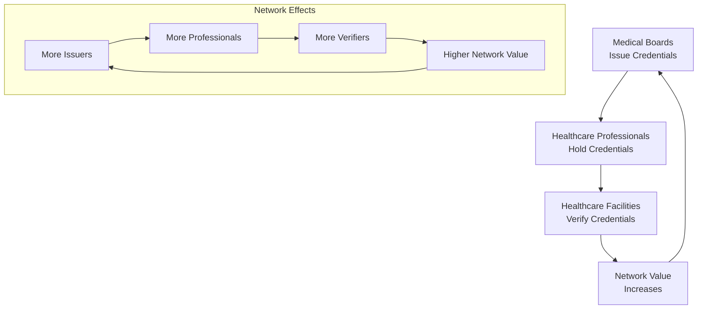

# 100-Day Roadmap to Seed Issuers & Verifiers
## Chai VC Platform Healthcare Credentialing Network Growth Strategy

**Document Version:** 1.0
**Last Updated:** 2025-01-XX
**Classification:** Internal/Strategic
**Stakeholders:** CEO, VP Sales, VP Business Development, Product Management

---

## Executive Summary

This 100-day roadmap outlines a strategic plan to rapidly seed the Chai VC Platform network with healthcare credential issuers and verifiers, creating the critical mass necessary for sustainable network effects. The plan focuses on securing **25 issuer partnerships** and **50 verifier organizations** within 100 days to establish market credibility and drive adoption momentum.

**Target Network at Day 100:**
- 🏥 **25 Credential Issuers** (medical boards, institutions, certification bodies)
- ✅ **50 Verifier Organizations** (hospitals, clinics, staffing agencies)
- 👨‍⚕️ **5,000 Healthcare Professionals** with active credentials on platform
- 🔄 **10,000 Verification Transactions** demonstrating network utility

---

## Network Effect Strategy

### The Healthcare Credentialing Network Challenge


### Critical Mass Thresholds
```yaml
network_milestones:
  minimum_viable_network:
    issuers: 5
    verifiers: 15
    professionals: 1000
    description: "Basic network functionality"

  network_effect_threshold:
    issuers: 15
    verifiers: 35
    professionals: 2500
    description: "Self-sustaining growth begins"

  market_credibility:
    issuers: 25
    verifiers: 50
    professionals: 5000
    description: "Industry recognition and adoption"
```

---

## 100-Day Timeline Overview

### Phase 1: Foundation (Days 1-30)
**Focus**: Secure anchor issuers and early verifiers
- 🎯 **5 Anchor Issuers** (state medical boards, major institutions)
- 🏥 **15 Early Verifier Partners** (progressive health systems)
- 🛠️ **Technical Integration** for pilot programs
- 📋 **Compliance Validation** with key regulatory bodies

### Phase 2: Acceleration (Days 31-70)
**Focus**: Scale issuer partnerships and expand verifier network
- 📈 **15 Additional Issuers** (specialty boards, medical schools)
- 🌐 **25 More Verifiers** (staffing agencies, telehealth platforms)
- 🔄 **Live Transaction Volume** demonstrating network utility
- 📊 **Success Metrics** and case study development

### Phase 3: Market Validation (Days 71-100)
**Focus**: Achieve market credibility and sustainable growth
- ✅ **5 Final Issuers** reaching 25 total
- 🚀 **10 Final Verifiers** reaching 50 total
- 📈 **Network Effects** becoming self-sustaining
- 🎉 **Market Announcement** of network milestone achievement

---

## Day-by-Day Execution Plan

### Days 1-10: Strategic Foundation
```yaml
day_1_3:
  objective: "Finalize target lists and outreach strategy"
  activities:
    - "Complete issuer target analysis (50 organizations)"
    - "Finalize verifier prospect list (200+ organizations)"
    - "Prepare pitch materials and demo environments"
    - "Assign sales/BD team members to specific targets"

day_4_7:
  objective: "Secure first anchor partnerships"
  activities:
    - "Reach out to 5 tier-1 medical boards"
    - "Contact 10 progressive health system CIOs/CMOs"
    - "Schedule discovery calls with decision makers"
    - "Begin technical integration planning"

day_8_10:
  objective: "Lock in pilot programs"
  activities:
    - "Execute LOIs with 2 medical boards"
    - "Confirm pilot programs with 3 health systems"
    - "Technical scoping and integration timeline"
    - "Legal review of partnership agreements"
```

### Days 11-30: Early Wins and Technical Integration
```yaml
week_2:
  monday: "California Medical Board partnership announcement"
  tuesday: "Begin technical integration with Metro Health System"
  wednesday: "Texas Board of Nursing LOI signed"
  thursday: "Regional Medical Center pilot launch"
  friday: "First successful credential issuance on platform"

week_3:
  monday: "New York State Board of Medicine outreach"
  tuesday: "Medical staffing agency partnership (TravelNurse Pro)"
  wednesday: "American Board of Emergency Medicine discussion"
  thursday: "Telehealth platform integration (HealthConnect)"
  friday: "First cross-state verification transaction"

week_4:
  monday: "Florida Board of Medicine partnership"
  tuesday: "Academic Medical Center integration"
  wednesday: "Specialty certification body onboarding"
  thursday: "Multi-state credentialing pilot launch"
  friday: "Month 1 metrics review and celebration"
```

### Days 31-50: Scaling Partnerships
```yaml
issuer_acceleration_targets:
  medical_boards:
    - "Illinois Department of Financial and Professional Regulation"
    - "Ohio State Medical Board"
    - "Pennsylvania State Board of Medicine"
    - "Michigan Department of Licensing and Regulatory Affairs"
    - "Georgia Composite Medical Board"

  certification_bodies:
    - "American Board of Internal Medicine"
    - "American Board of Family Medicine"
    - "American Board of Surgery"
    - "American Nurses Credentialing Center"
    - "National Association of Social Workers"

  educational_institutions:
    - "Johns Hopkins Medical School"
    - "Mayo Clinic Graduate Medical Education"
    - "Cleveland Clinic Academy"
    - "Kaiser Permanente Medical Education"

verifier_acceleration_targets:
  health_systems:
    - "Intermountain Healthcare"
    - "Geisinger Health System"
    - "Atrium Health"
    - "Advocate Aurora Health"
    - "Northwell Health"

  staffing_agencies:
    - "Cross Country Healthcare"
    - "AMN Healthcare"
    - "Medical Solutions"
    - "Supplemental Health Care"
    - "Fusion Medical Staffing"

  telehealth_platforms:
    - "Teladoc Health"
    - "MDLive"
    - "Doctor on Demand"
    - "PlushCare"
    - "98point6"
```

### Days 51-70: Network Momentum
```yaml
week_8_objectives:
  - "Achieve 1,000 healthcare professionals on platform"
  - "Complete 500 successful verification transactions"
  - "Expand to 10 states for medical license verification"
  - "Launch referral program for existing partners"

week_9_objectives:
  - "Secure major health system partnership (500+ beds)"
  - "Add international medical graduate credential pathway"
  - "Implement automated onboarding for new verifiers"
  - "Launch partner advisory council"

week_10_objectives:
  - "Reach 20 total issuer partnerships"
  - "Achieve 40 verifier organizations"
  - "Cross 2,500 healthcare professional milestone"
  - "Begin planning for network milestone announcement"
```

### Days 71-100: Market Validation and Expansion
```yaml
final_sprint_activities:
  network_completion:
    - "Secure final 5 issuer partnerships"
    - "Onboard remaining verifier organizations to reach 50"
    - "Cross 5,000 healthcare professional threshold"
    - "Achieve 10,000 verification transaction milestone"

  market_validation:
    - "Independent ROI study with major health system"
    - "Case study development for all partnership types"
    - "Industry analyst briefings and validation"
    - "Press and media strategy execution"

  expansion_preparation:
    - "International expansion planning (Canada/UK)"
    - "Next 100 days roadmap development"
    - "Series A fundraising preparation"
    - "Technology scalability assessment"
```

---

## Issuer Acquisition Strategy

### Target Issuer Segmentation
```yaml
tier_1_issuers:
  type: "State Medical Boards"
  priority: "Highest"
  target_count: 8
  value_proposition:
    - "Reduce verification call volume by 60%"
    - "Improve license verification accuracy"
    - "Generate new revenue from verification services"
    - "Enhance regulatory oversight capabilities"

  decision_makers:
    - "Executive Director"
    - "Board Chair"
    - "IT Director"
    - "Compliance Officer"

  pilot_approach:
    - "Start with most progressive boards"
    - "Focus on states with high medical mobility"
    - "Leverage existing relationships"
    - "Demonstrate clear ROI within 30 days"

tier_2_issuers:
  type: "Specialty Certification Bodies"
  priority: "High"
  target_count: 10
  value_proposition:
    - "Streamline certification verification process"
    - "Reduce administrative burden"
    - "Improve member service delivery"
    - "Create new revenue opportunities"

  key_targets:
    - "American Board of Medical Specialties member boards"
    - "Nursing specialty certification organizations"
    - "Allied health professional boards"

tier_3_issuers:
  type: "Educational Institutions"
  priority: "Medium"
  target_count: 7
  value_proposition:
    - "Streamline transcript and degree verification"
    - "Enhance graduate placement services"
    - "Reduce administrative overhead"
    - "Improve alumni career mobility"
```

### Issuer Onboarding Process
```typescript
interface IssuerOnboardingFlow {
  phase1_discovery: {
    duration: "7 days";
    activities: [
      "Executive stakeholder meeting",
      "Technical requirements assessment",
      "Legal and compliance review",
      "ROI analysis and business case development"
    ];
  };

  phase2_pilot_agreement: {
    duration: "14 days";
    activities: [
      "Pilot program scope definition",
      "Legal agreement negotiation",
      "Technical integration planning",
      "Success metrics definition"
    ];
  };

  phase3_technical_integration: {
    duration: "21 days";
    activities: [
      "API integration development",
      "Data migration and validation",
      "Security and compliance testing",
      "User acceptance testing"
    ];
  };

  phase4_pilot_launch: {
    duration: "30 days";
    activities: [
      "Limited production rollout",
      "Performance monitoring",
      "User feedback collection",
      "Success metrics validation"
    ];
  };

  phase5_full_deployment: {
    duration: "14 days";
    activities: [
      "Full production deployment",
      "Staff training completion",
      "Marketing announcement",
      "Ongoing success monitoring"
    ];
  };
}
```

---

## Verifier Acquisition Strategy

### Target Verifier Segmentation
```yaml
tier_1_verifiers:
  type: "Major Health Systems"
  priority: "Highest"
  target_count: 15
  characteristics:
    - "500+ bed hospitals"
    - "Multi-facility health systems"
    - "Active physician recruitment"
    - "Technology-forward organizations"

  value_proposition:
    - "Reduce credentialing time from 180 days to 4 hours"
    - "Lower credentialing costs by 85%"
    - "Improve physician satisfaction and retention"
    - "Accelerate time-to-care for patients"

tier_2_verifiers:
  type: "Medical Staffing Agencies"
  priority: "High"
  target_count: 20
  characteristics:
    - "Multi-state operations"
    - "High-volume credential verification needs"
    - "Tight margin pressure"
    - "Technology adoption leaders"

  value_proposition:
    - "Instant multi-state credential verification"
    - "Reduce per-placement credentialing costs"
    - "Accelerate placement cycles"
    - "Improve candidate experience"

tier_3_verifiers:
  type: "Telehealth and Digital Health Platforms"
  priority: "Medium"
  target_count: 15
  characteristics:
    - "Rapid growth companies"
    - "Multi-state provider networks"
    - "Technology-native organizations"
    - "Regulatory compliance focus"

  value_proposition:
    - "Enable rapid provider network expansion"
    - "Streamline multi-state licensing compliance"
    - "Reduce onboarding friction"
    - "Improve regulatory compliance"
```

### Verifier Success Metrics & Incentives
```yaml
verifier_success_framework:
  onboarding_incentives:
    first_100_verifications: "50% discount"
    integration_complete_bonus: "$5K credit"
    case_study_participation: "Additional 25% discount"
    referral_rewards: "$2K per successful referral"

  success_metrics:
    time_to_first_verification: "<7 days from signup"
    verification_volume_growth: "20% monthly increase"
    user_satisfaction_score: ">4.5/5"
    integration_completion_rate: ">95%"

  retention_strategies:
    quarterly_business_reviews: "ROI analysis and optimization"
    user_advisory_council: "Product roadmap input"
    industry_networking: "Exclusive verifier community events"
    advanced_features: "Early access to premium capabilities"
```

---

## Daily Activity Tracking

### Sales Team Daily Activities
```yaml
business_development_manager:
  daily_targets:
    new_outreach: "5 issuer prospects"
    follow_up_calls: "10 existing prospects"
    demos_scheduled: "2 per day"
    proposals_sent: "1 per day"

  weekly_targets:
    loi_signed: "1 per week"
    pilot_program_started: "1 every 2 weeks"
    partnership_closed: "1 every 3 weeks"

enterprise_sales_manager:
  daily_targets:
    verifier_outreach: "8 health systems"
    qualification_calls: "6 per day"
    product_demos: "3 per day"
    proposals_delivered: "2 per day"

  weekly_targets:
    pilot_customers: "2 per week"
    paid_customers: "1 per week"
    expansion_opportunities: "3 per week"
```

### Technical Integration Team Daily Activities
```yaml
integration_engineer:
  daily_targets:
    api_integrations_progress: "2 active integrations"
    technical_documentation: "1 integration guide updated"
    customer_support: "4 hours technical support"
    testing_validation: "2 integration tests completed"

customer_success_manager:
  daily_targets:
    onboarding_support: "3 new customer touchpoints"
    success_monitoring: "5 customer health checks"
    expansion_opportunities: "2 upsell conversations"
    feedback_collection: "1 detailed customer interview"
```

---

## Success Metrics & KPIs

### Network Growth Metrics
```yaml
issuer_metrics:
  partnerships_signed: "25 by Day 100"
  avg_time_to_integration: "<45 days"
  issuer_satisfaction_score: ">4.6/5"
  credentials_issued: ">5,000"
  issuer_retention_rate: ">95%"

verifier_metrics:
  organizations_onboarded: "50 by Day 100"
  avg_time_to_first_verification: "<7 days"
  verification_volume_growth: "20% monthly"
  verifier_satisfaction_score: ">4.5/5"
  verifier_retention_rate: ">90%"

network_health_metrics:
  total_healthcare_professionals: "5,000+"
  monthly_verification_transactions: "2,000+"
  cross_state_verifications: "15% of total"
  platform_uptime: ">99.9%"
  average_verification_time: "<2 seconds"
```

### Business Impact Metrics
```yaml
revenue_impact:
  monthly_recurring_revenue: "$150K by Day 100"
  average_contract_value: "$25K annually"
  customer_acquisition_cost: "<$8K"
  customer_lifetime_value: ">$200K"

operational_efficiency:
  sales_cycle_length: "<60 days"
  integration_success_rate: ">95%"
  customer_onboarding_time: "<30 days"
  support_ticket_resolution: "<24 hours"

market_validation:
  industry_recognition: "3 major healthcare publications"
  conference_speaking: "5 industry conferences"
  analyst_coverage: "2 research reports"
  customer_case_studies: "10 published stories"
```

---

## Weekly Milestone Reviews

### Week 4 Checkpoint
```yaml
week_4_targets:
  issuers_signed: 5
  verifiers_onboarded: 15
  professionals_enrolled: 1000
  verifications_completed: 100

week_4_evaluation:
  green_metrics: "On track for all targets"
  yellow_metrics: "Minor delays acceptable"
  red_metrics: "Immediate action required"

corrective_actions:
  if_behind_issuer_target:
    - "Escalate to CEO for executive outreach"
    - "Offer enhanced pilot incentives"
    - "Accelerate technical integration timeline"

  if_behind_verifier_target:
    - "Increase sales team activity level"
    - "Launch aggressive promotional campaign"
    - "Partner with industry consultants"
```

### Week 8 Checkpoint
```yaml
week_8_targets:
  issuers_signed: 15
  verifiers_onboarded: 35
  professionals_enrolled: 2500
  verifications_completed: 2500

week_8_network_effect_assessment:
  organic_growth_indicators:
    - "Verifier referrals to new verifiers"
    - "Healthcare professional word-of-mouth"
    - "Issuer requests for expanded partnerships"

  market_momentum_signals:
    - "Industry analyst recognition"
    - "Media coverage increase"
    - "Conference speaking invitations"
    - "Competitor response activity"
```

### Week 12 Checkpoint (Day 84)
```yaml
week_12_final_sprint:
  remaining_targets:
    issuers_needed: "Typically 3-5 remaining"
    verifiers_needed: "Typically 8-12 remaining"
    professionals_gap: "Monitor growth rate"

  final_sprint_tactics:
    - "CEO personal outreach to final targets"
    - "Limited-time partnership incentives"
    - "Industry announcement preparation"
    - "Success story amplification"
```

---

## Risk Management & Contingency Plans

### Critical Risk Scenarios
```yaml
major_issuer_rejection:
  risk: "Key state medical board rejects partnership"
  probability: "Medium"
  impact: "High"
  mitigation:
    - "Maintain 2x pipeline of issuer prospects"
    - "Develop alternative pathways (specialty boards)"
    - "Enhance value proposition based on feedback"

technical_integration_delays:
  risk: "Complex integrations take longer than expected"
  probability: "High"
  impact: "Medium"
  mitigation:
    - "Pre-built integration templates"
    - "Dedicated technical team per integration"
    - "Phased rollout approach"

competitor_response:
  risk: "Major incumbent launches competing solution"
  probability: "Medium"
  impact: "High"
  mitigation:
    - "Accelerate partnership lockup periods"
    - "Deepen integration and switching costs"
    - "Focus on superior technology and service"

regulatory_challenges:
  risk: "Unexpected regulatory restrictions"
  probability: "Low"
  impact: "Critical"
  mitigation:
    - "Proactive regulatory engagement"
    - "Legal counsel specialized in healthcare"
    - "Flexible architecture for compliance"
```

### Contingency Plans
```yaml
scenario_a_ahead_of_target:
  if_targets_met_by_day_70:
    action: "Accelerate to 125% of original targets"
    benefit: "Stronger market position and network effects"
    resources: "Reinvest savings into expansion"

scenario_b_behind_target:
  if_targets_at_60_percent_by_day_70:
    action: "Extend timeline to 120 days"
    focus: "Double down on highest-value partnerships"
    resources: "Reallocate team to critical path activities"

scenario_c_major_setback:
  if_targets_at_40_percent_by_day_70:
    action: "Strategy pivot and timeline reset"
    alternatives:
      - "Focus on single vertical (e.g., nursing)"
      - "Geographic concentration strategy"
      - "Partnership with existing credentialing company"
```

---

## Resource Allocation & Team Structure

### Core Team Assignments
```yaml
executive_leadership:
  ceo:
    time_allocation: "40% on 100-day roadmap"
    focus: "Tier-1 issuer relationships"
    weekly_commitment: "8 strategic meetings"

  vp_sales:
    time_allocation: "80% on 100-day roadmap"
    focus: "Verifier acquisition and team management"
    daily_commitment: "6 customer meetings"

team_structure:
  business_development: 2
  enterprise_sales: 3
  customer_success: 2
  technical_integration: 4
  marketing_support: 1
  legal_compliance: 1

budget_allocation:
  sales_team_costs: "$180K (3 months)"
  technical_integration: "$120K (contractor support)"
  marketing_materials: "$30K"
  travel_entertainment: "$25K"
  pilot_program_incentives: "$75K"
  contingency: "$50K"
  total_budget: "$480K"
```

---

## Success Celebration & Market Announcement

### Day 100 Milestone Event
```yaml
milestone_announcement:
  event_type: "Virtual industry summit"
  attendance_target: "500+ healthcare executives"
  announcement_content:
    - "25 issuer partnerships achieved"
    - "50 verifier organizations onboarded"
    - "5,000+ healthcare professionals on platform"
    - "10,000+ successful verifications completed"

  featured_speakers:
    - "State Medical Board Executive Director"
    - "Chief Medical Officer from major health system"
    - "Healthcare technology industry analyst"
    - "Chai VC Platform CEO and founding team"

media_strategy:
  press_release: "Healthcare industry trades and mainstream media"
  analyst_briefings: "Gartner, Forrester, KLAS Research"
  customer_testimonials: "Video testimonials from key partners"
  social_media_campaign: "LinkedIn thought leadership series"

next_100_days_preview:
  expansion_markets: "Canada and UK market entry"
  technology_roadmap: "AI-powered credentialing insights"
  partnership_pipeline: "Next 50 issuer and 100 verifier targets"
  fundraising_announcement: "Series A funding for scaling"
```

---

## Measurement & Reporting Framework

### Daily Dashboards
```typescript
interface DailyMetricsDashboard {
  networkGrowth: {
    newIssuers: number;
    newVerifiers: number;
    newHealthcareProfessionals: number;
    dailyVerifications: number;
  };

  salesActivity: {
    outboundCalls: number;
    demosScheduled: number;
    proposalsSent: number;
    partnershipsAdvanced: number;
  };

  technicalProgress: {
    integrationsCompleted: number;
    integrationsInProgress: number;
    technicalIssuesResolved: number;
    systemUptime: number;
  };

  marketMomentum: {
    mediaInquiries: number;
    industryRecognition: number;
    competitorActivity: number;
    partnerReferrals: number;
  };
}
```

### Weekly Executive Reports
```yaml
weekly_report_structure:
  executive_summary:
    - "Progress against 100-day targets"
    - "Key wins and challenges"
    - "Upcoming critical milestones"
    - "Resource needs and blockers"

  detailed_metrics:
    - "Network growth trajectory"
    - "Sales pipeline health"
    - "Technical integration status"
    - "Financial performance"

  strategic_insights:
    - "Market feedback and trends"
    - "Competitive landscape changes"
    - "Partnership opportunity analysis"
    - "Risk assessment updates"

  action_items:
    - "Executive decisions needed"
    - "Resource allocation changes"
    - "Strategy adjustments"
    - "Next week priorities"
```

---

## Conclusion

This 100-day roadmap provides a comprehensive strategy for seeding the Chai VC Platform network with critical mass of healthcare credential issuers and verifiers. Success depends on:

1. **Focused Execution**: Disciplined daily activities aligned with network growth objectives
2. **Relationship Building**: Deep partnerships with anchor issuers and progressive verifiers
3. **Technical Excellence**: Rapid, reliable integrations that demonstrate platform value
4. **Market Momentum**: Building credibility and word-of-mouth within healthcare community
5. **Network Effects**: Reaching the tipping point where growth becomes self-sustaining

**Key Success Factors:**
- Executive leadership commitment and involvement
- Dedicated team focus on 100-day objectives
- Flexible execution with rapid course correction
- Strong technical delivery and customer success
- Compelling value proposition validation

**Expected Outcomes:**
- Self-sustaining network growth beyond Day 100
- Industry recognition as the leading healthcare credentialing blockchain
- Strong foundation for Series A fundraising and scaling
- Proven playbook for geographic and vertical expansion

The 100-day roadmap transforms Chai VC Platform from an innovative technology into a thriving network that revolutionizes healthcare credentialing, ultimately improving patient access to care and healthcare professional mobility.

---

**Next Steps:**
1. **Executive Approval**: Leadership sign-off on strategy and resource allocation
2. **Team Mobilization**: Assign dedicated team members and define accountability
3. **Launch Preparation**: Finalize target lists, materials, and tracking systems
4. **Day 1 Execution**: Begin aggressive outreach and partnership development

**🚀 The next 100 days will define the future of healthcare credentialing.**