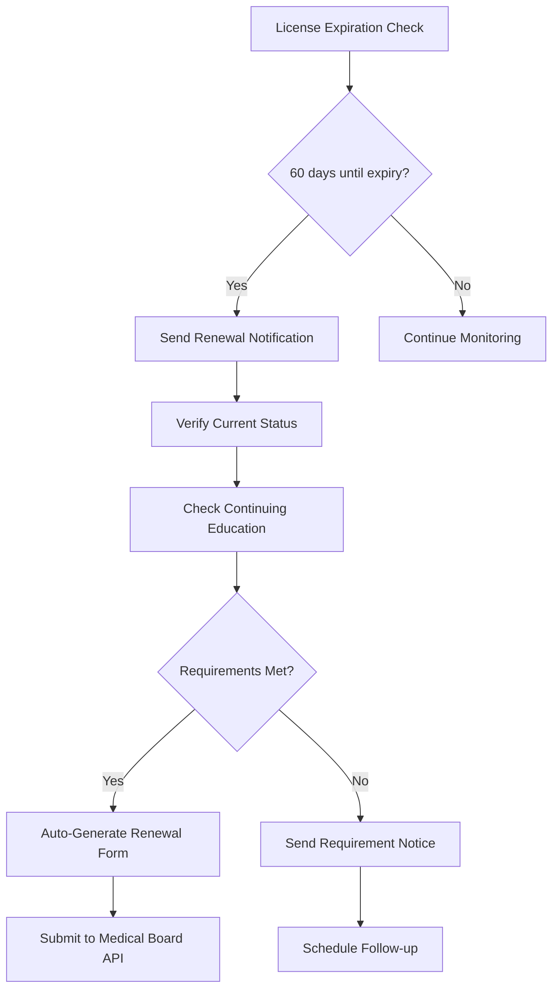

# Credential Re-Issue Automation Runbook

## Executive Summary

This runbook defines the automated processes, legal considerations, and operational procedures for re-issuing healthcare credentials in the Chai VC Platform. It covers license renewals, credential updates, emergency re-issuance, and compliance requirements while maintaining security and regulatory adherence.

## Overview

### Re-Issue Scenarios
1. **License Renewal**: Periodic license renewals (annual, biennial)
2. **Credential Updates**: Changes to personal information or qualifications
3. **Emergency Re-Issue**: Lost, stolen, or compromised credentials
4. **Regulatory Changes**: Updates due to regulatory requirement changes
5. **System Migration**: Technical platform updates or migrations
6. **Revocation Recovery**: Re-issuance after wrongful revocation

### Automation Benefits
- Reduced manual processing time
- Improved accuracy and consistency
- Enhanced compliance tracking
- Lower operational costs
- Better user experience
- Audit trail preservation

## Automated Re-Issue Workflows

### License Renewal Automation

#### Pre-Renewal Process (60 days before expiration)


#### Renewal Processing Service
```typescript
class LicenseRenewalService {
  async processRenewal(licenseId: string): Promise<RenewalResult> {
    const license = await this.getLicense(licenseId);

    // 1. Validate renewal eligibility
    const eligibility = await this.checkRenewalEligibility(license);
    if (!eligibility.eligible) {
      return { status: 'ineligible', reason: eligibility.reason };
    }

    // 2. Fetch updated information from medical board
    const boardData = await this.fetchBoardData(license.boardId, license.licenseNumber);

    // 3. Generate new credential with updated data
    const newCredential = await this.generateUpdatedCredential(license, boardData);

    // 4. Revoke old credential (with grace period)
    await this.scheduleRevocation(license.id, { gracePeriodDays: 30 });

    // 5. Issue new credential
    const issuanceResult = await this.issueCredential(newCredential);

    // 6. Update audit trail
    await this.logRenewal(license.id, newCredential.id, issuanceResult);

    return {
      status: 'completed',
      newCredentialId: newCredential.id,
      oldCredentialId: license.id
    };
  }
}
```

### Information Update Automation

#### Supported Update Types
```typescript
enum UpdateType {
  NAME_CHANGE = 'name_change',
  ADDRESS_CHANGE = 'address_change',
  SPECIALTY_ADDITION = 'specialty_addition',
  PRACTICE_LOCATION = 'practice_location',
  CONTACT_INFO = 'contact_info',
  CERTIFICATION_ADD = 'certification_add'
}

interface UpdateRequest {
  credentialId: string;
  updateType: UpdateType;
  newValue: any;
  supportingDocuments: Document[];
  requestorId: string;
  verificationRequired: boolean;
}
```

#### Update Processing Workflow
```typescript
class CredentialUpdateService {
  async processUpdate(request: UpdateRequest): Promise<UpdateResult> {
    // 1. Validate update request
    await this.validateUpdateRequest(request);

    // 2. Verify supporting documentation
    const docVerification = await this.verifyDocuments(request.supportingDocuments);
    if (!docVerification.valid) {
      throw new Error(`Document verification failed: ${docVerification.reason}`);
    }

    // 3. Check if manual review is required
    const reviewRequired = await this.assessManualReviewNeed(request);
    if (reviewRequired) {
      return await this.routeForManualReview(request);
    }

    // 4. Generate updated credential
    const updatedCredential = await this.generateUpdatedCredential(request);

    // 5. Issue updated credential
    const issuanceResult = await this.issueUpdatedCredential(updatedCredential);

    // 6. Schedule old credential revocation
    await this.scheduleRevocation(request.credentialId, {
      gracePeriodDays: 14,
      reason: 'updated'
    });

    return {
      status: 'completed',
      newCredentialId: updatedCredential.id,
      effectiveDate: issuanceResult.issuedAt
    };
  }
}
```

### Emergency Re-Issue Process

#### Emergency Scenarios
1. **Lost/Stolen Device**: Mobile wallet compromise
2. **Key Compromise**: Private key exposure
3. **Identity Theft**: Fraudulent use of credentials
4. **System Breach**: Platform security incident
5. **Regulatory Order**: Emergency regulatory compliance

#### Emergency Response Workflow
```typescript
class EmergencyReissueService {
  async handleEmergencyReissue(request: EmergencyRequest): Promise<EmergencyResult> {
    const startTime = Date.now();

    // 1. Immediate credential suspension
    await this.suspendCredential(request.credentialId, {
      reason: request.emergencyType,
      suspendedBy: request.requestorId
    });

    // 2. Notify relevant parties
    await this.sendEmergencyNotifications(request);

    // 3. Verify identity of requestor
    const identityVerification = await this.performEnhancedIdentityCheck(request);
    if (!identityVerification.verified) {
      throw new Error('Identity verification failed for emergency re-issue');
    }

    // 4. Generate new credential with new keys
    const newCredential = await this.generateEmergencyCredential(request);

    // 5. Issue with expedited processing
    const issuanceResult = await this.issueExpedited(newCredential);

    // 6. Log security incident
    await this.logSecurityIncident({
      type: request.emergencyType,
      oldCredentialId: request.credentialId,
      newCredentialId: newCredential.id,
      processingTime: Date.now() - startTime
    });

    return {
      status: 'emergency_reissued',
      newCredentialId: newCredential.id,
      processingTime: Date.now() - startTime
    };
  }
}
```

## Legal Considerations

### HIPAA Compliance Requirements

#### Minimum Necessary Standard
```typescript
interface MinimumNecessaryCheck {
  purpose: string;
  requestedData: string[];
  justification: string;
  approver: string;
}

class HIPAAComplianceService {
  async validateMinimumNecessary(request: MinimumNecessaryCheck): Promise<boolean> {
    // Ensure only minimum necessary PHI is included in re-issued credential
    const necessaryFields = await this.determineNecessaryFields(request.purpose);
    const requestedFields = new Set(request.requestedData);
    const unnecessaryFields = [...requestedFields].filter(
      field => !necessaryFields.includes(field)
    );

    if (unnecessaryFields.length > 0) {
      await this.logComplianceViolation({
        type: 'minimum_necessary_violation',
        unnecessaryFields,
        request
      });
      return false;
    }

    return true;
  }
}
```

#### Business Associate Agreement (BAA) Compliance
- **Third-Party Processors**: Ensure all re-issuance processors have valid BAAs
- **Data Retention**: Follow BAA requirements for credential data retention
- **Breach Notification**: Report any re-issuance-related data incidents
- **Access Logging**: Maintain detailed audit logs of all access

### State Regulatory Requirements

#### License Re-Issue Notifications
```typescript
interface RegulatoryNotification {
  stateBoard: string;
  licenseType: string;
  reissueReason: string;
  originalCredentialId: string;
  newCredentialId: string;
  notificationTimeline: number; // hours
}

class RegulatoryComplianceService {
  async notifyStateBoard(notification: RegulatoryNotification): Promise<void> {
    const stateRequirements = await this.getStateRequirements(notification.stateBoard);

    // Send notification within required timeline
    if (stateRequirements.requiresNotification) {
      await this.sendBoardNotification({
        ...notification,
        dueBy: Date.now() + (stateRequirements.notificationHours * 3600000)
      });
    }

    // Update regulatory compliance log
    await this.updateComplianceLog(notification);
  }
}
```

#### Legal Documentation Requirements
1. **Affidavits**: Sworn statements for emergency re-issues
2. **Court Orders**: Legal orders for name changes
3. **Identity Verification**: Enhanced KYC for sensitive updates
4. **Notarization**: Notarized documents for major changes
5. **Medical Board Approval**: Board approval for specialty changes

### Audit and Compliance Tracking

#### Legal Audit Trail
```typescript
interface LegalAuditEntry {
  actionType: 'reissue' | 'update' | 'emergency' | 'revocation';
  credentialId: string;
  userId: string;
  legalBasis: string;
  supportingDocuments: string[];
  approver: string;
  timestamp: Date;
  regulatoryNotifications: string[];
  retentionPeriod: number; // years
}

class LegalAuditService {
  async logLegalAction(entry: LegalAuditEntry): Promise<void> {
    // Store in immutable audit log
    const auditId = await this.storeAuditEntry(entry);

    // Schedule retention based on legal requirements
    await this.scheduleRetention(auditId, entry.retentionPeriod);

    // Notify legal team if high-risk action
    if (this.isHighRiskAction(entry)) {
      await this.notifyLegalTeam(entry);
    }
  }
}
```

## Automation Configuration

### Business Rules Engine
```typescript
class ReissueRulesEngine {
  private rules: ReissueRule[] = [
    {
      name: 'automatic_renewal',
      condition: (request) =>
        request.type === 'renewal' &&
        request.daysUntilExpiry <= 60 &&
        request.continuingEducationComplete,
      action: 'auto_process'
    },
    {
      name: 'manual_review_required',
      condition: (request) =>
        request.type === 'name_change' ||
        request.emergencyType === 'identity_theft',
      action: 'manual_review'
    },
    {
      name: 'enhanced_verification',
      condition: (request) =>
        request.type === 'emergency' &&
        request.riskScore > 7,
      action: 'enhanced_identity_check'
    }
  ];

  async evaluateRequest(request: ReissueRequest): Promise<RuleDecision> {
    const applicableRules = this.rules.filter(rule => rule.condition(request));

    // Apply most restrictive action
    const actions = applicableRules.map(rule => rule.action);
    if (actions.includes('manual_review')) {
      return { action: 'manual_review', reason: 'Business rule requirement' };
    }
    if (actions.includes('enhanced_identity_check')) {
      return { action: 'enhanced_identity_check', reason: 'High risk score' };
    }

    return { action: 'auto_process', reason: 'Standard automation criteria met' };
  }
}
```

### Integration Points

#### Medical Board APIs
```typescript
interface MedicalBoardAPI {
  getLicenseStatus(licenseNumber: string): Promise<LicenseStatus>;
  submitRenewalApplication(application: RenewalApplication): Promise<SubmissionResult>;
  verifyCredentials(credentials: Credential[]): Promise<VerificationResult>;
  reportCredentialUpdate(update: CredentialUpdate): Promise<ReportResult>;
}

class MedicalBoardIntegration {
  private apis: Map<string, MedicalBoardAPI> = new Map();

  async syncWithBoard(boardId: string, licenseNumber: string): Promise<SyncResult> {
    const api = this.apis.get(boardId);
    if (!api) {
      throw new Error(`No API integration for board: ${boardId}`);
    }

    const status = await api.getLicenseStatus(licenseNumber);
    return {
      isValid: status.isValid,
      expirationDate: status.expirationDate,
      restrictions: status.restrictions,
      specialties: status.specialties
    };
  }
}
```

#### Identity Verification Services
```typescript
class IdentityVerificationService {
  async performEnhancedKYC(userId: string, documents: Document[]): Promise<KYCResult> {
    // Multi-factor identity verification
    const results = await Promise.all([
      this.verifyGovernmentID(documents),
      this.performBiometricCheck(userId),
      this.validateAddressProof(documents),
      this.checkCreditBureauData(userId)
    ]);

    const overallScore = this.calculateKYCScore(results);

    return {
      verified: overallScore >= 85,
      score: overallScore,
      details: results,
      riskFactors: this.identifyRiskFactors(results)
    };
  }
}
```

## Monitoring and Alerting

### Key Performance Indicators (KPIs)
```typescript
interface ReissueKPIs {
  totalReissues: number;
  automaticReissues: number;
  manualReissues: number;
  emergencyReissues: number;
  averageProcessingTime: number; // minutes
  errorRate: number; // percentage
  complianceViolations: number;
  userSatisfactionScore: number;
}

class ReissueMonitoringService {
  async generateKPIReport(period: TimePeriod): Promise<ReissueKPIs> {
    return {
      totalReissues: await this.countReissues(period),
      automaticReissues: await this.countAutomaticReissues(period),
      manualReissues: await this.countManualReissues(period),
      emergencyReissues: await this.countEmergencyReissues(period),
      averageProcessingTime: await this.calculateAverageProcessingTime(period),
      errorRate: await this.calculateErrorRate(period),
      complianceViolations: await this.countComplianceViolations(period),
      userSatisfactionScore: await this.calculateSatisfactionScore(period)
    };
  }
}
```

### Alert Conditions
```typescript
const ALERT_CONDITIONS = [
  {
    name: 'high_emergency_reissue_rate',
    condition: (metrics) => metrics.emergencyReissues > 10,
    severity: 'HIGH',
    action: 'investigate_security_incident'
  },
  {
    name: 'slow_processing_times',
    condition: (metrics) => metrics.averageProcessingTime > 30,
    severity: 'MEDIUM',
    action: 'review_automation_rules'
  },
  {
    name: 'compliance_violations',
    condition: (metrics) => metrics.complianceViolations > 0,
    severity: 'CRITICAL',
    action: 'immediate_legal_review'
  }
];
```

## Error Handling and Recovery

### Common Error Scenarios
1. **Medical Board API Failure**: Fallback to manual processing
2. **Identity Verification Timeout**: Escalate to human review
3. **Document Processing Error**: Retry with alternative OCR service
4. **Database Transaction Failure**: Implement rollback and retry logic
5. **Notification Delivery Failure**: Queue for retry with escalation

### Recovery Procedures
```typescript
class ReissueRecoveryService {
  async handleProcessingFailure(
    failureType: FailureType,
    request: ReissueRequest
  ): Promise<RecoveryResult> {

    switch (failureType) {
      case 'MEDICAL_BOARD_API_TIMEOUT':
        return await this.fallbackToManualProcessing(request);

      case 'IDENTITY_VERIFICATION_FAILED':
        return await this.escalateToHumanReview(request);

      case 'DOCUMENT_PROCESSING_ERROR':
        return await this.retryWithBackupService(request);

      case 'DATABASE_ERROR':
        return await this.rollbackAndRetry(request);

      default:
        return await this.escalateToSupport(request, failureType);
    }
  }
}
```

## Legal Review Requirements

### When Legal Review is Required
1. **High-Risk Updates**: Name changes, specialty changes
2. **Emergency Situations**: Identity theft, fraud cases
3. **Regulatory Changes**: New compliance requirements
4. **Bulk Re-Issues**: System-wide credential updates
5. **Disputed Requests**: Contested credential updates

### Legal Approval Workflow
```typescript
interface LegalReviewRequest {
  reissueRequestId: string;
  reviewType: 'standard' | 'expedited' | 'emergency';
  riskLevel: 'low' | 'medium' | 'high' | 'critical';
  legalQuestions: string[];
  supportingDocuments: Document[];
  deadline?: Date;
}

class LegalReviewService {
  async submitForReview(request: LegalReviewRequest): Promise<ReviewResult> {
    // Route to appropriate legal team based on specialty
    const reviewer = await this.assignReviewer(request);

    // Set SLA based on review type
    const sla = this.getSLAForReviewType(request.reviewType);

    // Create review ticket
    const reviewId = await this.createReviewTicket(request, reviewer, sla);

    return {
      reviewId,
      assignedReviewer: reviewer,
      expectedCompletionDate: new Date(Date.now() + sla)
    };
  }
}
```

## Service Level Agreements (SLAs)

### Processing Time SLAs
```typescript
const PROCESSING_SLAS = {
  standard_renewal: { hours: 24, businessHours: true },
  emergency_reissue: { hours: 2, businessHours: false },
  information_update: { hours: 8, businessHours: true },
  name_change: { hours: 72, businessHours: true },
  specialty_change: { hours: 120, businessHours: true }
};

class SLAMonitoringService {
  async checkSLACompliance(requestId: string): Promise<SLAStatus> {
    const request = await this.getReissueRequest(requestId);
    const sla = PROCESSING_SLAS[request.type];

    const elapsed = Date.now() - request.submittedAt;
    const slaDeadline = this.calculateDeadline(request.submittedAt, sla);

    return {
      isCompliant: Date.now() < slaDeadline,
      timeRemaining: slaDeadline - Date.now(),
      escalationRequired: elapsed > (slaDeadline * 0.8) // 80% threshold
    };
  }
}
```

## Disaster Recovery

### Backup and Recovery Procedures
1. **Daily Backups**: All re-issuance data backed up daily
2. **Geographic Distribution**: Backups stored in multiple regions
3. **Recovery Testing**: Monthly disaster recovery testing
4. **Business Continuity**: Manual fallback procedures documented
5. **Communication Plan**: Stakeholder notification procedures

### Recovery Time Objectives (RTOs)
- **Critical Services**: 4 hours
- **Standard Processing**: 24 hours
- **Reporting Systems**: 72 hours
- **Historical Data**: 7 days

---

*Document Version: 1.0*
*Last Updated: September 2025*
*Next Review: December 2025*