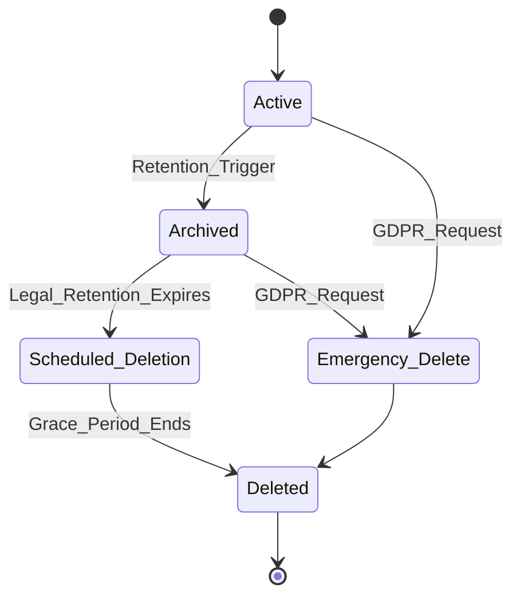

# Data Retention & Erasure Policy
## Chai VC Platform Healthcare Credentialing System

**Document Version:** 1.0
**Last Updated:** 2025-01-XX
**Classification:** Internal/Compliance
**Stakeholders:** Legal, Privacy Officer, Engineering, Operations

---

## Executive Summary

This policy defines comprehensive data retention and erasure procedures for the Chai VC Platform healthcare credentialing system, ensuring compliance with GDPR, HIPAA, state regulations, and healthcare industry standards. The policy covers PHI, PII, blockchain data, audit logs, and system metadata with automated enforcement mechanisms.

---

## 1. Legal & Regulatory Framework

### 1.1 Applicable Regulations
- **GDPR Articles 17 (Right to Erasure), 25 (Data Protection by Design)**
- **HIPAA 45 CFR §164.530(j) - Record Retention Requirements**
- **State Medical Board Regulations** (varies by jurisdiction)
- **FDA 21 CFR Part 820** (for medical device manufacturers)
- **ISO 27001:2022** - Information retention requirements

### 1.2 Legal Basis for Processing
```yaml
# Legal basis matrix
processing_purposes:
  credential_issuance:
    legal_basis: "Legitimate interest + Consent"
    retention_period: "7 years post-credential-expiry"
  verification_logs:
    legal_basis: "Legal obligation (audit)"
    retention_period: "10 years"
  marketing_preferences:
    legal_basis: "Consent"
    retention_period: "Until consent withdrawn"
  fraud_prevention:
    legal_basis: "Legitimate interest"
    retention_period: "5 years post-last-interaction"
```

---

## 2. Data Classification & Retention Matrix

### 2.1 Healthcare Data Categories

| Data Category | Examples | Retention Period | Legal Basis | Auto-Delete |
|---------------|----------|------------------|-------------|-------------|
| **Protected Health Information (PHI)** | Medical licenses, certifications, disciplinary records | 7 years post-expiry | HIPAA Legal Obligation | ✅ |
| **Personally Identifiable Information (PII)** | Names, addresses, SSN (hashed) | 7 years post-account-closure | GDPR Legitimate Interest | ✅ |
| **Verification Audit Logs** | Who verified what, when | 10 years | Legal/Regulatory Requirement | ✅ |
| **System Operational Logs** | API calls, errors, performance metrics | 2 years | Legitimate Interest | ✅ |
| **Blockchain Transaction Records** | On-chain hashes, proofs | Permanent* | Technical Necessity | ❌ |
| **Zero-Knowledge Proofs** | ZK-SNARK proofs, commitments | 1 year post-verification | Technical Processing | ✅ |
| **Marketing/Communications** | Email preferences, newsletters | Until consent withdrawn | Consent | ✅ |
| **Research Analytics** | Anonymized usage patterns | 5 years | Legitimate Interest | ✅ |

*Note: Blockchain data uses privacy-preserving hashes - no direct PHI on-chain*

### 2.2 Data Lifecycle States


---

## 3. Automated Retention Enforcement

### 3.1 Database Schema Design
```sql
-- Retention metadata for all data tables
CREATE TABLE retention_policy (
    id SERIAL PRIMARY KEY,
    table_name VARCHAR(100) NOT NULL,
    data_category VARCHAR(50) NOT NULL,
    retention_years INTEGER NOT NULL,
    auto_delete_enabled BOOLEAN DEFAULT true,
    last_cleanup_run TIMESTAMP,
    legal_hold_override BOOLEAN DEFAULT false,
    created_at TIMESTAMP DEFAULT NOW()
);

-- Track retention dates for individual records
CREATE TABLE record_retention (
    id SERIAL PRIMARY KEY,
    table_name VARCHAR(100) NOT NULL,
    record_id VARCHAR(100) NOT NULL,
    retention_expires_at TIMESTAMP NOT NULL,
    data_subject_id VARCHAR(100), -- For GDPR requests
    legal_hold BOOLEAN DEFAULT false,
    deletion_reason VARCHAR(200),
    created_at TIMESTAMP DEFAULT NOW(),

    UNIQUE(table_name, record_id)
);

-- Audit trail for all deletions
CREATE TABLE deletion_audit_log (
    id SERIAL PRIMARY KEY,
    table_name VARCHAR(100) NOT NULL,
    record_id VARCHAR(100) NOT NULL,
    deletion_type VARCHAR(50), -- 'automated', 'gdpr_request', 'legal_hold_release'
    data_category VARCHAR(50),
    deleted_by VARCHAR(100),
    deletion_reason TEXT,
    restored_from_backup BOOLEAN DEFAULT false,
    deleted_at TIMESTAMP DEFAULT NOW()
);
```

### 3.2 Automated Cleanup Service
```typescript
// src/services/data-retention-service.ts
import { PrismaClient } from '@prisma/client';
import { Logger } from 'winston';

interface RetentionConfig {
  tableName: string;
  retentionYears: number;
  dataCategory: string;
  customLogic?: (records: any[]) => Promise<void>;
}

export class DataRetentionService {
  private prisma: PrismaClient;
  private logger: Logger;
  private dryRun: boolean;

  constructor(prisma: PrismaClient, logger: Logger, dryRun = false) {
    this.prisma = prisma;
    this.logger = logger;
    this.dryRun = dryRun;
  }

  async executeRetentionPolicies(): Promise<void> {
    const policies = await this.prisma.retentionPolicy.findMany({
      where: { autoDeleteEnabled: true }
    });

    for (const policy of policies) {
      try {
        await this.processRetentionPolicy(policy);
      } catch (error) {
        this.logger.error(`Retention policy failed for ${policy.tableName}`, {
          error: error.message,
          policy: policy.id
        });
      }
    }
  }

  private async processRetentionPolicy(policy: any): Promise<void> {
    const cutoffDate = new Date();
    cutoffDate.setFullYear(cutoffDate.getFullYear() - policy.retentionYears);

    // Find records to delete
    const expiredRecords = await this.prisma.recordRetention.findMany({
      where: {
        tableName: policy.tableName,
        retentionExpiresAt: { lte: cutoffDate },
        legalHold: false
      }
    });

    if (expiredRecords.length === 0) {
      this.logger.info(`No expired records found for ${policy.tableName}`);
      return;
    }

    this.logger.info(`Found ${expiredRecords.length} expired records in ${policy.tableName}`);

    // Execute deletions with audit trail
    for (const record of expiredRecords) {
      await this.deleteRecordWithAudit(record, policy);
    }

    // Update last cleanup timestamp
    await this.prisma.retentionPolicy.update({
      where: { id: policy.id },
      data: { lastCleanupRun: new Date() }
    });
  }

  private async deleteRecordWithAudit(record: any, policy: any): Promise<void> {
    const transaction = await this.prisma.$transaction(async (tx) => {
      if (!this.dryRun) {
        // Delete from actual data table
        await this.executeTableSpecificDeletion(record.tableName, record.recordId, tx);

        // Remove retention tracking
        await tx.recordRetention.delete({
          where: { id: record.id }
        });
      }

      // Create audit log entry
      await tx.deletionAuditLog.create({
        data: {
          tableName: record.tableName,
          recordId: record.recordId,
          deletionType: 'automated',
          dataCategory: policy.dataCategory,
          deletedBy: 'system',
          deletionReason: `Retention period expired (${policy.retentionYears} years)`
        }
      });
    });

    this.logger.info(`${this.dryRun ? '[DRY RUN] ' : ''}Deleted record`, {
      table: record.tableName,
      recordId: record.recordId,
      category: policy.dataCategory
    });
  }

  // GDPR Right to Erasure implementation
  async processGDPRErasureRequest(dataSubjectId: string, requestId: string): Promise<void> {
    this.logger.info(`Processing GDPR erasure request`, { dataSubjectId, requestId });

    const relatedRecords = await this.prisma.recordRetention.findMany({
      where: { dataSubjectId }
    });

    for (const record of relatedRecords) {
      // Check for legal hold
      if (record.legalHold) {
        this.logger.warn(`Skipping deletion due to legal hold`, {
          table: record.tableName,
          recordId: record.recordId
        });
        continue;
      }

      await this.deleteRecordWithAudit(record, {
        dataCategory: 'gdpr_request',
        retentionYears: 0
      });
    }
  }

  private async executeTableSpecificDeletion(tableName: string, recordId: string, tx: any): Promise<void> {
    // Custom deletion logic for different table types
    const deletionStrategies = {
      'healthcare_credentials': async () => {
        // Soft delete with anonymization
        await tx.healthcareCredentials.update({
          where: { id: recordId },
          data: {
            licenseNumber: '[REDACTED]',
            issuerName: '[REDACTED]',
            holderName: '[REDACTED]',
            deletedAt: new Date(),
            status: 'DELETED'
          }
        });
      },
      'verification_logs': async () => {
        // Hard delete for logs
        await tx.verificationLogs.delete({
          where: { id: recordId }
        });
      },
      'user_profiles': async () => {
        // Anonymize PII, keep statistical data
        await tx.userProfiles.update({
          where: { id: recordId },
          data: {
            email: '[REDACTED]',
            firstName: '[REDACTED]',
            lastName: '[REDACTED]',
            phoneNumber: null,
            address: null,
            anonymizedAt: new Date()
          }
        });
      }
    };

    const strategy = deletionStrategies[tableName];
    if (strategy) {
      await strategy();
    } else {
      throw new Error(`No deletion strategy defined for table: ${tableName}`);
    }
  }
}

// Cron job configuration
export const scheduleRetentionEnforcement = () => {
  // Run every Sunday at 2 AM
  const cron = require('node-cron');

  cron.schedule('0 2 * * 0', async () => {
    const service = new DataRetentionService(
      new PrismaClient(),
      logger,
      false // Set to true for dry-run mode
    );

    await service.executeRetentionPolicies();
  });
};
```

---

## 4. Blockchain Data Special Considerations

### 4.1 Immutable Data Strategy
```typescript
// Blockchain data cannot be deleted, so we use privacy-preserving designs
interface CredentialCommitment {
  // On-chain: Only cryptographic hashes and proofs
  credentialHash: string; // SHA-256 of encrypted credential
  merkleRoot: string;     // For selective disclosure
  zkProof: string;        // Zero-knowledge validity proof
  issuerSignature: string;

  // Off-chain: Actual sensitive data (subject to retention policy)
  encryptedCredential?: string; // Stored off-chain, auto-deleted
  decryptionKey?: string;       // Stored in HSM, auto-deleted
}

// Privacy-preserving deletion for blockchain records
class BlockchainDataManager {
  async privacyPreservingDelete(credentialId: string): Promise<void> {
    // Delete off-chain sensitive data
    await this.deleteOffChainData(credentialId);

    // Delete decryption keys from HSM
    await this.revokeDecryptionKeys(credentialId);

    // On-chain hash remains but becomes meaningless without keys
    // This satisfies "right to be forgotten" while preserving blockchain integrity

    // Optionally: Add revocation proof to blockchain
    await this.addRevocationProof(credentialId);
  }
}
```

### 4.2 Zero-Knowledge Proof Retention
```typescript
interface ZKProofRetention {
  proofId: string;
  circuitId: string;
  publicInputsHash: string; // Non-sensitive
  proof: string;           // zk-SNARK proof
  createdAt: Date;

  // Private witness data (deleted after verification)
  privateWitness?: any;    // Auto-deleted after 24 hours

  // Retention metadata
  retentionExpiresAt: Date; // 1 year default
  verificationCount: number;
  lastUsed: Date;
}
```

---

## 5. Legal Hold Procedures

### 5.1 Legal Hold Implementation
```typescript
interface LegalHold {
  id: string;
  caseNumber: string;
  description: string;
  custodian: string;
  legalContact: string;

  // Scope of hold
  dataSubjects: string[];
  tableNames: string[];
  dateRangeStart?: Date;
  dateRangeEnd?: Date;

  // Status
  status: 'ACTIVE' | 'RELEASED' | 'EXPIRED';
  createdAt: Date;
  releasedAt?: Date;
  releasedBy?: string;
}

export class LegalHoldService {
  async placeLegalHold(holdRequest: LegalHold): Promise<void> {
    // Stop all automated deletions for specified data
    await this.prisma.recordRetention.updateMany({
      where: {
        dataSubjectId: { in: holdRequest.dataSubjects },
        tableName: { in: holdRequest.tableNames }
      },
      data: { legalHold: true }
    });

    // Create legal hold record
    await this.prisma.legalHold.create({ data: holdRequest });

    this.logger.info(`Legal hold placed`, {
      caseNumber: holdRequest.caseNumber,
      dataSubjects: holdRequest.dataSubjects.length,
      tables: holdRequest.tableNames.length
    });
  }

  async releaseLegalHold(holdId: string, releasedBy: string): Promise<void> {
    const hold = await this.prisma.legalHold.findUnique({ where: { id: holdId } });
    if (!hold) throw new Error('Legal hold not found');

    // Resume normal retention policies
    await this.prisma.recordRetention.updateMany({
      where: {
        dataSubjectId: { in: hold.dataSubjects },
        tableName: { in: hold.tableNames }
      },
      data: { legalHold: false }
    });

    // Mark hold as released
    await this.prisma.legalHold.update({
      where: { id: holdId },
      data: {
        status: 'RELEASED',
        releasedAt: new Date(),
        releasedBy
      }
    });
  }
}
```

---

## 6. Data Subject Rights Implementation

### 6.1 Right to Erasure (GDPR Article 17)
```typescript
export class DataSubjectRightsService {
  async processErasureRequest(request: {
    dataSubjectId: string;
    requestId: string;
    requestedBy: string;
    reason: string;
    urgentRequest?: boolean;
  }): Promise<{
    status: 'COMPLETED' | 'PARTIAL' | 'REJECTED';
    deletedRecords: number;
    retainedRecords: { table: string; reason: string }[];
    completionDate: Date;
  }> {
    const results = {
      status: 'COMPLETED',
      deletedRecords: 0,
      retainedRecords: [] as { table: string; reason: string }[],
      completionDate: new Date()
    };

    // Find all records for data subject
    const records = await this.prisma.recordRetention.findMany({
      where: { dataSubjectId: request.dataSubjectId }
    });

    for (const record of records) {
      // Check for legal obligations preventing deletion
      if (record.legalHold) {
        results.retainedRecords.push({
          table: record.tableName,
          reason: 'Legal hold in place'
        });
        continue;
      }

      // Check for legal retention requirements
      if (await this.hasLegalRetentionRequirement(record)) {
        results.retainedRecords.push({
          table: record.tableName,
          reason: 'Legal retention requirement'
        });
        continue;
      }

      // Perform deletion
      await this.deleteRecordWithAudit(record, 'gdpr_request');
      results.deletedRecords++;
    }

    // Update status based on results
    if (results.retainedRecords.length > 0) {
      results.status = results.deletedRecords > 0 ? 'PARTIAL' : 'REJECTED';
    }

    // Create audit trail
    await this.prisma.dataSubjectRequest.create({
      data: {
        requestId: request.requestId,
        dataSubjectId: request.dataSubjectId,
        requestType: 'ERASURE',
        status: results.status,
        deletedRecords: results.deletedRecords,
        retainedRecords: results.retainedRecords.length,
        processedBy: 'system',
        completedAt: new Date()
      }
    });

    return results;
  }

  private async hasLegalRetentionRequirement(record: any): Promise<boolean> {
    const retentionRules = {
      'healthcare_credentials': 7, // years - HIPAA requirement
      'verification_logs': 10,     // years - audit requirement
      'fraud_reports': 5,          // years - legal requirement
      'medical_licenses': 7        // years - state board requirement
    };

    const requiredRetentionYears = retentionRules[record.tableName];
    if (!requiredRetentionYears) return false;

    const retentionExpiry = new Date(record.createdAt);
    retentionExpiry.setFullYear(retentionExpiry.getFullYear() + requiredRetentionYears);

    return new Date() < retentionExpiry;
  }
}
```

---

## 7. Operational Procedures

### 7.1 Data Discovery for Retention
```bash
#!/bin/bash
# scripts/data-discovery-audit.sh

# Discover all tables containing personal data
echo "=== DATA RETENTION AUDIT ==="
echo "Date: $(date)"
echo "Database: $DATABASE_NAME"
echo

# Find tables with potential PII/PHI
psql -d $DATABASE_URL -c "
SELECT
    table_name,
    column_name,
    data_type,
    CASE
        WHEN column_name ILIKE '%name%' THEN 'PII'
        WHEN column_name ILIKE '%email%' THEN 'PII'
        WHEN column_name ILIKE '%phone%' THEN 'PII'
        WHEN column_name ILIKE '%ssn%' THEN 'PII'
        WHEN column_name ILIKE '%license%' THEN 'PHI'
        WHEN column_name ILIKE '%medical%' THEN 'PHI'
        ELSE 'OTHER'
    END as data_category
FROM information_schema.columns
WHERE table_schema = 'public'
AND (
    column_name ILIKE '%name%' OR
    column_name ILIKE '%email%' OR
    column_name ILIKE '%phone%' OR
    column_name ILIKE '%ssn%' OR
    column_name ILIKE '%license%' OR
    column_name ILIKE '%medical%'
)
ORDER BY table_name, data_category;
"

# Check retention policy coverage
psql -d $DATABASE_URL -c "
SELECT
    t.table_name,
    rp.retention_years,
    rp.data_category,
    CASE WHEN rp.id IS NULL THEN 'MISSING POLICY' ELSE 'COVERED' END as status
FROM (
    SELECT DISTINCT table_name
    FROM information_schema.tables
    WHERE table_schema = 'public'
) t
LEFT JOIN retention_policy rp ON t.table_name = rp.table_name
ORDER BY status DESC, table_name;
"
```

### 7.2 Emergency Data Purge Procedure
```typescript
// Emergency purge for security incidents or legal requirements
export class EmergencyPurgeService {
  async executeEmergencyPurge(request: {
    reason: string;
    dataSubjectIds: string[];
    authorizedBy: string;
    legalBasis: string;
  }): Promise<void> {
    this.logger.warn('EMERGENCY PURGE INITIATED', request);

    // Create audit trail before deletion
    await this.prisma.emergencyPurgeLog.create({
      data: {
        reason: request.reason,
        dataSubjects: request.dataSubjectIds,
        authorizedBy: request.authorizedBy,
        legalBasis: request.legalBasis,
        initiatedAt: new Date()
      }
    });

    // Execute immediate purge (bypass legal holds if authorized)
    for (const dataSubjectId of request.dataSubjectIds) {
      await this.processGDPRErasureRequest(dataSubjectId, `EMERGENCY-${Date.now()}`);
    }

    // Notify relevant parties
    await this.notifyEmergencyPurge(request);
  }

  private async notifyEmergencyPurge(request: any): Promise<void> {
    // Send notifications to privacy officer, legal team, etc.
    const notifications = [
      { recipient: 'privacy-officer@company.com', type: 'EMERGENCY_PURGE' },
      { recipient: 'legal-team@company.com', type: 'EMERGENCY_PURGE' },
      { recipient: 'security-team@company.com', type: 'EMERGENCY_PURGE' }
    ];

    // Implementation would send actual notifications
  }
}
```

---

## 8. Monitoring & Compliance Reporting

### 8.1 Retention Metrics Dashboard
```typescript
interface RetentionMetrics {
  // Policy compliance
  tablesWithPolicies: number;
  tablesWithoutPolicies: number;
  policyComplianceRate: number;

  // Deletion statistics
  recordsDeletedThisMonth: number;
  recordsDeletedThisYear: number;
  averageDeletionLatency: number; // days after expiry

  // Legal holds
  activeLegalHolds: number;
  recordsUnderLegalHold: number;

  // GDPR requests
  gdprRequestsThisMonth: number;
  averageGdprResponseTime: number; // hours
  gdprCompletionRate: number;

  // Risk indicators
  overRetainedRecords: number; // Past retention period
  orphanedRecords: number;     // No retention policy
}

export class RetentionMonitoringService {
  async generateComplianceReport(): Promise<RetentionMetrics> {
    const [
      tablesWithPolicies,
      tablesWithoutPolicies,
      deletionStats,
      legalHoldStats,
      gdprStats
    ] = await Promise.all([
      this.countTablesWithPolicies(),
      this.countTablesWithoutPolicies(),
      this.getDeletionStatistics(),
      this.getLegalHoldStatistics(),
      this.getGdprStatistics()
    ]);

    return {
      tablesWithPolicies,
      tablesWithoutPolicies,
      policyComplianceRate: tablesWithPolicies / (tablesWithPolicies + tablesWithoutPolicies),
      ...deletionStats,
      ...legalHoldStats,
      ...gdprStats
    };
  }

  // Alert on compliance violations
  async checkComplianceViolations(): Promise<string[]> {
    const violations = [];

    const overRetained = await this.prisma.$queryRaw`
      SELECT COUNT(*) as count
      FROM record_retention rr
      JOIN retention_policy rp ON rr.table_name = rp.table_name
      WHERE rr.retention_expires_at < NOW() - INTERVAL '30 days'
      AND rr.legal_hold = false
    `;

    if (overRetained[0].count > 0) {
      violations.push(`${overRetained[0].count} records overretained beyond grace period`);
    }

    return violations;
  }
}
```

---

## 9. Implementation Checklist

### 9.1 Technical Implementation
- [ ] **Database Schema**: Create retention tracking tables
- [ ] **Automated Service**: Implement DataRetentionService
- [ ] **Cron Jobs**: Schedule automated cleanup
- [ ] **Legal Hold System**: Implement hold/release procedures
- [ ] **GDPR Request Handler**: Build erasure request processor
- [ ] **Audit Logging**: Track all deletions and policy changes
- [ ] **Monitoring Dashboard**: Build compliance metrics
- [ ] **Emergency Procedures**: Implement emergency purge capability

### 9.2 Operational Readiness
- [ ] **Policy Documentation**: Complete retention schedule
- [ ] **Staff Training**: Train privacy officers and engineers
- [ ] **Legal Review**: Attorney approval of procedures
- [ ] **Testing**: Test all automated deletion processes
- [ ] **Backup Procedures**: Ensure compliant backup retention
- [ ] **Incident Response**: Define data breach procedures
- [ ] **Regular Audits**: Schedule quarterly compliance reviews
- [ ] **Vendor Management**: Review third-party retention policies

---

## 10. Conclusion

This data retention and erasure policy provides comprehensive coverage of healthcare credentialing data lifecycle management, with automated enforcement, legal hold procedures, and GDPR compliance capabilities. The implementation balances regulatory compliance with operational efficiency while maintaining strong audit trails and privacy protections.

**Key Success Metrics:**
- 100% policy coverage for all data tables
- <24 hour GDPR request response time
- Zero overretention violations
- Complete audit trail for all deletions

**Next Steps:**
1. Legal review and approval
2. Technical implementation (Q1 2025)
3. Staff training and testing (Q1 2025)
4. Production deployment (Q2 2025)
5. First compliance audit (Q2 2025)