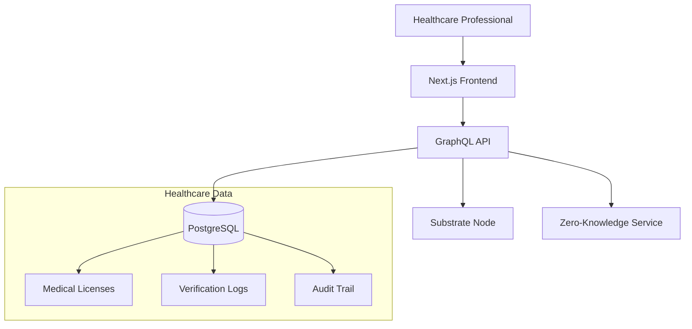

# Developer Onboarding Guide
## Chai VC Platform Healthcare Credentialing System

**🚀 Quick Start - Get productive in 2 hours**

---

## Prerequisites Checklist
- [ ] macOS/Linux with Docker installed
- [ ] Node.js 18+ and npm 9+
- [ ] Git configured with company SSH keys
- [ ] Access to company Slack channels
- [ ] 1Password access for shared credentials

---

## 15-Minute Setup

### 1. Clone & Environment Setup (3 minutes)
```bash
# Clone the repository
git clone git@github.com:company/chai-vc-platform.git
cd chai-vc-platform

# Copy environment template
cp .env.example .env.local

# Install dependencies (runs in all workspaces)
npm install

# Generate Prisma client
cd backend && npm run prisma:generate
```

### 2. Start Development Stack (5 minutes)
```bash
# Start all services (database, backend, frontend)
docker-compose up -d

# Wait for services to be healthy (check with)
docker-compose ps

# Seed the database with test data
cd backend && npm run seed
```

### 3. Verify Everything Works (2 minutes)
```bash
# Backend health check
curl http://localhost:4000/health

# Frontend
open http://localhost:3000

# GraphQL playground
open http://localhost:4000/graphql
```

### 4. Run Tests (5 minutes)
```bash
# Backend tests
cd backend && npm test

# Frontend tests
cd frontend && npm test

# E2E tests (optional for first setup)
cd e2e && npm run test:smoke
```

✅ **Setup Complete!** You should see:
- Frontend at `http://localhost:3000`
- Backend API at `http://localhost:4000`
- GraphQL Playground at `http://localhost:4000/graphql`
- Database at `localhost:5432`

---

## Architecture Overview (15 minutes)



### Key Components
| Component | Technology | Purpose |
|-----------|------------|---------|
| **Frontend** | Next.js 13 + TypeScript | Healthcare credential UI/UX |
| **Backend API** | Apollo GraphQL + Express | Business logic & healthcare workflows |
| **Database** | PostgreSQL + Prisma | PHI/PII storage with encryption |
| **Blockchain** | Substrate/Polkadot | Immutable credential proofs |
| **Zero-Knowledge** | Circom + snarkjs | Privacy-preserving verification |
| **Authentication** | DID-based + JWT | Decentralized identity |

---

## Development Workflow (30 minutes)

### Daily Development Flow
```bash
# 1. Start your day
git checkout main && git pull
docker-compose up -d  # Start local services

# 2. Create feature branch
git checkout -b feature/add-license-verification

# 3. Make changes, run tests frequently
cd backend && npm test -- --watch
cd frontend && npm run dev

# 4. Before committing
npm run lint:fix     # Auto-fix linting issues
npm run typecheck    # Ensure TypeScript compliance
npm test             # All tests pass

# 5. Commit and push
git add . && git commit -m "feat: add medical license verification"
git push -u origin feature/add-license-verification
```

### Pull Request Process
1. **Create PR** against `main` branch
2. **Required checks**: All tests pass, no lint errors, TypeScript compiles
3. **Required reviews**: 2 approvals (1 from senior dev, 1 from domain expert)
4. **Merge**: Squash and merge after approval

### Testing Strategy
```bash
# Unit tests (fastest feedback)
npm run test:unit

# Integration tests (API + database)
npm run test:integration

# E2E tests (full user journeys)
npm run test:e2e

# Healthcare-specific compliance tests
npm run test:compliance
```

---

## Key Files & Folders (10 minutes)

```
chai-vc-platform/
├── frontend/                    # Next.js healthcare UI
│   ├── pages/
│   │   ├── credentials/         # Credential management pages
│   │   ├── verify/              # Verification workflows
│   │   └── api/                 # API routes (Next.js)
│   ├── components/
│   │   ├── CredentialCard.tsx   # Reusable credential display
│   │   └── VerificationForm.tsx # ZK proof verification UI
│   └── hooks/                   # Custom React hooks
│
├── backend/                     # GraphQL API server
│   ├── src/
│   │   ├── graphql/
│   │   │   ├── resolvers.ts     # GraphQL business logic
│   │   │   └── schema.graphql   # API schema definition
│   │   ├── blockchain/          # Substrate integration
│   │   ├── services/            # Business logic services
│   │   └── middleware/          # Auth, logging, validation
│   ├── prisma/
│   │   ├── schema.prisma        # Database schema
│   │   └── seed.ts              # Test data generation
│   └── __tests__/               # Backend test suites
│
├── contracts/                   # Substrate pallets (Rust)
│   ├── credential-registry/     # On-chain credential registry
│   └── governance/              # Governance & voting logic
│
├── zk-circuits/                 # Zero-knowledge circuits
│   ├── medical-license.circom   # Medical license verification circuit
│   └── selective-disclosure.circom
│
├── docs/                        # Technical documentation
│   ├── technical-architecture.md
│   ├── api-reference.md         # GraphQL API docs
│   └── compliance-guide.md      # HIPAA/healthcare compliance
│
├── .env.example                 # Environment variables template
├── docker-compose.yml           # Local development stack
└── package.json                 # Monorepo configuration
```

---

## Common Commands Reference

### Development
```bash
# Start everything
npm run dev

# Backend only
cd backend && npm run dev

# Frontend only
cd frontend && npm run dev

# Database operations
cd backend && npm run prisma:studio    # Database GUI
cd backend && npm run prisma:migrate   # Apply schema changes

# Blockchain development
cd contracts && cargo build            # Build Rust pallets
docker-compose up substrate-node       # Start local blockchain
```

### Testing & Quality
```bash
# Run all tests
npm test

# Test specific service
cd backend && npm test
cd frontend && npm test

# Linting & formatting
npm run lint                    # Check all code
npm run lint:fix               # Auto-fix issues
npm run typecheck              # TypeScript validation
```

### Debugging
```bash
# View logs
docker-compose logs -f backend
docker-compose logs -f frontend

# Database debugging
cd backend && npx prisma studio

# GraphQL debugging
# Visit http://localhost:4000/graphql for GraphQL Playground
```

---

## Healthcare-Specific Development Notes (20 minutes)

### Working with PHI (Protected Health Information)
```typescript
// ❌ Bad: Logging sensitive data
console.log('Processing license:', licenseData);

// ✅ Good: Redacted logging
console.log('Processing license:', {
  id: licenseData.id,
  type: licenseData.type,
  // PHI fields omitted
});

// ❌ Bad: Direct database queries
const licenses = await db.license.findMany();

// ✅ Good: Use service layer with audit trails
const licenses = await licenseService.getLicensesForUser(userId, {
  auditReason: 'User dashboard display',
  requesterRole: 'HEALTHCARE_PROFESSIONAL'
});
```

### Zero-Knowledge Development
```typescript
// Example: Verifying medical license without revealing details
import { verifyMedicalLicense } from '../zk-circuits';

async function verifyLicenseZK(proof: ZKProof, publicInputs: PublicInputs) {
  // Verify proof without accessing private license details
  const isValid = await verifyMedicalLicense(proof, publicInputs);

  // Audit trail without sensitive data
  await auditService.logVerification({
    proofHash: hashProof(proof),
    result: isValid,
    timestamp: new Date()
  });

  return { isValid, proofVerified: true };
}
```

### Compliance Requirements
- **Audit Logging**: Every PHI access must be logged
- **Access Control**: Role-based permissions enforced
- **Data Encryption**: PHI encrypted at rest and in transit
- **Retention Policies**: Auto-deletion after retention period

---

## Troubleshooting Guide (15 minutes)

### Common Issues & Solutions

#### Database Connection Issues
```bash
# Problem: "database connection failed"
# Solution: Restart database service
docker-compose restart postgres

# Check database logs
docker-compose logs postgres

# Reset database (destructive!)
docker-compose down -v && docker-compose up -d
cd backend && npm run prisma:migrate:reset
```

#### Frontend Build Errors
```bash
# Problem: Next.js build failures
# Solution: Clear cache and reinstall
rm -rf frontend/.next
rm -rf node_modules
npm install
cd frontend && npm run build
```

#### GraphQL Schema Issues
```bash
# Problem: GraphQL schema out of sync
# Solution: Regenerate schema and restart
cd backend && npm run generate:schema
docker-compose restart backend
```

#### Zero-Knowledge Circuit Compilation
```bash
# Problem: Circuit compilation fails
# Solution: Rebuild circuits
cd zk-circuits && npm run compile:circuits
npm run generate:keys  # Regenerate proving keys
```

### Getting Help
1. **Slack Channels**:
   - `#dev-chai-vc` - General development questions
   - `#healthcare-compliance` - HIPAA/compliance questions
   - `#blockchain-dev` - Substrate/Web3 questions

2. **Documentation**:
   - API docs: `http://localhost:4000/graphql`
   - Architecture: `docs/technical-architecture.md`
   - Compliance: `docs/compliance-guide.md`

3. **Team Contacts**:
   - Tech Lead: @sarah.chen
   - Healthcare SME: @dr.martinez
   - Security: @alex.security

---

## Next Steps (15 minutes)

### Your First Week
- [ ] **Day 1**: Complete this onboarding, set up development environment
- [ ] **Day 2**: Read `docs/technical-architecture.md`, understand data flow
- [ ] **Day 3**: Pick up your first ticket (look for `good-first-issue` label)
- [ ] **Day 4**: Attend team standup, pair with senior developer
- [ ] **Day 5**: Submit your first PR, get familiar with review process

### Learning Path
1. **Healthcare Context** (Week 1)
   - Read HIPAA compliance requirements
   - Understand medical license verification workflows
   - Learn credential issuance processes

2. **Technical Deep Dive** (Week 2)
   - Master GraphQL API development
   - Learn zero-knowledge proof concepts
   - Understand blockchain integration

3. **Advanced Topics** (Weeks 3-4)
   - Cross-chain interoperability
   - Advanced privacy-preserving techniques
   - Governance and tokenomics

### Recommended First Issues
- `fix(frontend): improve error messaging in credential upload`
- `feat(backend): add pagination to license listing API`
- `docs(compliance): update HIPAA audit trail documentation`
- `test(integration): add test cases for verification workflow`

---

## Quick Reference Card

### Essential URLs
- **Local Frontend**: http://localhost:3000
- **Backend API**: http://localhost:4000
- **GraphQL Playground**: http://localhost:4000/graphql
- **Database Admin**: http://localhost:5555 (Prisma Studio)
- **Documentation**: http://localhost:3000/docs

### Key Environment Variables
```bash
DATABASE_URL="postgresql://..."
BLOCKCHAIN_RPC_URL="ws://localhost:9944"
ZK_PROVING_KEY_PATH="./circuits/keys/"
JWT_SECRET="your-jwt-secret"
ENCRYPTION_KEY="your-32-byte-key"
```

### Emergency Commands
```bash
# Reset everything (nuclear option)
docker-compose down -v && docker system prune -f
git clean -fdx && npm install
docker-compose up -d && sleep 30
cd backend && npm run seed

# Quick health check
npm run healthcheck
```

---

**🎉 Welcome to the team!** You're now ready to contribute to healthcare credential innovation.

**Questions?** Ask in `#dev-chai-vc` Slack channel or message your onboarding buddy.