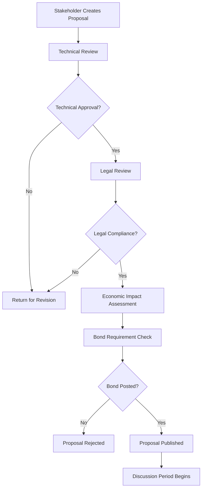

# Governance Process Documentation

## Executive Summary

This document defines the decentralized governance framework for the Chai VC Platform, establishing a transparent, democratic process for proposing, voting on, and enacting changes to platform parameters, policies, and protocol upgrades. The governance system balances stakeholder representation with technical expertise and regulatory compliance.

## Governance Overview

### Governance Principles
1. **Transparency**: All proposals and decisions are publicly visible
2. **Inclusivity**: All stakeholders can participate in governance
3. **Technical Merit**: Decisions based on technical and economic soundness
4. **Regulatory Compliance**: Governance must maintain legal compliance
5. **Progressive Decentralization**: Gradual transition to full community control

### Stakeholder Categories
```typescript
enum StakeholderType {
  HEALTHCARE_PROVIDER = 'healthcare_provider',    // 40% voting weight
  ISSUING_AUTHORITY = 'issuing_authority',        // 25% voting weight
  VERIFIER_ENTITY = 'verifier_entity',           // 20% voting weight
  TECHNICAL_CONTRIBUTOR = 'technical_contributor', // 10% voting weight
  COMMUNITY_MEMBER = 'community_member'           // 5% voting weight
}
```

### Governance Scope
- Protocol parameter changes
- Economic model adjustments
- Technical upgrade approvals
- Policy and compliance updates
- Treasury fund allocation
- Emergency response procedures

## Three-Phase Governance Process

### Phase 1: Proposal (propose)

#### Proposal Requirements
```typescript
interface GovernanceProposal {
  id: string;
  title: string;
  description: string;
  category: ProposalCategory;
  proposer: string;
  stakeholderType: StakeholderType;
  technicalSpecification?: TechnicalSpec;
  economicImpact: EconomicImpactAssessment;
  legalReview: LegalReviewStatus;
  implementationPlan: ImplementationPlan;
  votingThreshold: VotingThreshold;
  minimumQuorum: number;
  proposalBond: number; // VITA tokens required
  discussionPeriod: number; // days
  votingPeriod: number; // days
}

enum ProposalCategory {
  PROTOCOL_UPGRADE = 'protocol_upgrade',
  PARAMETER_CHANGE = 'parameter_change',
  ECONOMIC_POLICY = 'economic_policy',
  COMPLIANCE_UPDATE = 'compliance_update',
  TREASURY_ALLOCATION = 'treasury_allocation',
  EMERGENCY_ACTION = 'emergency_action'
}
```

#### Proposal Submission Process


#### Proposal Bond System
```typescript
class ProposalBondService {
  calculateBond(category: ProposalCategory, impact: EconomicImpact): number {
    const baseBond = {
      [ProposalCategory.PROTOCOL_UPGRADE]: 100000,    // 100K VITA
      [ProposalCategory.PARAMETER_CHANGE]: 50000,     // 50K VITA
      [ProposalCategory.ECONOMIC_POLICY]: 75000,      // 75K VITA
      [ProposalCategory.COMPLIANCE_UPDATE]: 25000,    // 25K VITA
      [ProposalCategory.TREASURY_ALLOCATION]: 200000, // 200K VITA
      [ProposalCategory.EMERGENCY_ACTION]: 10000      // 10K VITA
    };

    const impactMultiplier = {
      'low': 1.0,
      'medium': 1.5,
      'high': 2.0,
      'critical': 3.0
    };

    return baseBond[category] * impactMultiplier[impact.level];
  }
}
```

### Phase 2: Voting (vote)

#### Voting Mechanism
```typescript
interface VotingSystem {
  votingType: 'quadratic' | 'weighted' | 'binary';
  stakeholderWeights: Record<StakeholderType, number>;
  minimumQuorum: number;
  passingThreshold: number;
  vetoPowers: VetoPower[];
}

interface Vote {
  voter: string;
  voterType: StakeholderType;
  proposalId: string;
  choice: VoteChoice;
  weight: number;
  timestamp: Date;
  rationale?: string;
}

enum VoteChoice {
  FOR = 'for',
  AGAINST = 'against',
  ABSTAIN = 'abstain'
}
```

#### Quadratic Voting Implementation
```typescript
class QuadraticVotingService {
  calculateVotingPower(
    tokenBalance: number,
    stakeholderType: StakeholderType
  ): number {
    // Square root of token balance for quadratic voting
    const baseVotingPower = Math.sqrt(tokenBalance);

    // Apply stakeholder weight multiplier
    const stakeholderWeight = this.getStakeholderWeight(stakeholderType);

    return baseVotingPower * stakeholderWeight;
  }

  private getStakeholderWeight(type: StakeholderType): number {
    const weights = {
      [StakeholderType.HEALTHCARE_PROVIDER]: 1.0,
      [StakeholderType.ISSUING_AUTHORITY]: 1.2,
      [StakeholderType.VERIFIER_ENTITY]: 0.8,
      [StakeholderType.TECHNICAL_CONTRIBUTOR]: 0.6,
      [StakeholderType.COMMUNITY_MEMBER]: 0.4
    };
    return weights[type];
  }
}
```

#### Voting Period Structure
```typescript
interface VotingSchedule {
  discussionPeriod: number;    // 7-14 days
  votingPeriod: number;        // 5-7 days
  timelock: number;           // 2-7 days
  executionWindow: number;    // 30 days
}

class VotingPeriodService {
  getVotingSchedule(category: ProposalCategory): VotingSchedule {
    switch (category) {
      case ProposalCategory.EMERGENCY_ACTION:
        return {
          discussionPeriod: 1,  // 1 day
          votingPeriod: 2,      // 2 days
          timelock: 0,          // immediate
          executionWindow: 7
        };

      case ProposalCategory.PROTOCOL_UPGRADE:
        return {
          discussionPeriod: 14, // 14 days
          votingPeriod: 7,      // 7 days
          timelock: 7,          // 7 days
          executionWindow: 30
        };

      default:
        return {
          discussionPeriod: 7,
          votingPeriod: 5,
          timelock: 2,
          executionWindow: 30
        };
    }
  }
}
```

#### Veto Powers and Safeguards
```typescript
interface VetoPower {
  entity: string;
  entityType: 'regulatory' | 'technical' | 'security';
  scope: ProposalCategory[];
  vetoPeriod: number; // hours after vote passes
}

const VETO_POWERS: VetoPower[] = [
  {
    entity: 'technical_committee',
    entityType: 'technical',
    scope: [ProposalCategory.PROTOCOL_UPGRADE, ProposalCategory.PARAMETER_CHANGE],
    vetoPeriod: 72
  },
  {
    entity: 'compliance_officer',
    entityType: 'regulatory',
    scope: [ProposalCategory.COMPLIANCE_UPDATE, ProposalCategory.ECONOMIC_POLICY],
    vetoPeriod: 48
  },
  {
    entity: 'security_council',
    entityType: 'security',
    scope: Object.values(ProposalCategory),
    vetoPeriod: 24
  }
];
```

### Phase 3: Enactment (enact)

#### Execution Framework
```typescript
class ProposalExecutionService {
  async executeProposal(proposalId: string): Promise<ExecutionResult> {
    const proposal = await this.getProposal(proposalId);

    // Verify proposal passed and is ready for execution
    await this.validateExecutionReadiness(proposal);

    try {
      switch (proposal.category) {
        case ProposalCategory.PROTOCOL_UPGRADE:
          return await this.executeProtocolUpgrade(proposal);

        case ProposalCategory.PARAMETER_CHANGE:
          return await this.executeParameterChange(proposal);

        case ProposalCategory.TREASURY_ALLOCATION:
          return await this.executeTreasuryAllocation(proposal);

        default:
          return await this.executeGenericProposal(proposal);
      }
    } catch (error) {
      await this.handleExecutionFailure(proposalId, error);
      throw error;
    }
  }

  private async executeProtocolUpgrade(
    proposal: GovernanceProposal
  ): Promise<ExecutionResult> {
    // Multi-sig execution for protocol upgrades
    const multisigTx = await this.createMultisigTransaction(proposal);

    // Deploy new contracts or upgrade existing ones
    const deploymentResult = await this.deployUpgrade(proposal.technicalSpecification);

    // Update registry with new contract addresses
    await this.updateRegistry(deploymentResult);

    return {
      status: 'executed',
      transactionHash: multisigTx.hash,
      executedAt: new Date(),
      changes: deploymentResult.changes
    };
  }
}
```

#### Timelock Implementation
```typescript
class TimelockService {
  async scheduleExecution(
    proposalId: string,
    executionTime: Date
  ): Promise<void> {
    const timelockTx = await this.createTimelockTransaction(proposalId, executionTime);

    await this.storeTimelockSchedule({
      proposalId,
      scheduledFor: executionTime,
      transactionHash: timelockTx.hash,
      status: 'scheduled'
    });
  }

  async executeScheduledProposal(proposalId: string): Promise<ExecutionResult> {
    const schedule = await this.getTimelockSchedule(proposalId);

    // Verify timelock period has passed
    if (Date.now() < schedule.scheduledFor.getTime()) {
      throw new Error('Timelock period has not elapsed');
    }

    // Execute the proposal
    return await this.executeProposal(proposalId);
  }
}
```

## Specialized Governance Mechanisms

### Emergency Governance
```typescript
interface EmergencyProposal extends GovernanceProposal {
  emergencyType: EmergencyType;
  securityCouncilApproval: boolean;
  emergencyJustification: string;
  automaticExpiry: Date; // Auto-expires if not renewed
}

enum EmergencyType {
  SECURITY_BREACH = 'security_breach',
  REGULATORY_ORDER = 'regulatory_order',
  TECHNICAL_FAILURE = 'technical_failure',
  ECONOMIC_CRISIS = 'economic_crisis'
}

class EmergencyGovernanceService {
  async proposeEmergencyAction(
    proposal: EmergencyProposal
  ): Promise<string> {
    // Emergency proposals skip normal discussion period
    // Require security council pre-approval
    if (!proposal.securityCouncilApproval) {
      throw new Error('Emergency proposals require security council approval');
    }

    // Reduced voting period and immediate execution
    const proposalId = await this.submitProposal({
      ...proposal,
      discussionPeriod: 0,
      votingPeriod: 1, // 1 day
      timelock: 0
    });

    return proposalId;
  }
}
```

### Parameter Governance
```typescript
interface ParameterChange {
  parameter: string;
  currentValue: any;
  newValue: any;
  rationale: string;
  impactAssessment: ImpactAssessment;
}

const GOVERNABLE_PARAMETERS = {
  // Economic parameters
  'staking.minimumStake': { type: 'number', min: 1000, max: 100000 },
  'staking.slashingRate': { type: 'percentage', min: 0.01, max: 0.5 },
  'fees.verificationFee': { type: 'number', min: 1, max: 1000 },

  // Technical parameters
  'consensus.blockTime': { type: 'number', min: 3, max: 30 },
  'zkp.provingTimeout': { type: 'number', min: 30, max: 300 },

  // Compliance parameters
  'audit.retentionPeriod': { type: 'number', min: 365, max: 2555 } // days
};
```

### Treasury Governance
```typescript
interface TreasuryAllocation {
  recipient: string;
  amount: number;
  purpose: TreasuryPurpose;
  milestones: Milestone[];
  vestingSchedule?: VestingSchedule;
}

enum TreasuryPurpose {
  DEVELOPMENT = 'development',
  SECURITY_AUDIT = 'security_audit',
  MARKETING = 'marketing',
  ECOSYSTEM_INCENTIVES = 'ecosystem_incentives',
  LEGAL_COMPLIANCE = 'legal_compliance',
  EMERGENCY_FUND = 'emergency_fund'
}

class TreasuryGovernanceService {
  async proposeTreasuryAllocation(
    allocation: TreasuryAllocation
  ): Promise<string> {
    // Validate treasury has sufficient funds
    const treasuryBalance = await this.getTreasuryBalance();
    if (treasuryBalance < allocation.amount) {
      throw new Error('Insufficient treasury funds');
    }

    // Require higher threshold for treasury allocations
    return await this.submitProposal({
      category: ProposalCategory.TREASURY_ALLOCATION,
      technicalSpecification: allocation,
      votingThreshold: 0.66, // 66% approval required
      minimumQuorum: 0.4 // 40% participation required
    });
  }
}
```

## Governance Infrastructure

### On-Chain Governance Contracts
```solidity
contract ChaiGovernance {
    struct Proposal {
        uint256 id;
        address proposer;
        string title;
        string description;
        uint256 startBlock;
        uint256 endBlock;
        uint256 forVotes;
        uint256 againstVotes;
        mapping(address => bool) hasVoted;
        bool executed;
        bool canceled;
    }

    mapping(uint256 => Proposal) public proposals;
    mapping(address => uint256) public votingPower;

    event ProposalCreated(uint256 indexed id, address indexed proposer);
    event VoteCast(address indexed voter, uint256 indexed proposalId, bool support);
    event ProposalExecuted(uint256 indexed id);

    function propose(
        string memory title,
        string memory description,
        uint256 votingPeriod
    ) external returns (uint256) {
        require(votingPower[msg.sender] >= proposalThreshold, "Insufficient voting power");

        uint256 proposalId = proposalCount++;
        Proposal storage newProposal = proposals[proposalId];
        newProposal.id = proposalId;
        newProposal.proposer = msg.sender;
        newProposal.title = title;
        newProposal.description = description;
        newProposal.startBlock = block.number;
        newProposal.endBlock = block.number + votingPeriod;

        emit ProposalCreated(proposalId, msg.sender);
        return proposalId;
    }

    function castVote(uint256 proposalId, bool support) external {
        require(proposals[proposalId].startBlock <= block.number, "Voting not started");
        require(proposals[proposalId].endBlock >= block.number, "Voting ended");
        require(!proposals[proposalId].hasVoted[msg.sender], "Already voted");

        uint256 weight = votingPower[msg.sender];
        if (support) {
            proposals[proposalId].forVotes += weight;
        } else {
            proposals[proposalId].againstVotes += weight;
        }

        proposals[proposalId].hasVoted[msg.sender] = true;
        emit VoteCast(msg.sender, proposalId, support);
    }
}
```

### Voting Power Calculation
```typescript
class VotingPowerService {
  async calculateVotingPower(address: string): Promise<number> {
    const [
      stakedTokens,
      delegatedPower,
      stakeholderMultiplier,
      participationBonus
    ] = await Promise.all([
      this.getStakedTokens(address),
      this.getDelegatedPower(address),
      this.getStakeholderMultiplier(address),
      this.getParticipationBonus(address)
    ]);

    const basePower = Math.sqrt(stakedTokens + delegatedPower);
    const adjustedPower = basePower * stakeholderMultiplier * participationBonus;

    return Math.floor(adjustedPower);
  }

  private async getParticipationBonus(address: string): Promise<number> {
    const participationRate = await this.getParticipationRate(address);

    // Bonus for active participation in governance
    if (participationRate > 0.8) return 1.2;  // 20% bonus
    if (participationRate > 0.6) return 1.1;  // 10% bonus
    if (participationRate > 0.4) return 1.0;  // No bonus
    return 0.9; // 10% penalty for low participation
  }
}
```

## Governance Monitoring and Analytics

### Key Metrics
```typescript
interface GovernanceMetrics {
  totalProposals: number;
  passedProposals: number;
  failedProposals: number;
  averageParticipation: number;
  stakeholderDistribution: Record<StakeholderType, number>;
  treasuryBalance: number;
  governanceTokenSupply: number;
}

class GovernanceAnalyticsService {
  async generateGovernanceReport(period: TimePeriod): Promise<GovernanceReport> {
    const metrics = await this.calculateMetrics(period);

    return {
      period,
      metrics,
      topProposals: await this.getTopProposals(period),
      participationTrends: await this.getParticipationTrends(period),
      stakeholderAnalysis: await this.getStakeholderAnalysis(period),
      recommendations: await this.generateRecommendations(metrics)
    };
  }
}
```

### Governance Health Indicators
```typescript
const GOVERNANCE_HEALTH_INDICATORS = {
  participation: {
    healthy: 0.4,    // 40% participation
    warning: 0.25,   // 25% participation
    critical: 0.15   // 15% participation
  },
  proposalSuccess: {
    healthy: 0.6,    // 60% success rate
    warning: 0.4,    // 40% success rate
    critical: 0.2    // 20% success rate
  },
  stakeholderBalance: {
    maxSingleStakeholder: 0.3, // No single stakeholder > 30%
    minDiversity: 5 // At least 5 different stakeholder types
  }
};
```

## Legal and Compliance Framework

### Regulatory Compliance
```typescript
interface ComplianceCheck {
  jurisdiction: string;
  regulatoryBody: string;
  complianceType: 'securities' | 'healthcare' | 'data_protection';
  status: 'compliant' | 'non_compliant' | 'under_review';
  lastReviewed: Date;
  nextReview: Date;
}

class GovernanceComplianceService {
  async validateProposalCompliance(
    proposal: GovernanceProposal
  ): Promise<ComplianceResult> {
    const checks = await Promise.all([
      this.checkSecuritiesCompliance(proposal),
      this.checkHealthcareCompliance(proposal),
      this.checkDataProtectionCompliance(proposal)
    ]);

    return {
      compliant: checks.every(check => check.compliant),
      checks,
      recommendations: this.generateComplianceRecommendations(checks)
    };
  }
}
```

### Dispute Resolution
```typescript
interface GovernanceDispute {
  disputeId: string;
  proposalId: string;
  disputant: string;
  disputeType: DisputeType;
  arbitrators: string[];
  resolution?: DisputeResolution;
  createdAt: Date;
  resolvedAt?: Date;
}

enum DisputeType {
  VOTING_IRREGULARITY = 'voting_irregularity',
  EXECUTION_ERROR = 'execution_error',
  COMPLIANCE_VIOLATION = 'compliance_violation',
  TECHNICAL_DISPUTE = 'technical_dispute'
}
```

---

*Document Version: 1.0*
*Last Updated: September 2025*
*Next Review: December 2025*