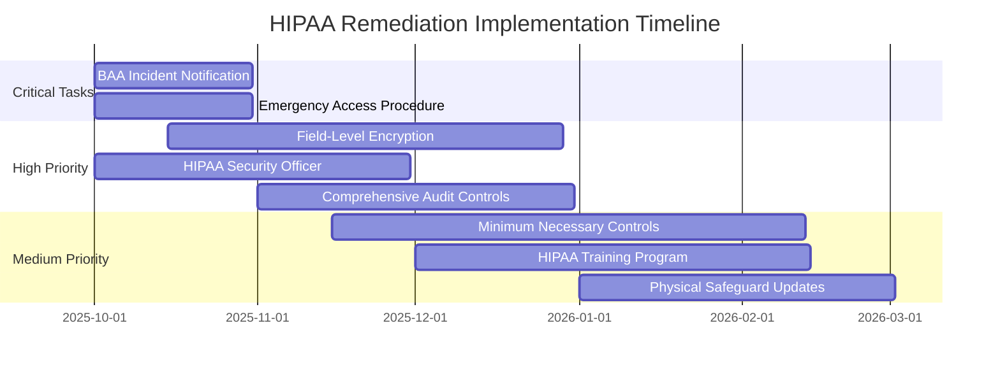

# HIPAA Mapping & Remediation Tasks

## Executive Summary

This document provides a comprehensive mapping of Chai VC Platform modules to HIPAA safeguards, identifies compliance gaps, and establishes prioritized remediation tasks. The analysis covers Administrative, Physical, and Technical Safeguards with specific focus on healthcare credential verification workflows.

## HIPAA Applicability Analysis

### Covered Entity Determination
```typescript
interface HIPAAApplicability {
  entity_type: 'Covered Entity' | 'Business Associate' | 'Not Covered';
  determination_factors: {
    handles_phi: boolean;
    healthcare_functions: string[];
    business_relationships: BusinessRelationship[];
  };
  regulatory_obligations: ComplianceObligation[];
}

const CHAI_VC_HIPAA_STATUS: HIPAAApplicability = {
  entity_type: 'Business Associate',
  determination_factors: {
    handles_phi: true,
    healthcare_functions: [
      'credential_verification',
      'license_validation',
      'employment_verification',
      'continuing_education_tracking'
    ],
    business_relationships: [
      {
        partner: 'Hospitals and Health Systems',
        relationship: 'Service Provider',
        phi_access: 'Employee Healthcare Information'
      },
      {
        partner: 'Medical Boards',
        relationship: 'Data Processor',
        phi_access: 'Licensed Professional Information'
      }
    ]
  },
  regulatory_obligations: [
    'Business Associate Agreement Compliance',
    'HIPAA Security Rule Implementation',
    'Breach Notification Requirements',
    'Minimum Necessary Standard'
  ]
};
```

### PHI Classification in Credential System
```sql
-- PHI Data Classification for Credential Verification
CREATE TABLE phi_classification (
    data_element VARCHAR(100) PRIMARY KEY,
    phi_category VARCHAR(50) NOT NULL,
    sensitivity_level VARCHAR(20) NOT NULL,
    hipaa_identifier_type VARCHAR(50),
    current_protection VARCHAR(100),
    required_protection VARCHAR(100),
    gap_identified BOOLEAN DEFAULT FALSE
);

INSERT INTO phi_classification VALUES
-- Direct Identifiers
('full_name', 'Direct Identifier', 'HIGH', '45 CFR 164.514(b)(2)(i)(A)', 'Encrypted at rest', 'Encrypted + Access Controls', FALSE),
('social_security_number', 'Direct Identifier', 'CRITICAL', '45 CFR 164.514(b)(2)(i)(I)', 'Hashed + Encrypted', 'Hashed + Encrypted + Audit', FALSE),
('medical_license_number', 'Direct Identifier', 'HIGH', '45 CFR 164.514(b)(2)(i)(N)', 'Encrypted at rest', 'Encrypted + Access Controls', FALSE),
('date_of_birth', 'Direct Identifier', 'HIGH', '45 CFR 164.514(b)(2)(i)(C)', 'Encrypted at rest', 'Encrypted + Minimum Necessary', FALSE),
('home_address', 'Direct Identifier', 'HIGH', '45 CFR 164.514(b)(2)(i)(E)', 'Encrypted at rest', 'Encrypted + Geographic Limits', TRUE),

-- Quasi-Identifiers
('graduation_date', 'Quasi-Identifier', 'MEDIUM', 'Education Record', 'Stored plaintext', 'Date truncation + Encryption', TRUE),
('specialty_certification', 'Quasi-Identifier', 'MEDIUM', 'Professional Record', 'Stored plaintext', 'Aggregated reporting only', TRUE),
('employment_history', 'Quasi-Identifier', 'MEDIUM', 'Professional Record', 'Stored plaintext', 'Limited retention + Encryption', TRUE),

-- Administrative Data
('verification_requests', 'Administrative', 'LOW', 'Audit Data', 'Log files', 'Structured audit trail', TRUE),
('system_access_logs', 'Administrative', 'MEDIUM', 'Audit Data', 'Log files', 'Tamper-proof logging', TRUE);
```

## HIPAA Administrative Safeguards Mapping

### §164.308(a)(1) - Security Officer
```yaml
Administrative_Safeguards:
  Security_Officer:
    requirement: "Assign security responsibilities to an individual"
    current_implementation:
      role: "Chief Security Officer (CSO)"
      responsibilities:
        - "Overall HIPAA compliance oversight"
        - "Security incident response coordination"
        - "Security awareness training program"
        - "Risk assessment leadership"
      authority_level: "C-level executive"
      reporting_structure: "Reports to CEO"

    gaps_identified:
      - gap_id: "ASG001"
        description: "No formal HIPAA Security Officer designation"
        priority: "HIGH"
        current_state: "CSO handles general security, not HIPAA-specific"
        required_state: "Designated HIPAA Security Officer with specific training"
        remediation_effort: "Low - documentation and training"

      - gap_id: "ASG002"
        description: "Insufficient HIPAA-specific training for security team"
        priority: "MEDIUM"
        current_state: "General security training only"
        required_state: "HIPAA Security Rule specific training"
        remediation_effort: "Medium - training program development"

    remediation_tasks:
      - task_id: "ASG001-R1"
        title: "Formally designate HIPAA Security Officer"
        description: "Create job description and formally designate responsible individual"
        priority: "HIGH"
        effort_hours: 16
        dependencies: []
        deliverables:
          - "HIPAA Security Officer job description"
          - "Formal designation letter"
          - "Updated organizational chart"

      - task_id: "ASG001-R2"
        title: "Implement HIPAA Security Officer training"
        description: "Provide specialized HIPAA training to designated officer"
        priority: "HIGH"
        effort_hours: 40
        dependencies: ["ASG001-R1"]
        deliverables:
          - "Training completion certificate"
          - "HIPAA knowledge assessment results"
```

### §164.308(a)(2) - Workforce Training
```typescript
interface WorkforceTrainingCompliance {
  requirement: string;
  current_implementation: TrainingProgram;
  gaps: ComplianceGap[];
  remediation_tasks: RemediationTask[];
}

const WORKFORCE_TRAINING_MAPPING: WorkforceTrainingCompliance = {
  requirement: "Implement procedures for authorization and/or supervision of workforce members",
  current_implementation: {
    training_platform: "Internal LMS",
    courses: [
      {
        name: "General Security Awareness",
        frequency: "Annual",
        completion_rate: 0.95,
        hipaa_specific: false
      },
      {
        name: "Data Privacy Fundamentals",
        frequency: "Annual",
        completion_rate: 0.87,
        hipaa_specific: false
      }
    ],
    access_controls: {
      role_based_access: true,
      minimum_necessary: false,
      regular_reviews: "Quarterly"
    }
  },
  gaps: [
    {
      gap_id: "ASG003",
      description: "No HIPAA-specific training program",
      priority: "HIGH",
      impact: "Non-compliance with workforce training requirements",
      current_state: "Generic privacy training only",
      required_state: "HIPAA Security and Privacy Rule training"
    },
    {
      gap_id: "ASG004",
      description: "Missing minimum necessary training",
      priority: "MEDIUM",
      impact: "Risk of excessive PHI access",
      current_state: "Full access based on role",
      required_state: "Minimum necessary principle application"
    }
  ],
  remediation_tasks: [
    {
      task_id: "ASG003-R1",
      title: "Develop HIPAA-specific training curriculum",
      priority: "HIGH",
      effort_hours: 80,
      cost_estimate: 25000,
      deliverables: [
        "HIPAA Security Rule training module",
        "HIPAA Privacy Rule training module",
        "Breach notification training module",
        "Role-specific training tracks"
      ]
    }
  ]
};
```

### §164.308(a)(3) - Information Access Management
```python
# Information Access Management Gap Analysis
class InformationAccessAnalysis:
    def __init__(self):
        self.current_access_controls = self.analyze_current_access()
        self.required_controls = self.get_hipaa_requirements()

    def analyze_current_access(self):
        return {
            'access_control_method': 'Role-Based Access Control (RBAC)',
            'authentication': 'Multi-factor authentication',
            'authorization_granularity': 'Module-level',
            'access_review_frequency': 'Quarterly',
            'automatic_logoff': True,
            'unique_user_identification': True,
            'emergency_access': False,  # GAP
            'minimum_necessary_controls': False,  # GAP
            'audit_trail_completeness': 'Partial'  # GAP
        }

    def identify_gaps(self):
        gaps = []

        # Gap: Emergency Access Procedure
        gaps.append({
            'gap_id': 'ASG005',
            'requirement': '§164.312(a)(2)(ii) Emergency access procedure',
            'description': 'No formal emergency access procedure for PHI',
            'priority': 'HIGH',
            'current_state': 'Admin override available but not documented',
            'required_state': 'Formal emergency access procedure with audit trail',
            'risk_level': 'HIGH',
            'business_impact': 'Potential delayed emergency response',
            'compliance_impact': 'HIPAA violation risk'
        })

        # Gap: Minimum Necessary Implementation
        gaps.append({
            'gap_id': 'ASG006',
            'requirement': '§164.502(b) Minimum necessary standard',
            'description': 'Access controls not implemented at minimum necessary level',
            'priority': 'MEDIUM',
            'current_state': 'Broad role-based access permissions',
            'required_state': 'Granular field-level access based on job function',
            'risk_level': 'MEDIUM',
            'business_impact': 'Privacy exposure risk',
            'compliance_impact': 'HIPAA Privacy Rule violation'
        })

        return gaps

    def generate_remediation_plan(self):
        return [
            {
                'task_id': 'ASG005-R1',
                'title': 'Implement Emergency Access Procedure',
                'description': 'Create and implement formal emergency PHI access procedure',
                'priority': 'HIGH',
                'timeline': '6 weeks',
                'effort_hours': 120,
                'resources_required': [
                    'Security Engineer',
                    'Compliance Officer',
                    'System Administrator'
                ],
                'deliverables': [
                    'Emergency Access Policy Document',
                    'Emergency Access Technical Implementation',
                    'Audit Trail Enhancement',
                    'Staff Training on Emergency Procedures'
                ],
                'acceptance_criteria': [
                    'Emergency access can be granted within 15 minutes',
                    'All emergency access is logged and auditable',
                    'Emergency access automatically expires after 24 hours',
                    'Emergency access triggers compliance notification'
                ]
            }
        ]
```

## HIPAA Physical Safeguards Mapping

### §164.310(a)(1) - Facility Access Controls
```json
{
  "physical_safeguards": {
    "facility_access_controls": {
      "requirement": "Limit physical access to electronic information systems and equipment",
      "current_implementation": {
        "primary_datacenter": {
          "location": "AWS us-west-2",
          "physical_controls": "AWS SOC 2 compliant facility",
          "access_method": "Cloud provider managed",
          "compliance_status": "COMPLIANT"
        },
        "office_facilities": {
          "locations": ["San Francisco HQ", "Remote workforce"],
          "access_controls": {
            "keycard_access": true,
            "visitor_management": true,
            "secure_workstations": false,
            "clean_desk_policy": false
          },
          "compliance_status": "PARTIAL"
        }
      },
      "gaps": [
        {
          "gap_id": "PSG001",
          "description": "No secure workstation requirements for PHI access",
          "priority": "MEDIUM",
          "affected_locations": ["San Francisco HQ", "Remote workers"],
          "current_state": "Standard business workstations",
          "required_state": "Workstations with PHI access controls",
          "remediation": {
            "task": "Implement workstation security standards",
            "effort_hours": 60,
            "cost_estimate": 50000
          }
        },
        {
          "gap_id": "PSG002",
          "description": "Missing clean desk policy for PHI materials",
          "priority": "LOW",
          "affected_locations": ["San Francisco HQ"],
          "current_state": "No formal clean desk policy",
          "required_state": "Clean desk policy with PHI handling procedures",
          "remediation": {
            "task": "Develop and implement clean desk policy",
            "effort_hours": 24,
            "cost_estimate": 5000
          }
        }
      ]
    }
  }
}
```

## HIPAA Technical Safeguards Mapping

### §164.312(a)(1) - Access Control
```typescript
class TechnicalSafeguardMapping {
  private accessControlAnalysis(): ComplianceAnalysis {
    return {
      requirement: '§164.312(a)(1) Access Control',
      description: 'Unique user identification, emergency access, automatic logoff, encryption',

      current_implementation: {
        unique_user_identification: {
          status: 'COMPLIANT',
          implementation: 'JWT tokens with user ID',
          evidence: 'Authentication system audit logs'
        },
        automatic_logoff: {
          status: 'COMPLIANT',
          implementation: 'Session timeout after 30 minutes',
          evidence: 'Frontend session management code'
        },
        encryption_decryption: {
          status: 'PARTIAL',
          implementation: 'AES-256 for data at rest, TLS 1.3 in transit',
          gaps: ['No field-level encryption for highly sensitive PHI']
        }
      },

      gaps: [
        {
          gap_id: 'TSG001',
          requirement: '§164.312(a)(2)(iv) Encryption and decryption',
          description: 'Insufficient encryption granularity for PHI elements',
          priority: 'HIGH',
          current_state: 'Database-level encryption only',
          required_state: 'Field-level encryption for SSN, addresses, etc.',
          technical_complexity: 'HIGH',
          business_impact: 'Data breach risk reduction',
          remediation_tasks: [
            {
              task_id: 'TSG001-R1',
              title: 'Implement field-level PHI encryption',
              description: 'Add application-level encryption for sensitive PHI fields',
              effort_estimate: 200,
              technical_requirements: [
                'Key management system integration',
                'Database schema modifications',
                'Application code updates',
                'Performance impact analysis'
              ]
            }
          ]
        }
      ]
    };
  }

  private auditControlsAnalysis(): ComplianceAnalysis {
    return {
      requirement: '§164.312(b) Audit controls',
      description: 'Hardware, software, and procedural mechanisms for recording access',

      current_implementation: {
        access_logging: {
          status: 'PARTIAL',
          coverage: ['API endpoints', 'Database queries', 'Authentication events'],
          gaps: ['PHI field-level access', 'Data export events', 'Bulk operations']
        },
        log_integrity: {
          status: 'COMPLIANT',
          implementation: 'Immutable logging with cryptographic signatures',
          evidence: 'Blockchain audit trail system'
        },
        log_analysis: {
          status: 'BASIC',
          implementation: 'Manual review and basic alerting',
          gaps: ['Automated PHI access pattern analysis', 'Machine learning anomaly detection']
        }
      },

      gaps: [
        {
          gap_id: 'TSG002',
          requirement: 'Comprehensive PHI access audit trail',
          priority: 'MEDIUM',
          remediation_tasks: [
            {
              task_id: 'TSG002-R1',
              title: 'Enhance audit logging for PHI access',
              description: 'Implement comprehensive PHI access logging and monitoring',
              effort_estimate: 120,
              deliverables: [
                'Field-level access logging',
                'PHI access dashboard',
                'Automated anomaly alerts',
                'Compliance reporting automation'
              ]
            }
          ]
        }
      ]
    };
  }
}
```

### §164.312(c)(1) - Integrity
```sql
-- Data Integrity Controls Assessment
CREATE TABLE hipaa_integrity_controls (
    control_id VARCHAR(20) PRIMARY KEY,
    requirement_section VARCHAR(20) NOT NULL,
    control_description TEXT NOT NULL,
    current_implementation TEXT,
    compliance_status VARCHAR(20) NOT NULL,
    gap_description TEXT,
    priority VARCHAR(10),
    remediation_plan TEXT
);

INSERT INTO hipaa_integrity_controls VALUES
('INT001', '§164.312(c)(1)',
 'Protect ePHI from improper alteration or destruction',
 'Database constraints, application validation, audit trails',
 'PARTIAL',
 'No cryptographic integrity verification for PHI records',
 'MEDIUM',
 'Implement digital signatures for PHI record integrity'),

('INT002', '§164.312(c)(2)',
 'Mechanism to authenticate ePHI has not been improperly modified',
 'Hash-based integrity checks on database backups only',
 'INCOMPLETE',
 'No real-time integrity monitoring for individual PHI records',
 'HIGH',
 'Implement real-time integrity monitoring with blockchain attestation'),

('INT003', 'CUSTOM',
 'Version control and change tracking for PHI',
 'Database triggers for audit trail creation',
 'BASIC',
 'Limited granularity in change tracking',
 'LOW',
 'Enhanced change tracking with field-level versioning');
```

## Business Associate Agreement (BAA) Requirements

### Current BAA Analysis
```typescript
interface BAARequirement {
  section: string;
  requirement: string;
  current_compliance: 'COMPLIANT' | 'PARTIAL' | 'NON_COMPLIANT';
  implementation_details: string;
  gaps?: string[];
  remediation_priority: 'LOW' | 'MEDIUM' | 'HIGH' | 'CRITICAL';
}

const BAA_COMPLIANCE_MATRIX: BAARequirement[] = [
  {
    section: '§164.502(e)(2)(i)(A)',
    requirement: 'Use PHI only for specified purposes',
    current_compliance: 'COMPLIANT',
    implementation_details: 'Purpose limitation enforced through access controls and data processing policies',
    remediation_priority: 'LOW'
  },
  {
    section: '§164.502(e)(2)(i)(B)',
    requirement: 'Ensure workforce compliance with BAA terms',
    current_compliance: 'PARTIAL',
    implementation_details: 'General training program exists but lacks BAA-specific content',
    gaps: ['No BAA-specific training module', 'No workforce attestation process'],
    remediation_priority: 'MEDIUM'
  },
  {
    section: '§164.502(e)(2)(i)(C)',
    requirement: 'Implement appropriate safeguards',
    current_compliance: 'PARTIAL',
    implementation_details: 'Technical and administrative safeguards implemented',
    gaps: ['Physical safeguard gaps identified', 'Audit controls need enhancement'],
    remediation_priority: 'HIGH'
  },
  {
    section: '§164.504(e)(2)(i)(D)',
    requirement: 'Report security incidents to covered entity',
    current_compliance: 'NON_COMPLIANT',
    implementation_details: 'Internal incident response process exists',
    gaps: ['No automated notification to covered entities', 'No incident reporting templates'],
    remediation_priority: 'CRITICAL'
  }
];
```

## Prioritized Remediation Plan

### Critical Priority Tasks (Complete within 30 days)
```yaml
critical_tasks:
  - task_id: "CRIT001"
    title: "Implement BAA Incident Notification System"
    requirement: "§164.504(e)(2)(i)(D)"
    description: "Create automated system to notify covered entities of security incidents"
    effort_hours: 80
    cost_estimate: 15000
    resources:
      - "Security Engineer (Lead)"
      - "Compliance Officer"
      - "DevOps Engineer"
    deliverables:
      - "Automated notification system"
      - "Incident notification templates"
      - "SLA agreements with covered entities"
      - "Testing and validation documentation"
    acceptance_criteria:
      - "Incidents trigger notifications within 4 hours"
      - "All covered entities receive appropriate notifications"
      - "Notification templates approved by legal"

  - task_id: "CRIT002"
    title: "Emergency PHI Access Procedure"
    requirement: "§164.312(a)(2)(ii)"
    description: "Implement formal emergency access procedure with audit controls"
    effort_hours: 60
    cost_estimate: 10000
    deliverables:
      - "Emergency access policy"
      - "Technical implementation"
      - "Audit trail system"
      - "Staff training materials"
```

### High Priority Tasks (Complete within 90 days)
```yaml
high_priority_tasks:
  - task_id: "HIGH001"
    title: "Field-Level PHI Encryption"
    requirement: "§164.312(a)(2)(iv)"
    description: "Implement application-level encryption for sensitive PHI elements"
    effort_hours: 200
    cost_estimate: 35000
    technical_complexity: "HIGH"
    dependencies: ["Key management system upgrade"]
    deliverables:
      - "Field-level encryption implementation"
      - "Key management integration"
      - "Performance impact assessment"
      - "Migration plan for existing data"

  - task_id: "HIGH002"
    title: "HIPAA Security Officer Designation and Training"
    requirement: "§164.308(a)(2)"
    description: "Formally designate and train HIPAA Security Officer"
    effort_hours: 80
    cost_estimate: 20000
    deliverables:
      - "Job description and formal designation"
      - "HIPAA-specific training completion"
      - "Organizational structure updates"
      - "Responsibility matrix documentation"
```

### Medium Priority Tasks (Complete within 180 days)
```yaml
medium_priority_tasks:
  - task_id: "MED001"
    title: "Comprehensive PHI Audit Enhancement"
    requirement: "§164.312(b)"
    description: "Enhance audit controls for comprehensive PHI access monitoring"
    effort_hours: 120
    cost_estimate: 25000

  - task_id: "MED002"
    title: "Minimum Necessary Implementation"
    requirement: "§164.502(b)"
    description: "Implement granular access controls based on minimum necessary standard"
    effort_hours: 160
    cost_estimate: 30000

  - task_id: "MED003"
    title: "HIPAA Workforce Training Program"
    requirement: "§164.530(b)"
    description: "Develop and implement comprehensive HIPAA training program"
    effort_hours: 100
    cost_estimate: 25000
```

## Implementation Timeline



## Compliance Monitoring

### Automated Compliance Monitoring System
```typescript
class HIPAAComplianceMonitor {
  private monitoringRules: ComplianceRule[] = [
    {
      rule_id: 'HIPAA_001',
      requirement: 'Access Control - Unique User Identification',
      check_type: 'AUTOMATED',
      frequency: 'DAILY',
      query: 'SELECT COUNT(*) FROM user_sessions WHERE user_id IS NULL',
      threshold: 0,
      alert_level: 'CRITICAL'
    },
    {
      rule_id: 'HIPAA_002',
      requirement: 'Audit Controls - PHI Access Logging',
      check_type: 'AUTOMATED',
      frequency: 'HOURLY',
      query: 'SELECT COUNT(*) FROM phi_access_log WHERE logged_at > NOW() - INTERVAL 1 HOUR',
      threshold_type: 'MINIMUM',
      threshold: 1,
      alert_level: 'MEDIUM'
    }
  ];

  async runComplianceChecks(): Promise<ComplianceReport> {
    const results = await Promise.all(
      this.monitoringRules.map(rule => this.executeRule(rule))
    );

    return {
      report_date: new Date(),
      overall_status: this.calculateOverallStatus(results),
      rule_results: results,
      remediation_required: results.filter(r => r.status === 'FAILED'),
      next_assessment: this.scheduleNextAssessment()
    };
  }
}
```

## Cost-Benefit Analysis

### Remediation Investment Summary
```json
{
  "total_remediation_cost": {
    "critical_tasks": 25000,
    "high_priority": 75000,
    "medium_priority": 80000,
    "total": 180000
  },
  "risk_reduction_value": {
    "breach_cost_avoidance": 2000000,
    "regulatory_fine_avoidance": 500000,
    "reputation_protection": 1000000,
    "total_risk_reduction": 3500000
  },
  "roi_analysis": {
    "investment": 180000,
    "risk_reduction": 3500000,
    "roi_ratio": "19.4:1",
    "payback_period": "3 months"
  },
  "ongoing_compliance_cost": {
    "annual_monitoring": 50000,
    "training_updates": 15000,
    "audit_and_assessment": 30000,
    "total_annual": 95000
  }
}
```

---

*Document Version: 1.0*
*Last Updated: September 2025*
*Next Review: December 2025*