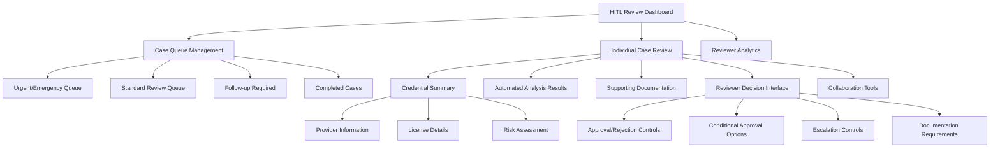

# Human-in-the-Loop UX Specification & Reviewer Flow
## Chai VC Platform Healthcare Credentialing System

**Document Version:** 1.0
**Last Updated:** 2025-01-XX
**Classification:** Internal/Product
**Stakeholders:** UX Design, Product Management, Healthcare SME, Engineering

---

## Executive Summary

This document defines the user experience design and workflow for Human-in-the-Loop (HITL) credential verification processes within the Chai VC Platform. The HITL system provides a critical safety net for automated healthcare credential verification, ensuring complex edge cases, regulatory exceptions, and high-risk scenarios receive appropriate human oversight while maintaining patient safety standards.

---

## 1. HITL System Overview

### 1.1 When HITL is Triggered
```yaml
hitl_triggers:
  automatic_escalation:
    - "Credential verification confidence < 95%"
    - "New healthcare license type not in training data"
    - "Cross-state license verification discrepancies"
    - "Disciplinary action flags detected"
    - "Expired credential with renewal in progress"
    - "Manual verification requested by healthcare facility"

  manual_escalation:
    - "Healthcare provider disputes automated decision"
    - "Complex multi-state licensing scenarios"
    - "International credential verification"
    - "Emergency credentialing requests"

  regulatory_requirements:
    - "High-risk specialties (surgery, anesthesia, emergency medicine)"
    - "Locum tenens temporary credentialing"
    - "Telemedicine cross-state practice verification"
    - "DEA license verification for controlled substances"
```

### 1.2 Reviewer Roles & Expertise
```yaml
reviewer_roles:
  level_1_reviewer:
    title: "Credential Verification Specialist"
    requirements:
      - "2+ years healthcare credentialing experience"
      - "Certification: CPCS or CPMSM preferred"
      - "Knowledge of state licensing requirements"
    responsibilities:
      - "Standard credential verification review"
      - "Documentation completeness assessment"
      - "Primary source verification"

  level_2_reviewer:
    title: "Senior Medical Staff Coordinator"
    requirements:
      - "5+ years healthcare credentialing experience"
      - "Advanced certification: CPCS, CPMSM, or equivalent"
      - "Multi-state licensing expertise"
    responsibilities:
      - "Complex multi-jurisdictional cases"
      - "Disciplinary action assessment"
      - "High-risk specialty credentialing"

  clinical_reviewer:
    title: "Chief Medical Officer / Medical Director"
    requirements:
      - "Active medical license"
      - "Healthcare leadership experience"
      - "Peer review expertise"
    responsibilities:
      - "Clinical competency assessment"
      - "Scope of practice determinations"
      - "Final approval for high-risk cases"

  compliance_reviewer:
    title: "Compliance Officer"
    requirements:
      - "Healthcare compliance expertise"
      - "Regulatory knowledge (Joint Commission, CMS)"
      - "Legal and regulatory training"
    responsibilities:
      - "Regulatory compliance verification"
      - "Policy exception approvals"
      - "Risk assessment and mitigation"
```

---

## 2. UX Design Principles

### 2.1 Healthcare-Specific Design Guidelines
```yaml
design_principles:
  patient_safety_first:
    - "Critical information prominently displayed"
    - "Clear visual hierarchy for risk indicators"
    - "Error states that prevent patient harm"
    - "Confirmation dialogs for high-risk decisions"

  clinical_workflow_integration:
    - "Familiar healthcare terminology and concepts"
    - "Workflow matches clinical decision-making patterns"
    - "Integration with existing credentialing systems"
    - "Mobile-responsive for on-call scenarios"

  regulatory_compliance:
    - "Complete audit trail visibility"
    - "Regulatory requirement checklists"
    - "Documentation standards adherence"
    - "Time-stamped reviewer actions"

  cognitive_load_reduction:
    - "Information presented in logical sequence"
    - "Contextual help and guidance"
    - "Smart defaults based on reviewer expertise"
    - "Progressive disclosure of complex details"

accessibility_requirements:
  wcag_compliance: "AA level minimum"
  keyboard_navigation: "Full keyboard accessibility"
  screen_reader_support: "ARIA labels and descriptions"
  color_contrast: "4.5:1 minimum for all text"
  font_size: "16px minimum for readability"
```

### 2.2 Information Architecture


---

## 3. Dashboard & Queue Management UX

### 3.1 HITL Review Dashboard
```typescript
interface HITLDashboard {
  personalizedGreeting: {
    reviewerName: string;
    currentShift: string;
    pendingUrgentCases: number;
  };

  queueOverview: {
    urgentQueue: {
      count: number;
      oldestCase: {
        age: string;
        riskLevel: 'HIGH' | 'CRITICAL';
      };
    };
    standardQueue: {
      count: number;
      averageAge: string;
    };
    myActiveReviews: {
      count: number;
      nearDeadline: number;
    };
  };

  performanceMetrics: {
    todayCompleted: number;
    averageReviewTime: string;
    qualityScore: number; // Based on audit results
    patientSafetyIndicator: 'GREEN' | 'YELLOW' | 'RED';
  };

  alerts: {
    type: 'EMERGENCY' | 'URGENT' | 'INFO';
    message: string;
    action?: string;
  }[];
}
```

**Dashboard Layout:**
```html
<!-- HITL Review Dashboard -->
<div class="hitl-dashboard">
  <!-- Header with critical alerts -->
  <header class="dashboard-header">
    <div class="reviewer-info">
      <h1>Good morning, Dr. Smith</h1>
      <p>Senior Medical Staff Coordinator • Monday 8:00 AM</p>
    </div>

    <div class="critical-alerts">
      <div class="alert alert-critical">
        🚨 3 Emergency credentialing cases require immediate attention
      </div>
    </div>
  </header>

  <!-- Key metrics overview -->
  <section class="metrics-overview">
    <div class="metric-card urgent">
      <h3>Urgent Queue</h3>
      <div class="metric-value">12</div>
      <p>Oldest: 2.5 hours (CRITICAL)</p>
    </div>

    <div class="metric-card standard">
      <h3>Standard Queue</h3>
      <div class="metric-value">47</div>
      <p>Avg age: 6.2 hours</p>
    </div>

    <div class="metric-card active">
      <h3>My Active Reviews</h3>
      <div class="metric-value">5</div>
      <p>2 near deadline</p>
    </div>

    <div class="metric-card performance">
      <h3>Today's Performance</h3>
      <div class="metric-value">18</div>
      <p>Completed • 95% quality</p>
    </div>
  </section>

  <!-- Queue navigation -->
  <nav class="queue-navigation">
    <button class="queue-tab active" data-queue="urgent">
      Urgent Queue <span class="badge">12</span>
    </button>
    <button class="queue-tab" data-queue="standard">
      Standard Queue <span class="badge">47</span>
    </button>
    <button class="queue-tab" data-queue="active">
      My Active Reviews <span class="badge">5</span>
    </button>
    <button class="queue-tab" data-queue="completed">
      Recently Completed
    </button>
  </nav>
</div>
```

### 3.2 Case Queue Management
```typescript
interface QueueItem {
  caseId: string;
  priority: 'EMERGENCY' | 'URGENT' | 'STANDARD' | 'LOW';
  providerInfo: {
    name: string;
    specialty: string;
    requestingFacility: string;
  };
  credentialType: string;
  riskLevel: 'LOW' | 'MEDIUM' | 'HIGH' | 'CRITICAL';
  ageInQueue: string;
  deadlineRemaining?: string;
  automaticAnalysis: {
    confidence: number;
    flaggedIssues: string[];
  };
  assignedTo?: string;
  lastActivity?: {
    action: string;
    timestamp: Date;
    reviewer: string;
  };
}

// Queue filtering and sorting
interface QueueFilters {
  priority: string[];
  riskLevel: string[];
  specialty: string[];
  facility: string[];
  ageThreshold?: number;
  assignedToMe?: boolean;
}
```

**Queue Interface:**
```html
<!-- Case Queue with healthcare-specific information -->
<div class="case-queue">
  <!-- Queue controls -->
  <div class="queue-controls">
    <div class="filters">
      <select id="priority-filter">
        <option value="">All Priorities</option>
        <option value="EMERGENCY">🚨 Emergency</option>
        <option value="URGENT">⚡ Urgent</option>
        <option value="STANDARD">📋 Standard</option>
      </select>

      <select id="specialty-filter">
        <option value="">All Specialties</option>
        <option value="EMERGENCY_MEDICINE">Emergency Medicine</option>
        <option value="SURGERY">Surgery</option>
        <option value="ANESTHESIOLOGY">Anesthesiology</option>
      </select>
    </div>

    <div class="queue-actions">
      <button class="btn-primary" id="claim-next">
        Claim Next Case
      </button>
      <button class="btn-secondary" id="bulk-actions">
        Bulk Actions
      </button>
    </div>
  </div>

  <!-- Queue list -->
  <div class="queue-list">
    <div class="queue-item priority-emergency" data-case-id="CASE-12345">
      <div class="case-header">
        <h3>Dr. Sarah Johnson, MD</h3>
        <span class="priority-badge emergency">🚨 EMERGENCY</span>
        <span class="risk-badge high">HIGH RISK</span>
      </div>

      <div class="case-details">
        <div class="provider-info">
          <p><strong>Specialty:</strong> Emergency Medicine</p>
          <p><strong>Facility:</strong> Metro General Hospital</p>
          <p><strong>License:</strong> Medical License - California</p>
        </div>

        <div class="timing-info">
          <p><strong>In Queue:</strong> 2h 15m</p>
          <p><strong>Deadline:</strong> 45m remaining</p>
          <p><strong>Auto Analysis:</strong> 87% confidence</p>
        </div>

        <div class="flagged-issues">
          <span class="flag">⚠️ Recent disciplinary action</span>
          <span class="flag">📋 Missing CME documentation</span>
        </div>
      </div>

      <div class="case-actions">
        <button class="btn-primary">Review Case</button>
        <button class="btn-secondary">Quick View</button>
        <button class="btn-ghost">Assign to Other</button>
      </div>
    </div>

    <!-- Additional queue items... -->
  </div>
</div>
```

---

## 4. Individual Case Review Interface

### 4.1 Case Review Layout
```html
<!-- Full-screen case review interface -->
<div class="case-review-interface">
  <!-- Fixed header with case context -->
  <header class="case-header">
    <div class="provider-context">
      <h1>Dr. Sarah Johnson, MD</h1>
      <p>Emergency Medicine • Metro General Hospital</p>
      <div class="status-indicators">
        <span class="priority emergency">🚨 EMERGENCY</span>
        <span class="risk-level high">HIGH RISK</span>
        <span class="deadline critical">⏰ 45m deadline</span>
      </div>
    </div>

    <div class="case-actions">
      <button class="btn-success">✅ Approve</button>
      <button class="btn-warning">⚠️ Conditional Approval</button>
      <button class="btn-danger">❌ Reject</button>
      <button class="btn-secondary">🔄 Escalate</button>
    </div>
  </header>

  <!-- Main content area with sidebar -->
  <div class="case-content">
    <!-- Left sidebar - Navigation -->
    <nav class="case-navigation">
      <ul>
        <li><a href="#overview" class="active">📋 Overview</a></li>
        <li><a href="#credentials">🏥 Credentials</a></li>
        <li><a href="#verification">✅ Verification</a></li>
        <li><a href="#background">🔍 Background Check</a></li>
        <li><a href="#references">👥 References</a></li>
        <li><a href="#documents">📄 Documents</a></li>
        <li><a href="#history">📜 History</a></li>
      </ul>
    </nav>

    <!-- Main content panel -->
    <main class="case-main-content">
      <!-- Overview section -->
      <section id="overview" class="content-section active">
        <h2>Case Overview & AI Analysis</h2>

        <!-- AI confidence and recommendations -->
        <div class="ai-analysis-card">
          <div class="confidence-indicator">
            <div class="confidence-meter" data-confidence="87">
              <div class="confidence-fill"></div>
            </div>
            <p>AI Confidence: 87%</p>
          </div>

          <div class="ai-recommendation">
            <h3>🤖 AI Recommendation: Further Review Required</h3>
            <p>Automated analysis identified potential concerns that require human verification.</p>
          </div>

          <div class="flagged-issues">
            <h4>⚠️ Flagged Issues:</h4>
            <ul>
              <li class="issue-high">Recent disciplinary action (2023)</li>
              <li class="issue-medium">CME documentation gap</li>
              <li class="issue-low">Address verification pending</li>
            </ul>
          </div>
        </div>

        <!-- Provider summary -->
        <div class="provider-summary-card">
          <h3>Provider Summary</h3>
          <div class="summary-grid">
            <div class="summary-item">
              <label>Full Name:</label>
              <span>Dr. Sarah Elizabeth Johnson</span>
            </div>
            <div class="summary-item">
              <label>Primary Specialty:</label>
              <span>Emergency Medicine</span>
            </div>
            <div class="summary-item">
              <label>Board Certification:</label>
              <span>American Board of Emergency Medicine (2019)</span>
            </div>
            <div class="summary-item">
              <label>Current Practice:</label>
              <span>Metro General Hospital, Los Angeles, CA</span>
            </div>
            <div class="summary-item">
              <label>Years in Practice:</label>
              <span>8 years</span>
            </div>
            <div class="summary-item">
              <label>Previous Credentialing:</label>
              <span>3 facilities, no rejections</span>
            </div>
          </div>
        </div>
      </section>

      <!-- Credentials section -->
      <section id="credentials" class="content-section">
        <h2>License & Certification Details</h2>

        <div class="credentials-grid">
          <!-- Medical License -->
          <div class="credential-card primary-license">
            <div class="credential-header">
              <h3>🏥 Medical License</h3>
              <span class="status verified">✅ Verified</span>
            </div>

            <div class="credential-details">
              <table class="details-table">
                <tr>
                  <td>State:</td>
                  <td>California</td>
                </tr>
                <tr>
                  <td>License Number:</td>
                  <td>A12345</td>
                </tr>
                <tr>
                  <td>Issue Date:</td>
                  <td>June 15, 2017</td>
                </tr>
                <tr>
                  <td>Expiration Date:</td>
                  <td>June 15, 2025</td>
                </tr>
                <tr>
                  <td>Status:</td>
                  <td>Active, Good Standing</td>
                </tr>
                <tr class="flagged-row">
                  <td>Disciplinary Actions:</td>
                  <td>⚠️ 1 action (2023) - <a href="#discipline-details">View Details</a></td>
                </tr>
              </table>
            </div>
          </div>

          <!-- Board Certification -->
          <div class="credential-card">
            <div class="credential-header">
              <h3>📋 Board Certification</h3>
              <span class="status verified">✅ Verified</span>
            </div>

            <div class="credential-details">
              <table class="details-table">
                <tr>
                  <td>Board:</td>
                  <td>American Board of Emergency Medicine</td>
                </tr>
                <tr>
                  <td>Certification Date:</td>
                  <td>March 20, 2019</td>
                </tr>
                <tr>
                  <td>Expiration Date:</td>
                  <td>March 20, 2029</td>
                </tr>
                <tr>
                  <td>MOC Status:</td>
                  <td>Current</td>
                </tr>
              </table>
            </div>
          </div>

          <!-- DEA License -->
          <div class="credential-card">
            <div class="credential-header">
              <h3>💊 DEA License</h3>
              <span class="status pending">⏳ Verification In Progress</span>
            </div>

            <div class="credential-details">
              <p class="verification-note">
                Primary source verification requested from DEA.
                Expected completion: 2 business days.
              </p>
            </div>
          </div>
        </div>
      </section>
    </main>

    <!-- Right sidebar - Quick actions and notes -->
    <aside class="case-sidebar">
      <div class="quick-actions">
        <h3>Quick Actions</h3>
        <button class="quick-action">📞 Contact Provider</button>
        <button class="quick-action">📧 Request Documentation</button>
        <button class="quick-action">🔍 Order Background Check</button>
        <button class="quick-action">📋 Generate Report</button>
      </div>

      <div class="reviewer-notes">
        <h3>Reviewer Notes</h3>
        <textarea placeholder="Add your notes about this case..."></textarea>
        <button class="btn-secondary">Save Notes</button>
      </div>

      <div class="case-timeline">
        <h3>Case Timeline</h3>
        <div class="timeline-item">
          <span class="time">2h ago</span>
          <span class="action">Case created</span>
        </div>
        <div class="timeline-item">
          <span class="time">1.5h ago</span>
          <span class="action">AI analysis completed</span>
        </div>
        <div class="timeline-item">
          <span class="time">45m ago</span>
          <span class="action">Assigned to current reviewer</span>
        </div>
      </div>
    </aside>
  </div>
</div>
```

### 4.2 Decision Interface Components
```typescript
interface ReviewerDecision {
  decision: 'APPROVE' | 'CONDITIONAL_APPROVE' | 'REJECT' | 'ESCALATE';
  confidence: number; // 1-10 scale
  conditions?: {
    type: 'TRAINING_REQUIRED' | 'SUPERVISION_REQUIRED' | 'LIMITED_SCOPE' | 'TIME_LIMITED';
    description: string;
    expirationDate?: Date;
  }[];
  rejectionReasons?: {
    category: 'LICENSE_ISSUE' | 'BACKGROUND_CONCERN' | 'COMPETENCY_QUESTION' | 'DOCUMENTATION_INCOMPLETE';
    details: string;
  }[];
  reviewerNotes: string;
  recommendedFollowup?: {
    action: string;
    timeline: string;
    assignTo?: string;
  };
}
```

**Decision Interface:**
```html
<!-- Decision panel with healthcare-specific options -->
<div class="decision-panel">
  <h3>Reviewer Decision</h3>

  <!-- Decision options -->
  <div class="decision-options">
    <div class="decision-option">
      <input type="radio" id="approve" name="decision" value="approve">
      <label for="approve" class="decision-label approve">
        <span class="icon">✅</span>
        <span class="text">Approve Credentialing</span>
        <span class="description">Provider meets all requirements</span>
      </label>
    </div>

    <div class="decision-option">
      <input type="radio" id="conditional" name="decision" value="conditional">
      <label for="conditional" class="decision-label conditional">
        <span class="icon">⚠️</span>
        <span class="text">Conditional Approval</span>
        <span class="description">Approve with specific conditions or limitations</span>
      </label>
    </div>

    <div class="decision-option">
      <input type="radio" id="reject" name="decision" value="reject">
      <label for="reject" class="decision-label reject">
        <span class="icon">❌</span>
        <span class="text">Reject Application</span>
        <span class="description">Provider does not meet requirements</span>
      </label>
    </div>

    <div class="decision-option">
      <input type="radio" id="escalate" name="decision" value="escalate">
      <label for="escalate" class="decision-label escalate">
        <span class="icon">🔄</span>
        <span class="text">Escalate for Review</span>
        <span class="description">Requires senior reviewer or clinical input</span>
      </label>
    </div>
  </div>

  <!-- Conditional approval options (shown when conditional is selected) -->
  <div class="conditional-options" style="display: none;">
    <h4>Select Conditions:</h4>
    <div class="condition-checkboxes">
      <label>
        <input type="checkbox" value="SUPERVISION_REQUIRED">
        Supervision required for initial period (specify duration)
      </label>
      <label>
        <input type="checkbox" value="LIMITED_SCOPE">
        Limited scope of practice (specify limitations)
      </label>
      <label>
        <input type="checkbox" value="TRAINING_REQUIRED">
        Additional training required (specify training)
      </label>
      <label>
        <input type="checkbox" value="TIME_LIMITED">
        Time-limited approval (specify expiration)
      </label>
    </div>
  </div>

  <!-- Rejection reasons (shown when reject is selected) -->
  <div class="rejection-reasons" style="display: none;">
    <h4>Rejection Reasons:</h4>
    <div class="reason-checkboxes">
      <label>
        <input type="checkbox" value="LICENSE_ISSUE">
        Licensing concerns or restrictions
      </label>
      <label>
        <input type="checkbox" value="BACKGROUND_CONCERN">
        Background check findings
      </label>
      <label>
        <input type="checkbox" value="COMPETENCY_QUESTION">
        Questions about clinical competency
      </label>
      <label>
        <input type="checkbox" value="DOCUMENTATION_INCOMPLETE">
        Incomplete or insufficient documentation
      </label>
    </div>
  </div>

  <!-- Confidence rating -->
  <div class="confidence-rating">
    <label>Decision Confidence (1-10):</label>
    <input type="range" min="1" max="10" value="8" id="confidence-slider">
    <span class="confidence-value">8</span>
  </div>

  <!-- Reviewer notes -->
  <div class="reviewer-notes">
    <label for="notes">Detailed Notes & Rationale:</label>
    <textarea id="notes" placeholder="Provide detailed reasoning for your decision, including specific observations and recommendations..."></textarea>
  </div>

  <!-- Submit decision -->
  <div class="submit-actions">
    <button class="btn-primary" id="submit-decision">Submit Decision</button>
    <button class="btn-secondary" id="save-draft">Save as Draft</button>
  </div>
</div>
```

---

## 5. Collaboration & Communication Features

### 5.1 Multi-Reviewer Workflow
```typescript
interface CollaborativeReview {
  primaryReviewer: string;
  consultingReviewers: {
    reviewerId: string;
    role: 'CLINICAL' | 'COMPLIANCE' | 'SPECIALTY_EXPERT';
    status: 'REQUESTED' | 'IN_PROGRESS' | 'COMPLETED';
    input?: {
      recommendation: string;
      confidence: number;
      notes: string;
      timestamp: Date;
    };
  }[];

  consensus: {
    required: boolean;
    achieved?: boolean;
    finalDecision?: string;
    decisionMaker: string;
  };
}
```

**Collaboration Interface:**
```html
<!-- Collaboration panel for complex cases -->
<div class="collaboration-panel">
  <h3>Collaborative Review</h3>

  <!-- Current review team -->
  <div class="review-team">
    <h4>Review Team:</h4>
    <div class="reviewer-cards">
      <div class="reviewer-card primary">
        <div class="reviewer-info">
          
          <div>
            <h5>Dr. Robert Smith</h5>
            <p>Primary Reviewer • Senior MSC</p>
          </div>
        </div>
        <span class="status active">Active</span>
      </div>

      <div class="reviewer-card consultant">
        <div class="reviewer-info">
          
          <div>
            <h5>Dr. Maria Wilson</h5>
            <p>Clinical Consultant • CMO</p>
          </div>
        </div>
        <span class="status completed">Input Provided</span>
      </div>
    </div>
  </div>

  <!-- Request consultation -->
  <div class="consultation-request">
    <h4>Request Additional Input:</h4>
    <select id="consultant-type">
      <option value="">Select consultant type</option>
      <option value="CLINICAL">Clinical Expert</option>
      <option value="COMPLIANCE">Compliance Officer</option>
      <option value="SPECIALTY">Specialty Expert</option>
      <option value="LEGAL">Legal Counsel</option>
    </select>

    <textarea placeholder="Describe the specific question or concern..."></textarea>
    <button class="btn-secondary">Request Consultation</button>
  </div>

  <!-- Chat/messaging -->
  <div class="case-discussion">
    <h4>Case Discussion:</h4>
    <div class="messages">
      <div class="message">
        <div class="message-header">
          <span class="sender">Dr. Wilson</span>
          <span class="time">2 hours ago</span>
        </div>
        <div class="message-content">
          The disciplinary action appears to be minor and resolved. I recommend conditional approval with 3-month supervision.
        </div>
      </div>

      <div class="message own">
        <div class="message-header">
          <span class="sender">You</span>
          <span class="time">1 hour ago</span>
        </div>
        <div class="message-content">
          Thank you for the input. I agree with the conditional approval recommendation.
        </div>
      </div>
    </div>

    <div class="message-input">
      <textarea placeholder="Add to discussion..."></textarea>
      <button class="btn-primary">Send</button>
    </div>
  </div>
</div>
```

### 5.2 Provider Communication
```html
<!-- Provider communication interface -->
<div class="provider-communication">
  <h3>Provider Communication</h3>

  <!-- Contact information -->
  <div class="provider-contact">
    <h4>Dr. Sarah Johnson Contact Info:</h4>
    <p>📧 s.johnson@metrohealth.com</p>
    <p>📞 (555) 123-4567</p>
    <p>🏥 Metro General Hospital</p>
  </div>

  <!-- Quick communication templates -->
  <div class="communication-templates">
    <h4>Quick Messages:</h4>
    <button class="template-btn">📋 Request Additional Documentation</button>
    <button class="template-btn">📅 Schedule Interview</button>
    <button class="template-btn">❓ Clarification Needed</button>
    <button class="template-btn">✅ Approval Notification</button>
  </div>

  <!-- Message composer -->
  <div class="message-composer">
    <select id="message-template">
      <option>Select template...</option>
      <option value="doc_request">Documentation Request</option>
      <option value="clarification">Request Clarification</option>
      <option value="interview">Schedule Interview</option>
    </select>

    <textarea placeholder="Compose message to provider..."></textarea>

    <div class="message-options">
      <label>
        <input type="checkbox" id="urgent-flag">
        Mark as urgent
      </label>
      <label>
        <input type="checkbox" id="cc-facility">
        CC: Credentialing Office
      </label>
    </div>

    <button class="btn-primary">Send Message</button>
  </div>
</div>
```

---

## 6. Mobile & Responsive Design

### 6.1 Mobile-First Considerations
```css
/* Mobile-responsive design for HITL reviews */
.hitl-mobile {
  /* Touch-friendly buttons */
  button {
    min-height: 44px;
    min-width: 44px;
    padding: 12px 16px;
  }

  /* Simplified navigation for small screens */
  .case-navigation {
    position: fixed;
    bottom: 0;
    left: 0;
    right: 0;
    background: white;
    border-top: 1px solid #ddd;
    display: flex;
    justify-content: space-around;
    padding: 8px;
  }

  .nav-item {
    display: flex;
    flex-direction: column;
    align-items: center;
    padding: 8px;
    text-decoration: none;
    color: #666;
  }

  .nav-item.active {
    color: #007bff;
  }

  /* Swipe gestures for case navigation */
  .case-content {
    touch-action: pan-x;
  }

  /* Collapsible sections for information density */
  .collapsible-section {
    margin-bottom: 16px;
  }

  .section-header {
    padding: 12px;
    background: #f8f9fa;
    border: 1px solid #dee2e6;
    cursor: pointer;
    display: flex;
    justify-content: space-between;
    align-items: center;
  }

  .section-content {
    padding: 16px;
    border: 1px solid #dee2e6;
    border-top: none;
    display: none;
  }

  .section-content.expanded {
    display: block;
  }
}

/* Tablet optimization */
@media (min-width: 768px) and (max-width: 1024px) {
  .hitl-interface {
    .case-content {
      display: flex;
      flex-direction: column;
    }

    .case-sidebar {
      position: sticky;
      top: 0;
      height: fit-content;
    }
  }
}
```

### 6.2 Mobile Case Review Interface
```html
<!-- Mobile-optimized case review -->
<div class="mobile-case-review">
  <!-- Fixed header with essential info -->
  <header class="mobile-header">
    <button class="back-btn">← Back</button>
    <div class="case-info">
      <h2>Dr. S. Johnson</h2>
      <span class="priority emergency">🚨 EMERGENCY</span>
    </div>
    <button class="more-btn">⋯</button>
  </header>

  <!-- Swipeable content sections -->
  <div class="content-carousel">
    <div class="content-slide active" data-section="overview">
      <div class="slide-header">
        <h3>Overview</h3>
        <span class="slide-indicator">1 of 6</span>
      </div>

      <!-- Key information cards -->
      <div class="info-cards">
        <div class="info-card risk-high">
          <h4>⚠️ Risk Level: HIGH</h4>
          <p>Recent disciplinary action requires review</p>
        </div>

        <div class="info-card ai-analysis">
          <h4>🤖 AI Confidence: 87%</h4>
          <p>Further human review recommended</p>
        </div>
      </div>
    </div>

    <div class="content-slide" data-section="credentials">
      <div class="slide-header">
        <h3>Credentials</h3>
        <span class="slide-indicator">2 of 6</span>
      </div>

      <!-- Simplified credential display -->
      <div class="mobile-credentials">
        <div class="credential-summary">
          <h4>🏥 Medical License</h4>
          <p><strong>CA License A12345</strong></p>
          <p>Expires: June 2025</p>
          <span class="status verified">✅ Verified</span>
        </div>

        <div class="credential-summary flagged">
          <h4>⚠️ Disciplinary History</h4>
          <p>1 action in 2023</p>
          <button class="details-btn">View Details</button>
        </div>
      </div>
    </div>
  </div>

  <!-- Fixed bottom navigation -->
  <nav class="mobile-bottom-nav">
    <button class="nav-item" data-section="overview">
      <span class="icon">📋</span>
      <span class="label">Overview</span>
    </button>
    <button class="nav-item" data-section="credentials">
      <span class="icon">🏥</span>
      <span class="label">Credentials</span>
    </button>
    <button class="nav-item" data-section="documents">
      <span class="icon">📄</span>
      <span class="label">Docs</span>
    </button>
    <button class="nav-item" data-section="decision">
      <span class="icon">✅</span>
      <span class="label">Decision</span>
    </button>
  </nav>

  <!-- Floating action button for quick decisions -->
  <div class="fab-container">
    <button class="fab primary" id="approve-fab">✅</button>
    <button class="fab secondary" id="more-actions-fab">⋯</button>
  </div>
</div>
```

---

## 7. Accessibility & Compliance

### 7.1 WCAG 2.1 AA Compliance
```typescript
interface AccessibilityFeatures {
  keyboardNavigation: {
    skipLinks: boolean;
    focusManagement: boolean;
    keyboardTraps: boolean;
    customKeyBindings: string[];
  };

  screenReaderSupport: {
    ariaLabels: boolean;
    ariaDescriptions: boolean;
    liveRegions: boolean;
    structuralMarkup: boolean;
  };

  visualAccessibility: {
    colorContrast: '4.5:1' | '3:1';
    focusIndicators: boolean;
    textScaling: '200%';
    reducedMotion: boolean;
  };

  cognitiveAccessibility: {
    clearLanguage: boolean;
    consistentNavigation: boolean;
    errorPrevention: boolean;
    contextHelp: boolean;
  };
}
```

**Accessibility Implementation:**
```html
<!-- Accessible HITL interface -->
<div class="hitl-interface" role="application" aria-label="Healthcare Credential Review System">
  <!-- Skip navigation for keyboard users -->
  <a href="#main-content" class="skip-link">Skip to main content</a>

  <!-- Screen reader announcements -->
  <div aria-live="polite" aria-atomic="true" class="sr-announcements"></div>

  <!-- Accessible form controls -->
  <fieldset class="decision-fieldset">
    <legend>Review Decision</legend>

    <div class="decision-options" role="radiogroup" aria-labelledby="decision-legend">
      <input type="radio" id="approve" name="decision" value="approve"
             aria-describedby="approve-desc">
      <label for="approve">Approve Credentialing</label>
      <div id="approve-desc" class="description">
        Provider meets all requirements for unrestricted practice
      </div>

      <!-- Additional options with proper ARIA attributes -->
    </div>
  </fieldset>

  <!-- Accessible data tables -->
  <table class="credentials-table" role="table" aria-label="Provider Credentials Summary">
    <caption>Summary of provider's licenses and certifications</caption>
    <thead>
      <tr>
        <th scope="col">Credential Type</th>
        <th scope="col">Status</th>
        <th scope="col">Expiration Date</th>
        <th scope="col">Actions</th>
      </tr>
    </thead>
    <tbody>
      <tr>
        <th scope="row">Medical License - California</th>
        <td>
          <span class="status verified" aria-label="Verified">✅</span>
          Verified
        </td>
        <td>June 15, 2025</td>
        <td>
          <button aria-label="View details for California medical license">
            View Details
          </button>
        </td>
      </tr>
    </tbody>
  </table>

  <!-- High contrast mode toggle -->
  <button class="contrast-toggle" aria-label="Toggle high contrast mode">
    <span aria-hidden="true">🔆</span>
    High Contrast
  </button>
</div>
```

### 7.2 Healthcare-Specific Accessibility
```css
/* Healthcare accessibility considerations */
.hitl-interface {
  /* High contrast for critical information */
  .risk-critical,
  .priority-emergency {
    background-color: #d32f2f;
    color: white;
    border: 3px solid #ffffff;
    font-weight: bold;
  }

  /* Clear visual hierarchy */
  h1 { font-size: 2rem; margin-bottom: 1rem; }
  h2 { font-size: 1.5rem; margin-bottom: 0.75rem; }
  h3 { font-size: 1.25rem; margin-bottom: 0.5rem; }

  /* Improved focus indicators */
  *:focus {
    outline: 3px solid #007bff;
    outline-offset: 2px;
    box-shadow: 0 0 0 5px rgba(0, 123, 255, 0.25);
  }

  /* High contrast mode */
  &.high-contrast {
    background: #000000;
    color: #ffffff;

    .btn-primary {
      background: #ffffff;
      color: #000000;
      border: 2px solid #ffffff;
    }

    .btn-secondary {
      background: #000000;
      color: #ffffff;
      border: 2px solid #ffffff;
    }
  }

  /* Reduced motion support */
  @media (prefers-reduced-motion: reduce) {
    * {
      animation-duration: 0.01ms !important;
      animation-iteration-count: 1 !important;
      transition-duration: 0.01ms !important;
    }
  }

  /* Print styles for documentation */
  @media print {
    .no-print { display: none; }

    .case-content {
      font-size: 12pt;
      line-height: 1.4;
    }

    .decision-summary {
      border: 2px solid #000;
      padding: 1rem;
      margin: 1rem 0;
    }
  }
}
```

---

## 8. Performance & Technical Considerations

### 8.1 Performance Optimization
```typescript
// Lazy loading for large credential documents
interface DocumentLoader {
  loadDocument: (documentId: string) => Promise<Document>;
  preloadCriticalDocuments: (caseId: string) => Promise<void>;
  cacheStrategy: 'memory' | 'indexeddb' | 'hybrid';
}

// Virtual scrolling for large case queues
interface VirtualizedQueue {
  itemHeight: number;
  visibleItems: number;
  totalItems: number;
  renderItem: (index: number) => JSX.Element;
  onScroll: (scrollTop: number) => void;
}

// Optimistic updates for reviewer actions
interface OptimisticUpdate {
  action: string;
  localState: any;
  onSuccess: (serverResponse: any) => void;
  onError: (error: any) => void;
  rollback: () => void;
}
```

### 8.2 Real-time Updates
```typescript
// WebSocket integration for real-time case updates
class HITLRealtimeService {
  private ws: WebSocket;
  private subscribers: Map<string, Function[]> = new Map();

  connect(): void {
    this.ws = new WebSocket(`wss://${window.location.host}/hitl-updates`);

    this.ws.onmessage = (event) => {
      const update = JSON.parse(event.data);
      this.handleUpdate(update);
    };
  }

  subscribe(caseId: string, callback: Function): void {
    if (!this.subscribers.has(caseId)) {
      this.subscribers.set(caseId, []);
    }
    this.subscribers.get(caseId)?.push(callback);
  }

  private handleUpdate(update: any): void {
    const { caseId, type, data } = update;

    switch (type) {
      case 'CASE_ASSIGNED':
        this.notifySubscribers(caseId, { type, data });
        break;
      case 'CONSULTATION_RESPONSE':
        this.notifySubscribers(caseId, { type, data });
        break;
      case 'URGENT_FLAG_ADDED':
        this.notifySubscribers(caseId, { type, data });
        this.showUrgentNotification(data);
        break;
    }
  }

  private showUrgentNotification(data: any): void {
    // Browser notification for urgent cases
    if (Notification.permission === 'granted') {
      new Notification('Urgent Healthcare Case', {
        body: `New emergency credentialing case requires immediate attention`,
        icon: '/icons/emergency.png',
        tag: 'urgent-case',
        requireInteraction: true
      });
    }
  }
}
```

---

## 9. Analytics & Reporting

### 9.1 HITL Performance Metrics
```typescript
interface HITLMetrics {
  reviewerPerformance: {
    averageReviewTime: number;
    casesCompletedPerDay: number;
    qualityScore: number; // Based on audit results
    escalationRate: number;
    overturnRate: number; // Cases overturned on appeal
  };

  systemEfficiency: {
    automationRate: number; // Percentage handled without HITL
    hitlTriggerAccuracy: number; // Correct HITL escalations
    falsePositiveRate: number;
    patientSafetyIncidents: number;
  };

  clinicalOutcomes: {
    credentialingErrors: number;
    timeToCredentialing: number;
    providerSatisfaction: number;
    facilitySatisfaction: number;
  };
}

// Dashboard for metrics visualization
const HITLAnalyticsDashboard = () => {
  return (
    <div className="analytics-dashboard">
      <div className="metric-cards">
        <MetricCard
          title="Cases Reviewed Today"
          value={42}
          trend="+8%"
          status="good"
        />
        <MetricCard
          title="Average Review Time"
          value="18m"
          trend="-12%"
          status="excellent"
        />
        <MetricCard
          title="Quality Score"
          value="96%"
          trend="+2%"
          status="excellent"
        />
        <MetricCard
          title="Patient Safety Incidents"
          value={0}
          trend="0"
          status="excellent"
        />
      </div>

      <div className="charts">
        <TimeSeriesChart
          title="Daily Review Volume"
          data={reviewVolumeData}
          timeRange="7d"
        />
        <PieChart
          title="Case Distribution by Priority"
          data={priorityDistribution}
        />
      </div>
    </div>
  );
};
```

---

## 10. Implementation Roadmap

### 10.1 Development Phases
```yaml
phase_1_mvp:
  duration: "8 weeks"
  features:
    - "Basic case queue management"
    - "Individual case review interface"
    - "Simple decision workflow"
    - "Basic reviewer roles"
    - "Essential accessibility features"

  success_criteria:
    - "Reviewers can complete basic case reviews"
    - "WCAG 2.1 AA compliance achieved"
    - "Mobile-responsive interface"
    - "Integration with existing backend"

phase_2_enhanced:
  duration: "6 weeks"
  features:
    - "Collaborative review workflows"
    - "Provider communication tools"
    - "Advanced filtering and search"
    - "Real-time updates"
    - "Analytics dashboard"

  success_criteria:
    - "Multi-reviewer workflows operational"
    - "Real-time case updates working"
    - "Provider communication integrated"
    - "Performance metrics available"

phase_3_optimization:
  duration: "4 weeks"
  features:
    - "AI-assisted review suggestions"
    - "Advanced analytics and reporting"
    - "Workflow customization"
    - "Integration with external systems"
    - "Performance optimization"

  success_criteria:
    - "AI suggestions improve review efficiency"
    - "Advanced reporting available"
    - "System performance optimized"
    - "External integrations complete"
```

### 10.2 Success Metrics
```yaml
quantitative_metrics:
  efficiency:
    - "Average case review time < 20 minutes"
    - "Queue wait time < 2 hours for standard cases"
    - "Queue wait time < 30 minutes for urgent cases"

  quality:
    - "Reviewer decision accuracy > 95%"
    - "Case overturn rate < 3%"
    - "Patient safety incidents = 0"

  user_satisfaction:
    - "Reviewer satisfaction score > 4.5/5"
    - "System usability score > 80"
    - "Training completion rate > 95%"

qualitative_metrics:
  user_feedback:
    - "Intuitive workflow design"
    - "Clear information presentation"
    - "Effective collaboration tools"
    - "Reliable system performance"

  clinical_outcomes:
    - "Improved credentialing accuracy"
    - "Faster time-to-practice for providers"
    - "Enhanced patient safety assurance"
    - "Better regulatory compliance"
```

---

## Conclusion

The Human-in-the-Loop UX specification provides a comprehensive framework for healthcare credential review processes that prioritize patient safety, regulatory compliance, and reviewer efficiency. The interface design balances the need for detailed information access with cognitive load management, ensuring that healthcare professionals can make accurate, well-informed credentialing decisions.

**Key Design Principles Achieved:**
- Patient safety prioritized through clear risk indicators and workflow design
- Clinical workflow integration with familiar healthcare terminology and processes
- Comprehensive accessibility ensuring equal access for all reviewers
- Collaborative tools supporting complex multi-reviewer scenarios
- Mobile optimization for on-call and remote review scenarios

**Next Steps:**
1. Stakeholder review and validation of UX specifications (Week 1-2)
2. Technical feasibility assessment and architecture planning (Week 2-3)
3. Design system development and component library creation (Week 3-4)
4. Prototype development and usability testing (Week 5-8)
5. Iterative refinement based on healthcare professional feedback (Week 9-12)

The HITL system represents a critical component of the Chai VC Platform, ensuring that automated healthcare credentialing maintains the highest standards of accuracy and safety through thoughtful human oversight and expert clinical judgment.