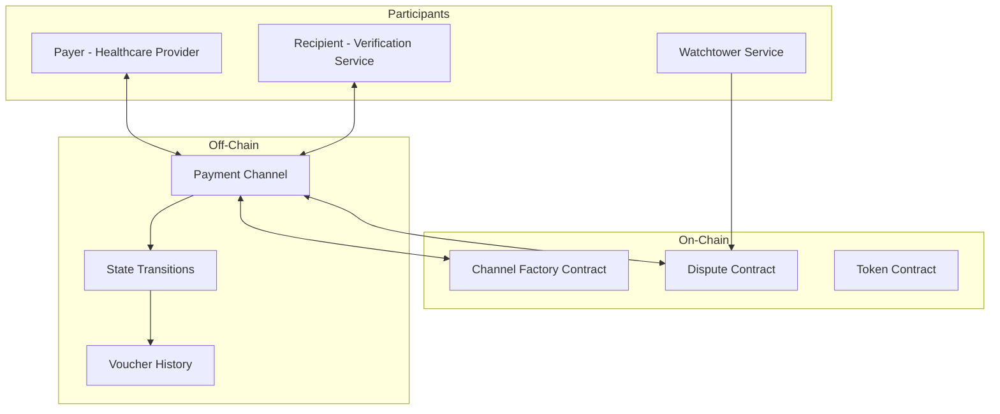

# Micropayment Channel Specification

## Executive Summary

This specification defines a micropayment channel system for the Chai VC Platform that enables high-frequency, low-cost payments for credential verification services. The system provides instant settlement for small payments while reducing on-chain transaction costs and improving user experience.

## Overview

### Use Cases
1. **Per-verification payments**: Pay-per-use credential verification
2. **Streaming payments**: Continuous payment for ongoing monitoring services
3. **Batch verification discounts**: Volume-based pricing for large verifiers
4. **Cross-chain payments**: Efficient payments across different blockchain networks
5. **Subscription services**: Recurring payments for premium features

### Key Benefits
- **Instant finality**: Sub-second payment confirmation
- **Low fees**: Minimal transaction costs regardless of payment frequency
- **Privacy**: Off-chain transactions provide enhanced privacy
- **Scalability**: Supports millions of micropayments without blockchain congestion
- **Dispute resolution**: Cryptographic proofs for payment disputes

## Channel Architecture

### Payment Channel Model


### Channel Lifecycle
1. **Channel Opening**: Participants deposit funds and create channel
2. **Payment Processing**: Off-chain payment voucher exchange
3. **State Updates**: Periodic state synchronization
4. **Channel Closing**: Final settlement and fund distribution
5. **Dispute Resolution**: Challenge period for contested closures

## Technical Specification

### Channel State Structure
```typescript
interface ChannelState {
  channelId: string;
  participants: [string, string]; // [payer, recipient]
  balances: [bigint, bigint];     // Current balances
  nonce: number;                  // State version number
  timeout: number;                // Channel expiry timestamp
  isOpen: boolean;               // Channel status
  totalTransferred: bigint;       // Cumulative transfer amount
  lastUpdate: number;            // Last state update timestamp
}

interface PaymentVoucher {
  channelId: string;
  recipient: string;
  amount: bigint;
  nonce: number;
  signature: string;
  metadata?: PaymentMetadata;
}

interface PaymentMetadata {
  verificationId?: string;
  serviceType: 'verification' | 'monitoring' | 'batch' | 'subscription';
  timestamp: number;
  expiryTime?: number;
}
```

### Smart Contract Interface
```solidity
contract MicropaymentChannel {
    struct Channel {
        address payable[2] participants;
        uint256[2] balances;
        uint256 nonce;
        uint256 timeout;
        bool isOpen;
        uint256 challengePeriod;
    }

    mapping(bytes32 => Channel) public channels;
    mapping(bytes32 => uint256) public challengeTimeout;

    event ChannelOpened(bytes32 indexed channelId, address[2] participants, uint256[2] deposits);
    event ChannelUpdated(bytes32 indexed channelId, uint256[2] newBalances, uint256 nonce);
    event ChannelClosed(bytes32 indexed channelId, uint256[2] finalBalances);
    event ChallengeStarted(bytes32 indexed channelId, uint256 challengeTimeout);

    function openChannel(
        address payable recipient,
        uint256 timeout,
        uint256 challengePeriod
    ) external payable returns (bytes32 channelId) {
        require(msg.value > 0, "Must deposit funds");
        require(recipient != msg.sender, "Cannot open channel with self");

        channelId = keccak256(abi.encodePacked(msg.sender, recipient, block.timestamp));

        channels[channelId] = Channel({
            participants: [payable(msg.sender), recipient],
            balances: [msg.value, 0],
            nonce: 0,
            timeout: block.timestamp + timeout,
            isOpen: true,
            challengePeriod: challengePeriod
        });

        emit ChannelOpened(channelId, [msg.sender, recipient], [msg.value, 0]);
        return channelId;
    }

    function updateChannel(
        bytes32 channelId,
        uint256[2] memory newBalances,
        uint256 nonce,
        bytes[2] memory signatures
    ) external {
        Channel storage channel = channels[channelId];
        require(channel.isOpen, "Channel is closed");
        require(nonce > channel.nonce, "Invalid nonce");
        require(block.timestamp < channel.timeout, "Channel expired");

        // Verify signatures from both participants
        bytes32 messageHash = keccak256(abi.encodePacked(channelId, newBalances, nonce));
        require(verifySignatures(messageHash, signatures, channel.participants), "Invalid signatures");

        channel.balances = newBalances;
        channel.nonce = nonce;

        emit ChannelUpdated(channelId, newBalances, nonce);
    }

    function closeChannel(
        bytes32 channelId,
        uint256[2] memory finalBalances,
        uint256 nonce,
        bytes[2] memory signatures
    ) external {
        Channel storage channel = channels[channelId];
        require(channel.isOpen, "Channel already closed");

        if (block.timestamp >= channel.timeout) {
            // Timeout closure - anyone can close
            _finalizeChannel(channelId, channel.balances);
        } else {
            // Cooperative closure - requires both signatures
            bytes32 messageHash = keccak256(abi.encodePacked(channelId, finalBalances, nonce, "close"));
            require(verifySignatures(messageHash, signatures, channel.participants), "Invalid signatures");

            _finalizeChannel(channelId, finalBalances);
        }
    }

    function challengeClose(
        bytes32 channelId,
        uint256[2] memory balances,
        uint256 nonce,
        bytes memory signature
    ) external {
        Channel storage channel = channels[channelId];
        require(channel.isOpen, "Channel not open");
        require(nonce > channel.nonce, "Outdated state");

        // Start challenge period
        challengeTimeout[channelId] = block.timestamp + channel.challengePeriod;

        // Update to challenged state
        channel.balances = balances;
        channel.nonce = nonce;

        emit ChallengeStarted(channelId, challengeTimeout[channelId]);
    }
}
```

## Payment Processing

### Voucher-Based Payments
```typescript
class MicropaymentService {
  private channels: Map<string, ChannelState> = new Map();
  private keyPair: KeyPair;

  async createPaymentVoucher(
    channelId: string,
    recipient: string,
    amount: bigint,
    metadata?: PaymentMetadata
  ): Promise<PaymentVoucher> {
    const channel = this.channels.get(channelId);
    if (!channel || !channel.isOpen) {
      throw new Error('Channel not available');
    }

    // Check sufficient balance
    if (channel.balances[0] < amount) {
      throw new Error('Insufficient channel balance');
    }

    // Create payment voucher
    const voucher: PaymentVoucher = {
      channelId,
      recipient,
      amount,
      nonce: channel.nonce + 1,
      signature: '', // Will be set below
      metadata
    };

    // Sign voucher
    const voucherHash = this.hashVoucher(voucher);
    voucher.signature = await this.sign(voucherHash);

    // Update local channel state
    channel.balances[0] -= amount;
    channel.balances[1] += amount;
    channel.nonce += 1;
    channel.totalTransferred += amount;

    return voucher;
  }

  async processPaymentVoucher(voucher: PaymentVoucher): Promise<boolean> {
    // Verify voucher signature
    const voucherHash = this.hashVoucher(voucher);
    const isValid = await this.verifySignature(voucher.signature, voucherHash, voucher.channelId);

    if (!isValid) {
      throw new Error('Invalid voucher signature');
    }

    // Update recipient's channel state
    const channel = this.channels.get(voucher.channelId);
    if (!channel) {
      throw new Error('Channel not found');
    }

    // Apply payment
    channel.balances[0] -= voucher.amount;
    channel.balances[1] += voucher.amount;
    channel.nonce = voucher.nonce;
    channel.lastUpdate = Date.now();

    // Store voucher for dispute resolution
    await this.storeVoucher(voucher);

    return true;
  }
}
```

### Streaming Payments
```typescript
class StreamingPaymentService {
  private streams: Map<string, PaymentStream> = new Map();

  async createPaymentStream(
    channelId: string,
    ratePerSecond: bigint,
    duration: number
  ): Promise<PaymentStream> {
    const stream: PaymentStream = {
      id: this.generateStreamId(),
      channelId,
      ratePerSecond,
      startTime: Date.now(),
      endTime: Date.now() + (duration * 1000),
      totalPaid: 0n,
      isActive: true
    };

    this.streams.set(stream.id, stream);

    // Start streaming process
    this.processStream(stream.id);

    return stream;
  }

  private async processStream(streamId: string): Promise<void> {
    const stream = this.streams.get(streamId);
    if (!stream || !stream.isActive) return;

    const now = Date.now();
    const elapsed = Math.min(now - stream.startTime, stream.endTime - stream.startTime);
    const amountDue = BigInt(Math.floor(elapsed / 1000)) * stream.ratePerSecond;
    const paymentAmount = amountDue - stream.totalPaid;

    if (paymentAmount > 0) {
      try {
        await this.createPaymentVoucher(
          stream.channelId,
          stream.recipient,
          paymentAmount,
          { serviceType: 'streaming', timestamp: now }
        );

        stream.totalPaid = amountDue;
      } catch (error) {
        console.error('Stream payment failed:', error);
        stream.isActive = false;
        return;
      }
    }

    // Schedule next payment
    if (now < stream.endTime) {
      setTimeout(() => this.processStream(streamId), 1000); // Check every second
    } else {
      stream.isActive = false;
    }
  }
}

interface PaymentStream {
  id: string;
  channelId: string;
  recipient: string;
  ratePerSecond: bigint;
  startTime: number;
  endTime: number;
  totalPaid: bigint;
  isActive: boolean;
}
```

## Healthcare-Specific Applications

### Verification Service Payments
```typescript
class VerificationPaymentService {
  private readonly VERIFICATION_PRICES = {
    'basic_license': 5_000_000n, // 5 VITA tokens (wei)
    'specialty_cert': 8_000_000n, // 8 VITA tokens
    'multi_state': 12_000_000n,   // 12 VITA tokens
    'international': 20_000_000n,  // 20 VITA tokens
    'expedited': 15_000_000n      // 15 VITA tokens
  };

  async processVerificationPayment(
    channelId: string,
    verificationType: string,
    verificationId: string
  ): Promise<PaymentResult> {
    const amount = this.VERIFICATION_PRICES[verificationType];
    if (!amount) {
      throw new Error('Unknown verification type');
    }

    const voucher = await this.micropaymentService.createPaymentVoucher(
      channelId,
      this.getVerificationServiceAddress(),
      amount,
      {
        verificationId,
        serviceType: 'verification',
        timestamp: Date.now()
      }
    );

    // Submit to verification service
    const result = await this.submitVerificationRequest(verificationId, voucher);

    return {
      voucher,
      verificationResult: result,
      cost: amount,
      timestamp: Date.now()
    };
  }

  async processBatchPayments(
    channelId: string,
    verifications: BatchVerificationRequest[]
  ): Promise<BatchPaymentResult> {
    let totalCost = 0n;
    const results: PaymentResult[] = [];

    // Calculate bulk discount
    const discount = this.calculateBulkDiscount(verifications.length);

    for (const verification of verifications) {
      const baseAmount = this.VERIFICATION_PRICES[verification.type];
      const discountedAmount = (baseAmount * BigInt(100 - discount)) / 100n;

      const result = await this.processVerificationPayment(
        channelId,
        verification.type,
        verification.id
      );

      results.push(result);
      totalCost += discountedAmount;
    }

    return {
      results,
      totalCost,
      discount,
      savings: results.reduce((sum, r) => sum + r.cost, 0n) - totalCost
    };
  }

  private calculateBulkDiscount(count: number): number {
    if (count >= 100) return 20; // 20% discount for 100+
    if (count >= 50) return 15;  // 15% discount for 50+
    if (count >= 10) return 10;  // 10% discount for 10+
    return 0; // No discount for < 10
  }
}
```

### Subscription Model
```typescript
class SubscriptionPaymentService {
  private subscriptions: Map<string, Subscription> = new Map();

  async createSubscription(
    channelId: string,
    plan: SubscriptionPlan,
    duration: number
  ): Promise<Subscription> {
    const subscription: Subscription = {
      id: this.generateSubscriptionId(),
      channelId,
      plan,
      monthlyRate: this.calculateMonthlyRate(plan),
      startDate: Date.now(),
      endDate: Date.now() + (duration * 30 * 24 * 60 * 60 * 1000), // duration in months
      isActive: true,
      totalPaid: 0n,
      nextBillingDate: Date.now() + (30 * 24 * 60 * 60 * 1000) // 30 days
    };

    this.subscriptions.set(subscription.id, subscription);

    // Schedule first payment
    this.scheduleSubscriptionPayment(subscription.id);

    return subscription;
  }

  private async scheduleSubscriptionPayment(subscriptionId: string): Promise<void> {
    const subscription = this.subscriptions.get(subscriptionId);
    if (!subscription || !subscription.isActive) return;

    const now = Date.now();
    const timeUntilBilling = subscription.nextBillingDate - now;

    setTimeout(async () => {
      try {
        await this.processSubscriptionPayment(subscriptionId);
      } catch (error) {
        console.error('Subscription payment failed:', error);
        await this.handleSubscriptionFailure(subscriptionId);
      }
    }, timeUntilBilling);
  }

  private calculateMonthlyRate(plan: SubscriptionPlan): bigint {
    const rates = {
      'basic': 50_000_000n,      // 50 VITA/month
      'professional': 150_000_000n, // 150 VITA/month
      'enterprise': 500_000_000n    // 500 VITA/month
    };

    return rates[plan] || rates['basic'];
  }
}

interface Subscription {
  id: string;
  channelId: string;
  plan: SubscriptionPlan;
  monthlyRate: bigint;
  startDate: number;
  endDate: number;
  isActive: boolean;
  totalPaid: bigint;
  nextBillingDate: number;
}

type SubscriptionPlan = 'basic' | 'professional' | 'enterprise';
```

## Security and Dispute Resolution

### Watchtower Service
```typescript
class WatchtowerService {
  private monitoredChannels: Set<string> = new Set();
  private disputeHistory: Map<string, DisputeRecord[]> = new Map();

  async monitorChannel(channelId: string): Promise<void> {
    this.monitoredChannels.add(channelId);

    // Continuously monitor for fraudulent closures
    setInterval(async () => {
      await this.checkForFraudulentClosure(channelId);
    }, 10000); // Check every 10 seconds
  }

  private async checkForFraudulentClosure(channelId: string): Promise<void> {
    const onChainState = await this.getOnChainChannelState(channelId);
    const latestKnownState = await this.getLatestOffChainState(channelId);

    if (onChainState.nonce < latestKnownState.nonce) {
      // Fraudulent closure detected - submit challenge
      await this.submitChallenge(channelId, latestKnownState);
    }
  }

  async submitChallenge(
    channelId: string,
    correctState: ChannelState
  ): Promise<void> {
    const proof = await this.generateStateProof(correctState);

    await this.channelContract.challengeClose(
      channelId,
      correctState.balances,
      correctState.nonce,
      proof.signature
    );

    // Record dispute
    const dispute: DisputeRecord = {
      channelId,
      challengedAt: Date.now(),
      challengedState: correctState,
      challenger: this.address,
      status: 'pending'
    };

    this.recordDispute(channelId, dispute);
  }
}
```

### Fraud Prevention
```typescript
class FraudPreventionService {
  private riskScores: Map<string, RiskAssessment> = new Map();

  async assessChannelRisk(
    channelId: string,
    participantHistory: ParticipantHistory[]
  ): Promise<RiskAssessment> {
    const riskFactors = {
      newAccount: this.assessAccountAge(participantHistory),
      transactionPatterns: this.analyzeTransactionPatterns(participantHistory),
      disputeHistory: this.checkDisputeHistory(participantHistory),
      stakeAmount: this.assessStakeRisk(channelId),
      velocityRisk: this.checkTransactionVelocity(participantHistory)
    };

    const overallRisk = this.calculateOverallRisk(riskFactors);

    const assessment: RiskAssessment = {
      channelId,
      riskScore: overallRisk,
      riskLevel: this.categorizeRisk(overallRisk),
      factors: riskFactors,
      recommendations: this.generateRecommendations(overallRisk, riskFactors),
      assessmentDate: Date.now()
    };

    this.riskScores.set(channelId, assessment);
    return assessment;
  }

  private generateRecommendations(
    riskScore: number,
    factors: RiskFactors
  ): string[] {
    const recommendations: string[] = [];

    if (riskScore > 7) {
      recommendations.push('Require additional collateral');
      recommendations.push('Enable watchtower monitoring');
      recommendations.push('Reduce channel timeout period');
    }

    if (factors.disputeHistory > 5) {
      recommendations.push('Require co-signer for large payments');
    }

    if (factors.velocityRisk > 8) {
      recommendations.push('Implement payment velocity limits');
    }

    return recommendations;
  }
}
```

## Performance and Scalability

### Channel Optimization
```typescript
class ChannelOptimizer {
  async optimizeChannelParameters(
    usage: ChannelUsageStats,
    performance: PerformanceMetrics
  ): Promise<OptimizedParameters> {
    const recommendations: OptimizedParameters = {
      suggestedBalance: this.calculateOptimalBalance(usage),
      recommendedTimeout: this.calculateOptimalTimeout(usage, performance),
      challengePeriod: this.calculateOptimalChallengePeriod(performance),
      batchSize: this.calculateOptimalBatchSize(usage),
      updateFrequency: this.calculateOptimalUpdateFrequency(usage)
    };

    return recommendations;
  }

  private calculateOptimalBalance(usage: ChannelUsageStats): bigint {
    // Calculate based on average daily usage + buffer
    const dailyAverage = usage.totalVolume / BigInt(usage.activeDays);
    const buffer = dailyAverage / 2n; // 50% buffer
    const weeklyNeeds = dailyAverage * 7n + buffer;

    return weeklyNeeds;
  }

  private calculateOptimalTimeout(
    usage: ChannelUsageStats,
    performance: PerformanceMetrics
  ): number {
    // Longer timeout for stable, high-volume channels
    const baseTimeout = 7 * 24 * 60 * 60; // 7 days in seconds

    if (usage.averageTransactionSize > 10_000_000n && performance.uptimePercentage > 0.99) {
      return baseTimeout * 4; // 28 days for premium channels
    }

    if (usage.transactionCount > 1000 && performance.disputeRate < 0.01) {
      return baseTimeout * 2; // 14 days for established channels
    }

    return baseTimeout; // 7 days default
  }
}
```

### State Channel Network
```typescript
class StateChannelNetwork {
  private channels: Map<string, ChannelState> = new Map();
  private routingTable: Map<string, RouteInfo[]> = new Map();

  async findPaymentRoute(
    from: string,
    to: string,
    amount: bigint
  ): Promise<PaymentRoute | null> {
    // Find optimal route through channel network
    const routes = await this.calculateRoutes(from, to, amount);

    if (routes.length === 0) {
      return null;
    }

    // Select best route based on cost and reliability
    return this.selectOptimalRoute(routes, amount);
  }

  async routePayment(
    route: PaymentRoute,
    amount: bigint,
    metadata?: PaymentMetadata
  ): Promise<RouteResult> {
    const results: HopResult[] = [];

    for (let i = 0; i < route.hops.length; i++) {
      const hop = route.hops[i];

      try {
        const result = await this.processHop(hop, amount, metadata);
        results.push(result);

        if (!result.success) {
          // Rollback previous hops
          await this.rollbackRoute(results.slice(0, i));
          throw new Error(`Hop ${i} failed: ${result.error}`);
        }
      } catch (error) {
        await this.rollbackRoute(results);
        throw error;
      }
    }

    return {
      success: true,
      totalFees: results.reduce((sum, r) => sum + r.fee, 0n),
      hops: results,
      duration: Date.now() - results[0].timestamp
    };
  }
}
```

## Integration APIs

### REST API Interface
```typescript
// API Routes for micropayment channels
@Controller('channels')
export class ChannelController {
  @Post('open')
  async openChannel(@Body() request: OpenChannelRequest): Promise<ChannelResponse> {
    const channel = await this.channelService.openChannel(
      request.recipient,
      request.initialDeposit,
      request.timeout
    );

    return {
      channelId: channel.id,
      status: 'opened',
      balance: channel.balances[0],
      expiryTime: channel.timeout
    };
  }

  @Post('pay')
  async makePayment(@Body() request: PaymentRequest): Promise<PaymentResponse> {
    const voucher = await this.paymentService.createPaymentVoucher(
      request.channelId,
      request.recipient,
      BigInt(request.amount),
      request.metadata
    );

    return {
      voucherId: voucher.signature.slice(0, 16), // Short ID
      status: 'processed',
      remainingBalance: await this.getChannelBalance(request.channelId),
      timestamp: Date.now()
    };
  }

  @Get(':channelId/status')
  async getChannelStatus(@Param('channelId') channelId: string): Promise<ChannelStatus> {
    const channel = await this.channelService.getChannel(channelId);
    const onChainState = await this.channelService.getOnChainState(channelId);

    return {
      channelId,
      isOpen: channel.isOpen,
      balances: channel.balances,
      lastUpdate: channel.lastUpdate,
      onChainNonce: onChainState.nonce,
      offChainNonce: channel.nonce,
      syncStatus: onChainState.nonce === channel.nonce ? 'synced' : 'pending'
    };
  }
}
```

### WebSocket Real-time Updates
```typescript
@WebSocketGateway(8080, { namespace: 'channels' })
export class ChannelGateway {
  @WebSocketServer()
  server: Server;

  @SubscribeMessage('subscribe-channel')
  handleChannelSubscription(
    @ConnectedSocket() client: Socket,
    @MessageBody() data: { channelId: string }
  ): void {
    client.join(`channel-${data.channelId}`);
    client.emit('subscribed', { channelId: data.channelId });
  }

  async notifyPayment(channelId: string, payment: PaymentNotification): Promise<void> {
    this.server.to(`channel-${channelId}`).emit('payment-received', payment);
  }

  async notifyStateUpdate(channelId: string, newState: ChannelState): Promise<void> {
    this.server.to(`channel-${channelId}`).emit('state-updated', {
      channelId,
      balances: newState.balances,
      nonce: newState.nonce,
      timestamp: newState.lastUpdate
    });
  }
}
```

---

*Document Version: 1.0*
*Last Updated: September 2025*
*Next Review: December 2025*