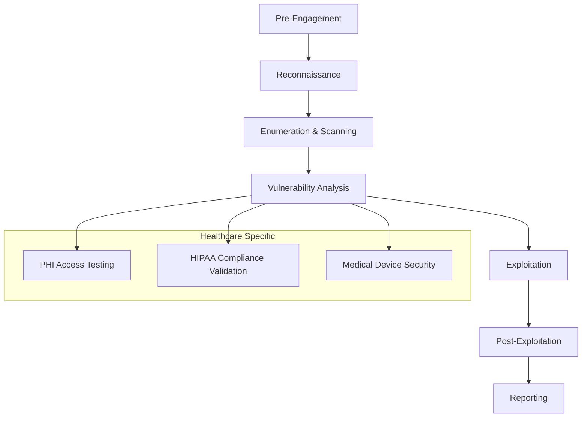

# Penetration Testing Checklist & Red Team Abuse Cases

## Executive Summary

This document provides a comprehensive penetration testing framework for the Chai VC Platform, including healthcare-specific attack vectors, red team abuse cases, and systematic testing procedures. The checklist covers blockchain, cryptographic, API, and healthcare compliance attack surfaces.

## Testing Methodology

### Testing Phases


### Testing Scope Categories
```typescript
enum TestingCategory {
  WEB_APPLICATION = 'web_application',
  API_ENDPOINTS = 'api_endpoints',
  BLOCKCHAIN_CONTRACTS = 'blockchain_contracts',
  CRYPTOGRAPHIC_IMPLEMENTATION = 'cryptographic_implementation',
  INFRASTRUCTURE = 'infrastructure',
  SOCIAL_ENGINEERING = 'social_engineering',
  PHYSICAL_SECURITY = 'physical_security',
  HEALTHCARE_SPECIFIC = 'healthcare_specific'
}

interface PenTestScope {
  category: TestingCategory;
  systems: string[];
  boundaries: string[];
  restrictions: string[];
  priority: 'LOW' | 'MEDIUM' | 'HIGH' | 'CRITICAL';
}
```

## Web Application Security Testing

### Authentication & Session Management
```yaml
Authentication_Testing:
  scope: "User authentication, session handling, credential verification system"

  test_cases:
    - test_id: "AUTH001"
      name: "Username Enumeration"
      description: "Attempt to enumerate valid usernames through login response timing"
      methodology: |
        1. Create list of common healthcare professional usernames
        2. Monitor response times for login attempts
        3. Analyze error messages for information disclosure
        4. Test account lockout mechanisms
      expected_security_controls:
        - "Consistent response times for valid/invalid usernames"
        - "Generic error messages"
        - "Account lockout after failed attempts"
      abuse_cases:
        - "Attacker enumerates valid healthcare provider accounts"
        - "Credential stuffing attacks against medical professionals"
        - "Account takeover of medical board officials"

    - test_id: "AUTH002"
      name: "Multi-Factor Authentication Bypass"
      description: "Attempt to bypass MFA requirements for privileged accounts"
      methodology: |
        1. Test MFA implementation for timing attacks
        2. Attempt direct endpoint access bypassing MFA
        3. Test backup authentication methods
        4. Social engineering MFA reset procedures
      healthcare_specific_risks:
        - "Emergency access procedures may bypass MFA"
        - "Medical device integration might use legacy auth"
        - "On-call staff may have simplified access methods"

    - test_id: "AUTH003"
      name: "Session Management Vulnerabilities"
      description: "Test session handling for healthcare workflows"
      methodology: |
        1. Test session fixation attacks
        2. Verify secure session termination
        3. Test concurrent session limits
        4. Analyze session token entropy
      healthcare_considerations:
        - "Long-duration sessions for extended medical procedures"
        - "Shared workstation scenarios in clinical environments"
        - "Emergency access session handling"
```

### Authorization & Access Control
```python
class AuthorizationTestSuite:
    def __init__(self):
        self.healthcare_roles = [
            'physician', 'nurse', 'pharmacist', 'medical_board_official',
            'hospital_admin', 'patient', 'insurance_verifier', 'researcher'
        ]

    def test_privilege_escalation(self):
        """Test horizontal and vertical privilege escalation"""
        test_cases = []

        # Vertical privilege escalation
        test_cases.append({
            'test_id': 'AUTHZ001',
            'name': 'Vertical Privilege Escalation',
            'description': 'Lower privileged user accessing higher privileged functions',
            'methodology': [
                'Login as nurse role',
                'Attempt to access medical board administrative functions',
                'Test credential issuance capabilities',
                'Verify license revocation permissions'
            ],
            'abuse_scenarios': [
                'Nurse attempting to issue medical licenses',
                'Medical student accessing board certification data',
                'Hospital staff modifying physician credentials'
            ]
        })

        # Horizontal privilege escalation
        test_cases.append({
            'test_id': 'AUTHZ002',
            'name': 'Horizontal Privilege Escalation',
            'description': 'User accessing other users data at same privilege level',
            'methodology': [
                'Login as physician A',
                'Attempt to access physician B credentials',
                'Test patient data access controls',
                'Verify organization boundaries'
            ],
            'healthcare_risks': [
                'Physician accessing competitor physician records',
                'Cross-hospital data access violations',
                'Insurance fraud through credential manipulation'
            ]
        })

        return test_cases

    def test_minimum_necessary_compliance(self):
        """Test HIPAA minimum necessary standard implementation"""
        return {
            'test_id': 'AUTHZ003',
            'name': 'Minimum Necessary Standard Validation',
            'description': 'Verify users only access minimum necessary PHI',
            'methodology': [
                'Map user roles to data access requirements',
                'Test excessive data exposure in API responses',
                'Verify field-level access controls',
                'Test bulk data export restrictions'
            ],
            'compliance_validation': [
                'HR staff cannot access clinical data',
                'Billing staff limited to billing-relevant PHI',
                'Researchers access only de-identified data',
                'Insurance verifiers limited to coverage verification'
            ]
        }
```

## API Security Testing

### GraphQL Security Assessment
```typescript
class GraphQLPenetrationTesting {
  private testIntrospectionAttacks(): TestCase {
    return {
      testId: 'API001',
      name: 'GraphQL Introspection Information Disclosure',
      description: 'Attempt to extract schema information through introspection',
      methodology: [
        'Send introspection queries to GraphQL endpoint',
        'Map available queries, mutations, and types',
        'Identify sensitive healthcare data fields',
        'Test for disabled introspection in production'
      ],
      healthcareRisks: [
        'Exposure of PHI field structures',
        'Discovery of internal medical terminology',
        'Mapping of healthcare provider relationships'
      ],
      testQueries: [
        `query IntrospectionQuery {
          __schema {
            queryType { name }
            mutationType { name }
            types {
              name
              fields {
                name
                type { name }
              }
            }
          }
        }`,
        `query {
          __type(name: "User") {
            fields {
              name
              type {
                name
                ofType { name }
              }
            }
          }
        }`
      ]
    };
  }

  private testQueryDepthLimits(): TestCase {
    return {
      testId: 'API002',
      name: 'GraphQL Depth-Based DoS Attack',
      description: 'Test query depth limitations and resource consumption',
      methodology: [
        'Construct deeply nested queries',
        'Monitor server resource consumption',
        'Test query complexity analysis',
        'Verify timeout mechanisms'
      ],
      maliciousQueries: [
        `query NestedQuery {
          users {
            credentials {
              issuer {
                users {
                  credentials {
                    issuer {
                      users { name }
                    }
                  }
                }
              }
            }
          }
        }`,
        'alias-based query multiplication attacks',
        'recursive relationship exploitation'
      ]
    };
  }

  private testFieldLevelAuthorization(): TestCase {
    return {
      testId: 'API003',
      name: 'Field-Level Authorization Bypass',
      description: 'Test granular field access controls in GraphQL',
      methodology: [
        'Identify sensitive fields (SSN, addresses, medical data)',
        'Test field access with different user roles',
        'Attempt to query restricted fields through nested queries',
        'Verify field-level error messages don\'t leak information'
      ],
      healthcareSpecificTests: [
        'Social security number field access',
        'Home address information in credentials',
        'Medical specialty sensitive information',
        'Disciplinary action records'
      ]
    };
  }
}
```

### REST API Security Testing
```bash
#!/bin/bash
# API Security Testing Script

# Test 1: API Authentication Bypass
echo "Testing API Authentication Bypass..."
curl -X GET "https://api.chai-vc.com/v1/credentials" \
  -H "Content-Type: application/json" \
  > auth_bypass_test.json

# Test 2: Parameter Pollution
echo "Testing HTTP Parameter Pollution..."
curl -X GET "https://api.chai-vc.com/v1/users?id=123&id=456" \
  -H "Authorization: Bearer $TEST_TOKEN"

# Test 3: Mass Assignment
echo "Testing Mass Assignment Vulnerabilities..."
curl -X POST "https://api.chai-vc.com/v1/credentials" \
  -H "Content-Type: application/json" \
  -H "Authorization: Bearer $TEST_TOKEN" \
  -d '{
    "name": "Test Credential",
    "type": "medical_license",
    "is_admin": true,
    "role": "administrator"
  }'

# Test 4: Injection Attacks
echo "Testing SQL Injection in API Parameters..."
curl -X GET "https://api.chai-vc.com/v1/search?q=' OR 1=1 --" \
  -H "Authorization: Bearer $TEST_TOKEN"

# Test 5: Rate Limiting
echo "Testing API Rate Limiting..."
for i in {1..100}; do
  curl -X GET "https://api.chai-vc.com/v1/credentials" \
    -H "Authorization: Bearer $TEST_TOKEN" &
done
wait
```

## Blockchain & Smart Contract Testing

### Smart Contract Vulnerability Assessment
```solidity
// Penetration Testing Contract for Identifying Vulnerabilities
pragma solidity ^0.8.19;

contract ChaiVCPenetrationTest {

    // Test Case 1: Reentrancy Attack
    function testReentrancyAttack(address targetContract) external {
        // Attempt reentrancy on withdrawal functions
        ITargetContract(targetContract).withdraw();
    }

    // Test Case 2: Integer Overflow/Underflow
    function testIntegerOverflow(address stakingContract, uint256 amount) external {
        // Test with maximum uint256 value
        IStakingContract(stakingContract).stake(type(uint256).max);

        // Test underflow with zero balance withdrawal
        IStakingContract(stakingContract).unstake(amount);
    }

    // Test Case 3: Access Control Bypass
    function testAccessControlBypass(address governanceContract) external {
        // Attempt to call admin functions without proper role
        IGovernanceContract(governanceContract).emergencyPause();
        IGovernanceContract(governanceContract).upgradeTo(address(this));
    }

    // Test Case 4: Front-running Attack
    function testFrontRunning(address bondingCurve, uint256 amount) external {
        // Monitor mempool for large purchases and front-run
        IBondingCurve(bondingCurve).purchase{value: amount}();
    }

    // Test Case 5: Flash Loan Attack
    function testFlashLoanAttack(address flashLoanProvider, uint256 amount) external {
        // Attempt governance manipulation with flash loans
        IFlashLoanProvider(flashLoanProvider).flashLoan(
            amount,
            abi.encode("GOVERNANCE_ATTACK")
        );
    }
}
```

### Blockchain-Specific Test Cases
```yaml
Smart_Contract_Testing:
  credential_verification_contract:
    - test_id: "SC001"
      name: "Credential Forgery Attack"
      description: "Attempt to forge valid credentials without proper signatures"
      methodology: |
        1. Analyze credential validation logic
        2. Attempt signature replay attacks
        3. Test signature malleability
        4. Verify merkle proof validation
      healthcare_impact: "Fake medical licenses accepted by system"

    - test_id: "SC002"
      name: "Timestamp Manipulation"
      description: "Manipulate credential timestamps for validity periods"
      methodology: |
        1. Test block.timestamp dependencies
        2. Attempt license expiration bypass
        3. Test renewal period manipulation
        4. Verify time-based access controls
      abuse_scenarios:
        - "Extending expired medical licenses"
        - "Backdating credential issuance"
        - "Bypassing continuing education requirements"

  staking_contract:
    - test_id: "SC003"
      name: "Slash Condition Manipulation"
      description: "Attempt to avoid slashing or trigger false slashing"
      methodology: |
        1. Analyze slashing conditions
        2. Test dispute resolution logic
        3. Attempt collusion attacks
        4. Verify stake calculation accuracy
      healthcare_specific:
        - "Medical board officials avoiding penalties"
        - "False reporting to trigger competitor slashing"
        - "Collusion between medical verification services"

  governance_contract:
    - test_id: "SC004"
      name: "Proposal Spam Attack"
      description: "Spam governance system with malicious proposals"
      methodology: |
        1. Test proposal creation rate limits
        2. Attempt to flood voting system
        3. Test proposal bond requirements
        4. Verify voting weight calculations
      impact_assessment:
        - "Disruption of legitimate governance"
        - "Manipulation of medical board decisions"
        - "Resource exhaustion attacks"
```

## Healthcare-Specific Penetration Testing

### PHI Access Control Testing
```python
class PHIPenetrationTesting:
    def __init__(self):
        self.phi_elements = [
            'names', 'geographic_subdivisions', 'dates', 'telephone_numbers',
            'vehicle_identifiers', 'device_identifiers', 'web_urls',
            'ip_addresses', 'biometric_identifiers', 'full_face_photos',
            'medical_record_numbers', 'health_plan_numbers',
            'account_numbers', 'certificate_numbers', 'social_security_numbers'
        ]

    def test_phi_exposure_vectors(self):
        return [
            {
                'test_id': 'PHI001',
                'name': 'API Response PHI Leakage',
                'description': 'Test for unintended PHI exposure in API responses',
                'methodology': [
                    'Intercept all API responses',
                    'Scan for PHI elements in responses',
                    'Test error messages for PHI exposure',
                    'Verify data filtering effectiveness'
                ],
                'automated_tools': [
                    'Custom PHI scanner script',
                    'Burp Suite with PHI detection rules',
                    'API response analyzer'
                ],
                'compliance_validation': 'HIPAA Privacy Rule §164.502(a)'
            },
            {
                'test_id': 'PHI002',
                'name': 'Log File PHI Analysis',
                'description': 'Analyze log files for inadvertent PHI logging',
                'methodology': [
                    'Collect application and system logs',
                    'Search for PHI patterns using regex',
                    'Test log aggregation systems',
                    'Verify log anonymization processes'
                ],
                'search_patterns': [
                    r'\b\d{3}-\d{2}-\d{4}\b',  # SSN pattern
                    r'\b\d{10}\b',              # Phone number
                    r'\b\d{1,2}/\d{1,2}/\d{4}\b', # Date pattern
                    r'\b[A-Z]{2}\d{6}\b'        # License number pattern
                ]
            }
        ]

    def test_minimum_necessary_violations(self):
        return {
            'test_id': 'PHI003',
            'name': 'Minimum Necessary Standard Compliance',
            'description': 'Verify minimum necessary PHI access controls',
            'test_scenarios': [
                {
                    'role': 'billing_staff',
                    'should_access': ['billing_info', 'insurance_details'],
                    'should_not_access': ['clinical_notes', 'lab_results'],
                    'test_method': 'Role-based API testing'
                },
                {
                    'role': 'hr_personnel',
                    'should_access': ['employment_verification', 'credentials'],
                    'should_not_access': ['patient_data', 'medical_records'],
                    'test_method': 'UI and API access testing'
                }
            ]
        }
```

### Medical Device Integration Security
```typescript
interface MedicalDeviceSecurityTest {
  testId: string;
  deviceType: string;
  securityConcerns: string[];
  testProcedures: string[];
  regulatoryConsiderations: string[];
}

const MEDICAL_DEVICE_TESTS: MedicalDeviceSecurityTest[] = [
  {
    testId: 'MDI001',
    deviceType: 'Digital Identity Verification Devices',
    securityConcerns: [
      'Weak authentication protocols',
      'Unencrypted communication channels',
      'Default credentials',
      'Firmware vulnerabilities'
    ],
    testProcedures: [
      'Network traffic analysis for unencrypted data',
      'Default credential testing',
      'Firmware analysis for hardcoded secrets',
      'Protocol downgrade attacks'
    ],
    regulatoryConsiderations: [
      'FDA 510(k) cybersecurity requirements',
      'Medical Device Data Systems (MDDS) regulations',
      'HIPAA technical safeguards'
    ]
  },
  {
    testId: 'MDI002',
    deviceType: 'Badge/Card Readers',
    securityConcerns: [
      'RFID/NFC cloning vulnerabilities',
      'Physical tampering detection',
      'Credential replay attacks',
      'Side-channel attacks'
    ],
    testProcedures: [
      'RFID signal analysis and cloning attempts',
      'Physical security assessment',
      'Replay attack testing',
      'Electromagnetic side-channel analysis'
    ],
    regulatoryConsiderations: [
      'Physical security requirements',
      'Access control technical standards'
    ]
  }
];
```

## Social Engineering & Human Factor Testing

### Healthcare-Specific Social Engineering
```yaml
Social_Engineering_Tests:
  pretext_scenarios:
    - scenario_id: "SE001"
      name: "Medical Emergency Impersonation"
      description: "Impersonate medical professional requesting urgent credential access"
      methodology: |
        1. Research hospital staff directory
        2. Call IT helpdesk claiming medical emergency
        3. Request expedited credential verification
        4. Test emergency access procedures
      risk_level: "HIGH"
      potential_impact: "Unauthorized PHI access, patient safety risk"

    - scenario_id: "SE002"
      name: "Regulatory Audit Impersonation"
      description: "Impersonate regulatory auditor requesting system access"
      methodology: |
        1. Research recent healthcare regulations
        2. Contact system administrators as "auditor"
        3. Request comprehensive system access
        4. Test compliance-driven access grants
      regulatory_risks:
        - "HIPAA audit impersonation"
        - "Joint Commission survey fraud"
        - "State medical board investigation fake"

    - scenario_id: "SE003"
      name: "Vendor Technical Support"
      description: "Impersonate healthcare technology vendor support"
      methodology: |
        1. Research healthcare technology vendors
        2. Contact staff claiming system issues
        3. Request remote access credentials
        4. Test vendor relationship trust exploitation
      common_targets:
        - "EHR system administrators"
        - "Medical device technicians"
        - "IT helpdesk personnel"

  phishing_campaigns:
    - campaign_id: "PH001"
      name: "Medical License Renewal Phishing"
      description: "Fake medical board license renewal notifications"
      vector: "Email with malicious license renewal link"
      target_audience: "Licensed healthcare professionals"
      payload_types:
        - "Credential harvesting pages"
        - "Malware download (disguised as renewal forms)"
        - "Banking trojan (for license fee payments)"

    - campaign_id: "PH002"
      name: "HIPAA Compliance Training Phishing"
      description: "Mandatory HIPAA training notification with malicious links"
      vector: "Email appearing from HR/Compliance department"
      target_audience: "All healthcare employees"
      social_engineering_elements:
        - "Urgency: 'Complete by end of week or face penalties'"
        - "Authority: 'Mandated by Chief Compliance Officer'"
        - "Fear: 'Failure to comply may result in termination'"
```

## Red Team Abuse Cases

### Advanced Persistent Threat Scenarios
```typescript
interface APTScenario {
  scenarioId: string;
  name: string;
  objective: string;
  phases: AttackPhase[];
  healthcareImpact: string[];
  detectionEvasion: string[];
}

const HEALTHCARE_APT_SCENARIOS: APTScenario[] = [
  {
    scenarioId: 'APT001',
    name: 'Medical Board Credential Manipulation Campaign',
    objective: 'Long-term manipulation of medical licensing system for financial gain',
    phases: [
      {
        phase: 'Initial Access',
        techniques: [
          'Spear phishing medical board staff',
          'Watering hole attacks on medical association websites',
          'Supply chain compromise of medical software'
        ],
        timeline: 'Weeks 1-4'
      },
      {
        phase: 'Persistence & Privilege Escalation',
        techniques: [
          'Install backdoors in credential verification systems',
          'Compromise service accounts with administrative privileges',
          'Establish persistence in cloud infrastructure'
        ],
        timeline: 'Weeks 2-8'
      },
      {
        phase: 'Lateral Movement',
        techniques: [
          'Move between medical board systems',
          'Access connected hospital verification networks',
          'Compromise inter-state licensing databases'
        ],
        timeline: 'Weeks 6-12'
      },
      {
        phase: 'Data Collection & Manipulation',
        techniques: [
          'Harvest medical professional credentials',
          'Modify licensing records for illegal practitioners',
          'Create fraudulent credentials for co-conspirators'
        ],
        timeline: 'Weeks 8-24'
      }
    ],
    healthcareImpact: [
      'Fraudulent medical practitioners gain licenses',
      'Patient safety compromised by unqualified providers',
      'Healthcare system trust degraded',
      'Regulatory non-compliance exposure'
    ],
    detectionEvasion: [
      'Living off the land techniques',
      'Normal administrative tools abuse',
      'Small, incremental changes to avoid detection',
      'Legitimate credential workflow mimicry'
    ]
  }
];
```

### Insider Threat Scenarios
```python
class InsiderThreatScenarios:
    def __init__(self):
        self.insider_types = [
            'disgruntled_employee', 'financially_motivated',
            'compromised_account', 'negligent_insider'
        ]

    def generate_abuse_scenarios(self):
        return [
            {
                'scenario_id': 'IT001',
                'name': 'Rogue Medical Board Official',
                'insider_type': 'financially_motivated',
                'access_level': 'high_privilege',
                'attack_vector': [
                    'Abuse administrative privileges to modify license statuses',
                    'Create backdoor accounts for external accomplices',
                    'Sell verified credentials to unlicensed practitioners',
                    'Disable audit logging during fraudulent activities'
                ],
                'detection_challenges': [
                    'Legitimate administrative access makes detection difficult',
                    'Insider knowledge of monitoring systems',
                    'Ability to modify audit trails',
                    'Trusted position reduces suspicion'
                ],
                'impact_assessment': {
                    'patient_safety': 'CRITICAL',
                    'regulatory_compliance': 'HIGH',
                    'financial_loss': 'HIGH',
                    'reputation_damage': 'CRITICAL'
                }
            },
            {
                'scenario_id': 'IT002',
                'name': 'Negligent Healthcare Administrator',
                'insider_type': 'negligent_insider',
                'attack_vector': [
                    'Misconfigure access controls exposing PHI',
                    'Share administrative credentials inappropriately',
                    'Disable security controls for convenience',
                    'Install unauthorized software creating vulnerabilities'
                ],
                'prevention_measures': [
                    'Principle of least privilege enforcement',
                    'Regular access reviews and audits',
                    'Security awareness training',
                    'Technical controls preventing misconfigurations'
                ]
            }
        ]
```

## Automated Testing Framework

### Security Test Automation
```python
#!/usr/bin/env python3
"""
Automated Penetration Testing Framework for Chai VC Platform
"""

import asyncio
import json
import logging
from typing import List, Dict
import aiohttp
import sqlmap
import nmap

class ChaiVCPenTestFramework:
    def __init__(self, config_file: str):
        self.config = self.load_config(config_file)
        self.results = {}

    async def run_comprehensive_test(self):
        """Run complete penetration testing suite"""

        # Phase 1: Reconnaissance
        await self.passive_reconnaissance()
        await self.active_reconnaissance()

        # Phase 2: Vulnerability Assessment
        await self.web_application_testing()
        await self.api_security_testing()
        await self.infrastructure_testing()

        # Phase 3: Healthcare-Specific Testing
        await self.phi_exposure_testing()
        await self.hipaa_compliance_testing()

        # Phase 4: Blockchain Testing
        await self.smart_contract_testing()
        await self.consensus_mechanism_testing()

        # Phase 5: Social Engineering
        await self.phishing_simulation()
        await self.pretexting_tests()

        return self.compile_results()

    async def web_application_testing(self):
        """Automated web application security testing"""

        test_cases = [
            self.test_sql_injection(),
            self.test_xss_vulnerabilities(),
            self.test_csrf_protection(),
            self.test_authentication_bypass(),
            self.test_authorization_flaws(),
            self.test_session_management()
        ]

        results = await asyncio.gather(*test_cases)
        self.results['web_application'] = results

    async def test_sql_injection(self):
        """Test for SQL injection vulnerabilities"""

        injection_payloads = [
            "' OR '1'='1",
            "'; DROP TABLE users; --",
            "' UNION SELECT * FROM information_schema.tables --",
            "' OR 1=1 AND SLEEP(5) --"
        ]

        vulnerable_endpoints = []

        for endpoint in self.config['test_endpoints']:
            for payload in injection_payloads:
                try:
                    response = await self.send_request_with_payload(endpoint, payload)

                    if self.detect_sql_injection(response):
                        vulnerable_endpoints.append({
                            'endpoint': endpoint,
                            'payload': payload,
                            'severity': 'HIGH',
                            'evidence': response.text[:500]
                        })

                except Exception as e:
                    logging.error(f"Error testing {endpoint}: {e}")

        return {
            'test_type': 'SQL Injection',
            'vulnerable_endpoints': vulnerable_endpoints,
            'total_tested': len(self.config['test_endpoints'])
        }

    async def phi_exposure_testing(self):
        """Test for PHI exposure in various system components"""

        phi_patterns = {
            'ssn': r'\b\d{3}-\d{2}-\d{4}\b',
            'phone': r'\b\d{3}-\d{3}-\d{4}\b',
            'dob': r'\b\d{1,2}/\d{1,2}/\d{4}\b',
            'medical_record': r'\bMR\d{6,}\b'
        }

        phi_exposures = []

        # Test API responses
        for endpoint in self.config['api_endpoints']:
            response = await self.authenticated_request(endpoint)

            for phi_type, pattern in phi_patterns.items():
                matches = re.findall(pattern, response.text)
                if matches:
                    phi_exposures.append({
                        'endpoint': endpoint,
                        'phi_type': phi_type,
                        'matches': len(matches),
                        'severity': 'CRITICAL'
                    })

        # Test log files
        log_files = await self.get_accessible_log_files()
        for log_file in log_files:
            content = await self.read_log_file(log_file)

            for phi_type, pattern in phi_patterns.items():
                matches = re.findall(pattern, content)
                if matches:
                    phi_exposures.append({
                        'source': f'Log file: {log_file}',
                        'phi_type': phi_type,
                        'matches': len(matches),
                        'severity': 'HIGH'
                    })

        return {
            'test_type': 'PHI Exposure',
            'exposures_found': phi_exposures,
            'compliance_impact': 'HIPAA Privacy Rule Violation'
        }
```

### Test Reporting Framework
```typescript
interface PenTestReport {
  executiveSummary: ExecutiveSummary;
  vulnerabilityFindings: VulnerabilityFinding[];
  healthcareSpecificFindings: HealthcareFinding[];
  complianceImpact: ComplianceImpact[];
  recommendations: Recommendation[];
  appendices: Appendix[];
}

class PenTestReportGenerator {
  generateReport(testResults: TestResults): PenTestReport {
    return {
      executiveSummary: this.generateExecutiveSummary(testResults),
      vulnerabilityFindings: this.categorizeVulnerabilities(testResults),
      healthcareSpecificFindings: this.extractHealthcareFindings(testResults),
      complianceImpact: this.assessComplianceImpact(testResults),
      recommendations: this.generateRecommendations(testResults),
      appendices: this.compileAppendices(testResults)
    };
  }

  private generateExecutiveSummary(results: TestResults): ExecutiveSummary {
    const criticalFindings = results.findings.filter(f => f.severity === 'CRITICAL').length;
    const highFindings = results.findings.filter(f => f.severity === 'HIGH').length;

    return {
      testingPeriod: results.testingPeriod,
      scope: results.scope,
      methodology: 'OWASP WSTG + Healthcare-specific testing',
      keyFindings: {
        critical: criticalFindings,
        high: highFindings,
        medium: results.findings.filter(f => f.severity === 'MEDIUM').length,
        low: results.findings.filter(f => f.severity === 'LOW').length
      },
      businessRiskSummary: this.calculateBusinessRisk(results),
      complianceRiskSummary: this.calculateComplianceRisk(results),
      recommendedActions: this.extractTopRecommendations(results, 5)
    };
  }
}
```

---

*Document Version: 1.0*
*Last Updated: September 2025*
*Next Review: December 2025*