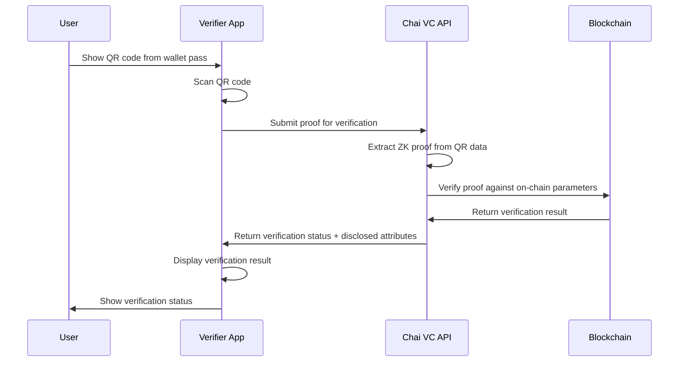

# Apple/Google Wallet Pass Integration Specification

## Executive Summary

This specification defines the integration of healthcare credentials with Apple Wallet (PassKit) and Google Wallet (Google Pay API) for the Chai VC Platform. The integration enables healthcare professionals to store, present, and verify their credentials directly from their mobile wallets while maintaining privacy and security standards.

## Overview

### Integration Scope
- **Apple Wallet**: iOS PassKit framework integration
- **Google Wallet**: Google Wallet API implementation
- **Credential Types**: Medical licenses, certifications, badges
- **Verification**: QR code and NFC-based verification
- **Privacy**: Selective disclosure capabilities

### Key Benefits
1. **User Convenience**: Native mobile wallet experience
2. **Offline Verification**: Works without internet connectivity
3. **Security**: Hardware-backed credential storage
4. **Standardization**: Consistent cross-platform experience
5. **Privacy**: Zero-knowledge proof integration

## Apple Wallet Integration

### Pass Types and Structure

#### Medical License Pass
```json
{
  "formatVersion": 1,
  "passTypeIdentifier": "pass.com.chai-vc.medical-license",
  "serialNumber": "ML-2025-001",
  "teamIdentifier": "CHAI123456",
  "organizationName": "Chai VC Platform",
  "description": "Medical License",
  "logoText": "Medical License",
  "foregroundColor": "rgb(255, 255, 255)",
  "backgroundColor": "rgb(0, 90, 156)",
  "labelColor": "rgb(255, 255, 255)",
  "webServiceURL": "https://passes.chai-vc.com",
  "authenticationToken": "pass-auth-token-here",
  "generic": {
    "primaryFields": [
      {
        "key": "license-type",
        "label": "License Type",
        "value": "Doctor of Medicine (MD)"
      }
    ],
    "secondaryFields": [
      {
        "key": "state",
        "label": "State",
        "value": "California"
      },
      {
        "key": "specialty",
        "label": "Specialty",
        "value": "Internal Medicine"
      }
    ],
    "auxiliaryFields": [
      {
        "key": "license-number",
        "label": "License #",
        "value": "CA123456"
      },
      {
        "key": "expiration",
        "label": "Expires",
        "value": "2025-12-31",
        "dateStyle": "PKDateStyleMedium"
      }
    ],
    "backFields": [
      {
        "key": "verification-url",
        "label": "Verify Online",
        "value": "https://verify.chai-vc.com/ML-2025-001"
      },
      {
        "key": "issuer",
        "label": "Issued By",
        "value": "California Medical Board"
      },
      {
        "key": "issue-date",
        "label": "Issue Date",
        "value": "2020-01-15",
        "dateStyle": "PKDateStyleMedium"
      }
    ]
  },
  "barcode": {
    "message": "chai-vc://verify?proof=eyJ0eXAiOiJKV1QiLCJhbGciOiJFUzI1NiJ9...",
    "format": "PKBarcodeFormatQR",
    "messageEncoding": "iso-8859-1",
    "altText": "Verification QR Code"
  },
  "nfc": {
    "message": "00142020656E4465766963652020202020",
    "encryptionPublicKey": "base64-encoded-public-key"
  }
}
```

### Pass Generation API

#### Endpoint Structure
```typescript
interface PassGenerationRequest {
  credentialId: string;
  userId: string;
  disclosureLevel: 'minimal' | 'standard' | 'full';
  validityPeriod?: number; // Days until pass expires
  customization?: PassCustomization;
}

interface PassCustomization {
  primaryColor?: string;
  secondaryColor?: string;
  logoUrl?: string;
  backgroundImageUrl?: string;
  includePhoto?: boolean;
}

interface PassGenerationResponse {
  passUrl: string;
  serialNumber: string;
  expiresAt: string;
  downloadInstructions: string[];
}
```

#### Implementation
```typescript
class ApplePassService {
  async generatePass(request: PassGenerationRequest): Promise<Buffer> {
    // 1. Validate credential and user permissions
    const credential = await this.validateCredential(request.credentialId);

    // 2. Generate zero-knowledge proof for pass content
    const proof = await this.generateZKProof(credential, request.disclosureLevel);

    // 3. Create pass structure
    const passData = this.createPassStructure(credential, proof, request);

    // 4. Sign pass with Apple certificates
    const signedPass = await this.signPass(passData);

    return signedPass;
  }

  private async signPass(passData: any): Promise<Buffer> {
    // Create manifest and signature
    const manifest = this.createManifest(passData);
    const signature = await this.createPKCS7Signature(manifest);

    // Package as .pkpass file
    return this.createPkpassArchive(passData, manifest, signature);
  }
}
```

### Apple Wallet Limitations

#### Technical Constraints
1. **Storage Limit**: 10MB maximum pass size
2. **Field Limits**: Maximum 4 primary, 4 secondary, 4 auxiliary fields
3. **Image Constraints**: Specific size requirements for logos and backgrounds
4. **Update Frequency**: Limited push notification updates
5. **Network Dependency**: Pass updates require internet connectivity

#### Privacy Limitations
1. **Static Data**: Pass content is relatively static once generated
2. **Apple Servers**: Passes may be cached on Apple's servers
3. **Location Services**: Apple may track pass usage location
4. **Limited Encryption**: Standard pass content not end-to-end encrypted
5. **Metadata Exposure**: Pass metadata visible to Apple

#### Security Considerations
1. **Certificate Management**: Requires Apple Developer certificates
2. **Pass Tampering**: Physical pass files can be modified
3. **Replay Attacks**: QR codes may be copied and reused
4. **Device Compromise**: Passes accessible if device is compromised

## Google Wallet Integration

### Pass Object Structure

#### Medical License Object
```json
{
  "iss": "chai-vc-platform@healthcare.iam.gserviceaccount.com",
  "aud": "google",
  "typ": "savetowallet",
  "iat": 1727222400,
  "exp": 1727308800,
  "payload": {
    "genericObjects": [
      {
        "id": "3388000000022234567.medical-license-001",
        "classId": "3388000000022234567.medical_license_class",
        "state": "ACTIVE",
        "heroImage": {
          "sourceUri": {
            "uri": "https://assets.chai-vc.com/medical-hero.png"
          }
        },
        "cardTitle": {
          "defaultValue": {
            "language": "en-US",
            "value": "Medical License"
          }
        },
        "subheader": {
          "defaultValue": {
            "language": "en-US",
            "value": "Doctor of Medicine"
          }
        },
        "header": {
          "defaultValue": {
            "language": "en-US",
            "value": "California Medical Board"
          }
        },
        "textModulesData": [
          {
            "id": "license-number",
            "header": "License Number",
            "body": "CA123456"
          },
          {
            "id": "specialty",
            "header": "Specialty",
            "body": "Internal Medicine"
          },
          {
            "id": "expiration",
            "header": "Expires",
            "body": "2025-12-31"
          }
        ],
        "barcode": {
          "type": "QR_CODE",
          "value": "chai-vc://verify?proof=eyJ0eXAiOiJKV1QiLCJhbGciOiJFUzI1NiJ9...",
          "alternateText": "Verification QR Code"
        }
      }
    ]
  }
}
```

### Google Wallet Service Implementation
```typescript
class GoogleWalletService {
  private jwt = require('jsonwebtoken');

  async generateSaveUrl(request: PassGenerationRequest): Promise<string> {
    // 1. Create JWT payload
    const payload = await this.createPayload(request);

    // 2. Sign JWT with service account key
    const token = this.jwt.sign(payload, this.serviceAccountKey, {
      algorithm: 'RS256',
      issuer: this.serviceAccountEmail,
      audience: 'google'
    });

    // 3. Return save URL
    return `https://pay.google.com/gp/v/save/${token}`;
  }

  private async createPayload(request: PassGenerationRequest) {
    const credential = await this.validateCredential(request.credentialId);
    const proof = await this.generateZKProof(credential, request.disclosureLevel);

    return {
      iss: this.serviceAccountEmail,
      aud: 'google',
      typ: 'savetowallet',
      iat: Math.floor(Date.now() / 1000),
      exp: Math.floor(Date.now() / 1000) + (60 * 60), // 1 hour
      payload: {
        genericObjects: [this.createGenericObject(credential, proof)]
      }
    };
  }
}
```

### Google Wallet Limitations

#### Platform Constraints
1. **Android Only**: Limited to Android devices
2. **Google Services**: Requires Google Play Services
3. **Account Dependency**: Requires Google account
4. **Regional Availability**: Not available in all countries
5. **API Quotas**: Rate limits on pass creation

#### Data Limitations
1. **Field Restrictions**: Limited customization options
2. **Image Constraints**: Specific aspect ratios required
3. **Text Limits**: Character limits on text fields
4. **Color Restrictions**: Limited color customization
5. **Layout Constraints**: Fixed layout templates

#### Privacy Concerns
1. **Google Analytics**: Usage data collected by Google
2. **Cloud Storage**: Passes stored on Google's servers
3. **Cross-App Tracking**: Potential integration with other Google services
4. **Location Data**: Google may track pass usage patterns
5. **Advertising Integration**: Potential use for targeted advertising

## Cross-Platform Verification

### QR Code Verification Flow


### Verification API
```typescript
interface VerificationRequest {
  qrCode: string;
  verifierDID: string;
  requiredAttributes?: string[];
  context?: string;
}

interface VerificationResponse {
  verified: boolean;
  credentialType: string;
  disclosedAttributes: Record<string, any>;
  verificationTimestamp: string;
  verifierDID: string;
  nullifierHash: string; // Prevent replay
}

class WalletVerificationService {
  async verifyQRCode(request: VerificationRequest): Promise<VerificationResponse> {
    // 1. Decode QR code data
    const proofData = this.decodeQRData(request.qrCode);

    // 2. Verify zero-knowledge proof
    const verificationResult = await this.verifyZKProof(proofData);

    // 3. Check nullifier for replay protection
    await this.checkNullifier(verificationResult.nullifierHash);

    // 4. Return verification result
    return {
      verified: verificationResult.isValid,
      credentialType: verificationResult.credentialType,
      disclosedAttributes: verificationResult.attributes,
      verificationTimestamp: new Date().toISOString(),
      verifierDID: request.verifierDID,
      nullifierHash: verificationResult.nullifierHash
    };
  }
}
```

## NFC Integration

### Apple NFC Implementation
```typescript
class NFCPassReader {
  async readNFCPass(): Promise<NFCPassData> {
    // iOS Core NFC implementation
    const session = new NFCNDEFReaderSession({
      invalidateAfterFirstRead: true,
      alertMessage: "Hold near healthcare credential"
    });

    return new Promise((resolve, reject) => {
      session.onDidDetectNDEFs = (messages) => {
        const passData = this.parseNDEFMessage(messages[0]);
        resolve(passData);
      };

      session.onDidInvalidate = (error) => {
        if (error) reject(error);
      };

      session.begin();
    });
  }
}
```

### Google NFC Implementation
```typescript
class GoogleNFCService {
  async enableNFCPass(passObject: any): Promise<void> {
    // Enable NFC for Google Wallet pass
    const nfcData = {
      message: this.createNDEFMessage(passObject),
      encryptionKey: await this.generateNFCKey()
    };

    // Update pass with NFC capabilities
    await this.updatePassWithNFC(passObject.id, nfcData);
  }
}
```

## Security Architecture

### Cryptographic Security
1. **Hardware-Backed Storage**: Utilize Secure Enclave (iOS) / Trusted Execution Environment (Android)
2. **Certificate Pinning**: Pin Chai VC API certificates
3. **Proof Verification**: Zero-knowledge proof validation
4. **Replay Protection**: Nullifier-based anti-replay mechanisms
5. **Time-Based Validity**: Pass expiration and refresh cycles

### Privacy Preservation
1. **Selective Disclosure**: Only reveal necessary attributes
2. **Zero-Knowledge Proofs**: Verify without exposing data
3. **Local Processing**: Client-side proof generation
4. **Minimal Data Transmission**: Reduce network exposure
5. **Ephemeral Keys**: Temporary keys for pass generation

### Anti-Tampering Measures
1. **Digital Signatures**: Cryptographically signed passes
2. **Integrity Checks**: Hash-based integrity verification
3. **Certificate Validation**: Verify issuer certificates
4. **Blockchain Anchoring**: On-chain proof verification
5. **Device Attestation**: Hardware-based device verification

## Implementation Roadmap

### Phase 1: Foundation (Month 1)
- [ ] Apple Developer account and certificates setup
- [ ] Google Cloud project and service account configuration
- [ ] Basic pass generation for both platforms
- [ ] QR code verification system
- [ ] Initial security implementation

### Phase 2: Core Features (Month 2)
- [ ] Zero-knowledge proof integration
- [ ] Selective disclosure implementation
- [ ] NFC support for both platforms
- [ ] Pass update and refresh mechanisms
- [ ] Comprehensive error handling

### Phase 3: Advanced Features (Month 3)
- [ ] Hardware-backed security integration
- [ ] Cross-platform verification testing
- [ ] Performance optimization
- [ ] User experience refinements
- [ ] Comprehensive testing suite

### Phase 4: Production Ready (Month 4)
- [ ] Security audit completion
- [ ] Apple App Store approval
- [ ] Google Play Console approval
- [ ] Production deployment
- [ ] Monitoring and analytics setup

## Compliance and Limitations

### HIPAA Compliance
- **Covered Entity Requirements**: Healthcare organizations must ensure BAA compliance
- **Minimum Necessary**: Only disclose minimum necessary PHI
- **Access Controls**: Implement proper access logging
- **Audit Trail**: Maintain verification audit logs
- **Breach Notification**: Follow HIPAA breach notification requirements

### Platform Store Requirements
- **Apple App Store**: Must comply with App Store Review Guidelines
- **Google Play Store**: Must follow Google Play Developer Policy
- **Content Restrictions**: No misleading medical claims
- **Privacy Policies**: Clear data handling disclosures
- **Age Restrictions**: Appropriate age ratings

### Technical Limitations Summary

#### Apple Wallet
- Maximum 10MB pass size
- Limited field customization
- iOS-only availability
- Certificate management complexity
- Pass update limitations

#### Google Wallet
- Android-only platform
- Google account requirement
- Limited design flexibility
- Regional availability restrictions
- API rate limiting

#### Cross-Platform Issues
- Different user experiences
- Inconsistent feature sets
- Verification compatibility challenges
- Development and maintenance overhead
- Testing complexity across platforms

---

*Document Version: 1.0*
*Last Updated: September 2025*
*Next Review: December 2025*